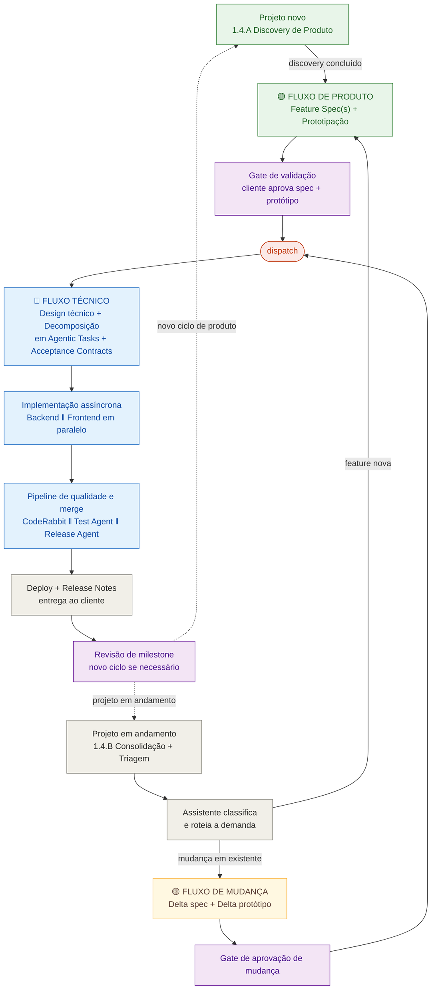
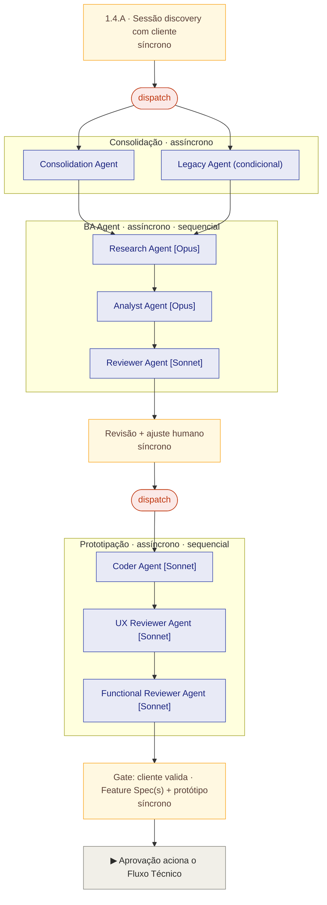
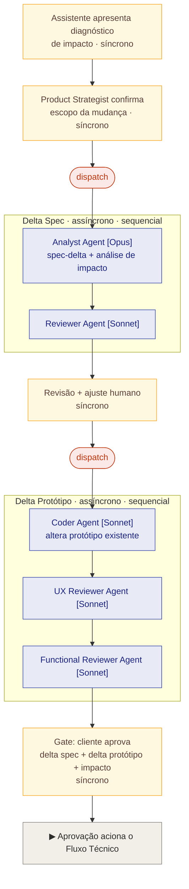
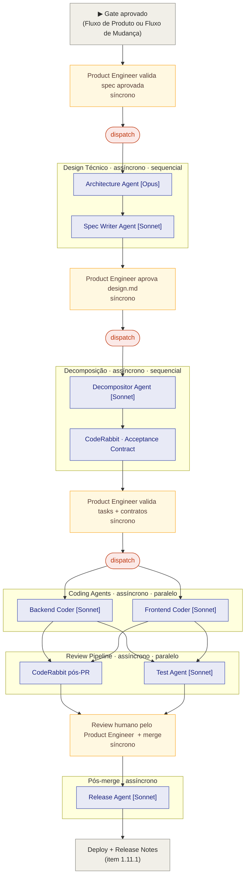

# Projeto reThink Kognit

> **Versão:** 0.3 — Rascunho para validação
> **Data:** Abril de 2026
> **Status:** Em progresso

---

## Sobre Este Documento

Este resumo descreve as duas fases da transformação do processo de engenharia da Kognit em direção ao modelo Agent-First.

A fase **Now** é o processo completo e definitivo: cobre desde a preparação técnica até a entrega em produção, introduzindo o padrão assíncrono de trabalho de forma gradativa — primeiro com ferramentas disponíveis hoje, depois com infraestrutura dedicada.

Fatores técnicos transversais considerados ao longo das fases: arquitetura de solução, planejamento de tarefas, organização do file system, delegação e seleção de modelos, tool calling com guardrails, memória e estado dos agentes, execução de código, gerenciamento de contexto e loops de validação autônoma.

**Fontes de referência consultadas:**
- **Stripe Minions** — https://stripe.dev/blog/minions-stripes-one-shot-end-to-end-coding-agents e part 2
- **Agyn** — paper "A Multi-Agent System for Team-Based Autonomous Software Engineering"
- **SE 3.0 / SASE** — paper "Agentic Software Engineering: Foundational Pillars and a Research Roadmap"
- **Harness** — https://www.anthropic.com/engineering/harness-design-long-running-apps


---

## Fase 1 — Now: Processo Agent-First Completo

**Objetivo:** Transformar o processo de engenharia da Kognit introduzindo o padrão assíncrono de trabalho — o profissional para de pilotar o agente turno a turno e passa a entregar um requisito, aguardar o artefato completo e revisar. A transformação acontece de forma gradativa dentro desta fase: começa com a preparação técnica e simulação do padrão assíncrono usando ferramentas disponíveis hoje, e evolui para infraestrutura dedicada de dispatch e execução em cloud. A fase encerra quando o time consegue conduzir entregas completas de ponta a ponta com agentes operando de forma predominantemente assíncrona.

#### a) Diagrama Macro Now



#### b) Diagrama Fluxo de Produto



#### c) Diagrama Fluxo de Mudança



#### d) Diagrama Fluxo Técnico




---

### Como ler este documento

Os itens estão organizados em camadas, não em ordem de execução. Leia os grupos nesta sequência para entender o processo do ponto de vista operacional:

1. **Grupo 1 — Papéis:** quem faz o quê no processo. Leia primeiro para saber de qual perspectiva cada item foi escrito.
2. **Grupo 2 — Fundação Técnica:** o que precisa existir antes de qualquer demanda rodar (repositório, padrões, governança). Leia uma vez — não é consultado a cada demanda.
3. **Ponto de entrada — duas situações distintas:**
   - **Projeto novo** (sem `feature-map.yaml` estabelecido): o processo começa no item 1.4.A (Discovery de Produto). O Assistente entra em operação após o primeiro ciclo de discovery estar commitado.
   - **Projeto em andamento**: o processo começa no item 1.4.B (Consolidação de Sessão e Triagem) — reuniões com o cliente alimentam o `triage.md`, e o Assistente (1.12) classifica e roteia cada item triado. O Backlog (1.17) define o que entra no pipeline.
4. **Grupo 3 — Fluxo de Produto:** o que acontece quando o Assistente classifica uma demanda como feature nova.
5. **Grupo 3.1 — Fluxo de Mudança:** o que acontece quando o Assistente classifica uma demanda como mudança em feature existente.
6. **Grupo 4 — Fluxo Técnico:** o que acontece após qualquer gate de aprovação — seja de produto ou de mudança.
7. **Grupo 5 — Infraestrutura restante (1.13 a 1.16):** ambientes de execução em cloud, gestão de contexto e cerimônias. Leia por último ou sob demanda.


---

### Grupo 1 — Mapeamento de Papéis

#### 1.1 Redefinição de Papéis

**Objetivo:** Estabelecer os dois perfis de entrega do processo Agent-First a partir dos papéis atuais da Kognit, sem criar novos cargos. Cada profissional entrega de ponta a ponta dentro do seu fluxo. A acumulação de papéis é situacional — depende do tamanho do projeto e das horas contratadas.

**Mapeamento:**

| Papel Humano | Papéis Kognit Atuais |
|---|---|
| Product Strategist | Project Owner · Analista de Negócios Sr. · Analista de Negócios |
| Product Engineer | Analista de Solução · Desenvolvedor Sr. · Desenvolvedor |

**Notas de acumulação:**
- Em projetos pequenos ou demandas técnicas pontuais, o Analista de Solução pode atuar como estrategista — conduzindo discovery técnico e entregando da concepção ao PR sem handoff.

**Referências:**
- **SE 3.0 / SASE:** o framework redefine o papel humano como "Agent Coach" — não mais executor de tarefas, mas condutor de agentes. A separação em dois perfis de entrega (produto e engenharia) espelha a dualidade SE4H (SE for Humans) proposta pelo SASE, onde cada humano mantém foco estratégico dentro do seu domínio.
- **Agyn:** o sistema demonstra que a separação de responsabilidades por papel (manager, researcher, engineer, reviewer) é mais eficaz do que um agente monolítico. O mesmo princípio se aplica aos profissionais humanos: clareza de papel melhora a qualidade das entregas.

---

### Grupo 2 — Pré-Requisitos / Preparação

>  Os itens deste grupo estabelecem a base para que o processo Agent-First comece a rodar e se mantenha controlado ao longo do tempo: migração técnica, padrões computáveis, governança de execução, artefatos de handoff, métricas e critérios de roteamento por tipo de demanda.


#### 1.2 Migração e Fundação Técnica

**Objetivo:** Migrar o ecossistema de repositórios e CI/CD para GitHub, habilitando o ecossistema nativo de agentes autônomos. Sem esta migração, nenhum agente de coding funciona com qualidade de forma integrada.

**Decisão de arquitetura — Azure DevOps vs GitHub:** O processo adota GitHub Issues + GitHub Projects como sistema único de rastreabilidade e backlog. O Azure Boards deixa de ser usado para planejamento. Azure Repos e Azure Pipelines podem coexistir durante a transição, com migração gradual para GitHub Actions conforme o time ganha confiança (ver item 1.2).

A justificativa é técnica e estratégica: todos os agentes do processo (Release Agent, Assistente de Contexto Permanente, Decompositor Agent) operam via GitHub API — criando Issues, lendo labels, abrindo PRs e atualizando artefatos. Manter o backlog no Azure Boards exigiria uma camada de integração adicional sem benefício real. Além disso, o GitHub é a plataforma onde a Microsoft está concentrando investimento em Agentic DevOps — o ecossistema de automação e IA é nativo aqui, não no Azure DevOps.

O GitHub Projects suporta sprints (campos de iteração), backlog priorizado, board kanban, roadmap e métricas de fluxo — suficiente para o porte dos projetos Kognit. As limitações conhecidas (burndown chart não nativo, hierarquia Epic/Feature/Story via labels em vez de tipo de work item) são endereçadas pelo mapeamento de tipos do item 1.13 e não afetam o fluxo central do processo.

**Papéis humanos:** Product Engineer (lidera e executa a migração de pipelines, repositórios e CI/CD).

**Fatores técnicos:**
- **File system:** estrutura de repositório padronizada conforme Mapa de Artefatos abaixo
- **State management:** Azure Boards → GitHub Issues + Projects; labels para `epic`, `feature`, `backlog-item`, `agent-eligible`, `agent-dispatched`, `needs-human`, `manual-task`, `bug`, `change-approved`, `pending-client-input`, `refinement-rejected`, `agent-stopped`, `budget-exceeded`, `timeout`, `retry-limit`, `class-a`, `class-b`, `class-c`, `class-d`, `legacy-access-approved`, `legacy-access-restricted`, `sensitive-system`
- **Code execution:** GitHub Actions substitui Azure Pipelines; quality gates: SonarQube (análise de código), Roslyn analyzers (.NET/C#), ESLint/TypeScript (front-end), xUnit (testes unitários back-end), Vitest (testes unitários front-end), Cypress (E2E)
- **Feature map:** `feature-map.yaml` criado manualmente no início do projeto pelo Product Strategist e Product Engineer — índice estruturado de todas as features com dependências, módulos, processos associados, artefatos e estado vivo do trabalho em andamento. Formato YAML para leitura precisa por agentes e edição legível por humanos. Três seções: **em-producao** (features mergeadas e deployadas, incluindo bugs abertos por feature), **em-andamento** (features com Issue aberta, branch ativa e PRs em curso — inclui módulos afetados para detecção de conflito entre demandas simultâneas) e **backlog** (itens priorizados ainda não iniciados, com dependências declaradas). O Assistente (item 1.12) lê o `feature-map.yaml` via MCP Server para toda análise de impacto — combinando a camada semântica do YAML com os dados vivos do GitHub (Issues, branches, PRs) para detectar conflitos antes de criar qualquer nova Issue. Atualizado automaticamente pelo Release Agent (item 1.11) a cada merge e a cada deploy.

**Mapa de Artefatos — Estrutura de Repositório**

Referência única de todos os artefatos produzidos e consumidos ao longo do processo. Alterações de convenção de nomenclatura ou estrutura de pastas são feitas exclusivamente aqui.

**Estrutura multi-produto:** quando um cliente possui mais de um produto, os artefatos de contexto compartilhado (discovery, sessões, triage, identidade visual, processos) ficam num repositório dedicado `[cliente]-context`, separado dos repositórios de produto. Cada repositório de produto mantém sua estrutura técnica independente. O backlog unificado é gerenciado via GitHub Projects no nível da organização, vinculando Issues dos repositórios de produto com campo customizado `produto` para identificação e filtro.

---

**Repositório: `[cliente]-context`** *(usado quando o cliente tem mais de um produto)*
```
docs/
  product/
    feature-map-[produto].md               ← índice de features por produto (produção + WIP) um arquivo por produto do cliente
    identidade-visual/
      logo-[cliente].png                   ← logomarca do cliente
      paleta-[cliente].png                 ← paleta de cores
      design-system-[cliente].md           ← convenções visuais quando existirem

  context/
    discovery-draft-[produto].md           ← discovery em construção — acumula insights de múltiplas sessões; renomeado para discovery-[produto]-[data].md quando aprovado
    discovery-[produto]-[data].md          ← discovery finalizado e aprovado pelo Product Strategist — input do Research Agent e Analyst Agent (1.5)
    session-[cliente]-[data].md            ← notas/transcrição estruturada de cada reunião — cobre todos os produtos discutidos na sessão; referencia o link do board da sessão
    legacy-[sistema]-[data].md             ← documentação de sistema legado
    milestone-review-[cliente]-[data].md   ← registro de revisão de milestone

  triage/
    triage-[cliente].md                    ← itens pendentes de encaminhamento — cobre todos os produtos; identifica o produto em cada item; itens saem quando viram Issue ou são descartados
    triage-history-[cliente].md            ← log cronológico de itens resolvidos com número da Issue gerada, produto, data e decisão tomada

  processes/
    [processo]-as-is-v[n].bpmn             ← processo atual do cliente
    [processo]-as-is-v[n].png              ← gerado automaticamente pelo CI
    [processo]-to-be-v[n].bpmn             ← processo futuro com o produto
    [processo]-to-be-v[n].png              ← gerado automaticamente pelo CI
```

---

**Repositório: `[produto]`** *(um por produto — estrutura idêntica para todos os produtos do cliente)*

```
CLAUDE.md                                  ← governança operacional e padrões dos agentes
.cursorrules                               ← padrões front-end para o Coder Agent
.coderabbit.yaml                           ← regras de review automático (CodeRabbit)
CHANGELOG.md                               ← histórico técnico de merges (Release Agent)

.github/
  workflows/                               ← GitHub Actions (quality gates, CI, Release Agent, bpmn-to-image, portal Swagger UI)

.kognit/
  templates/
    crp.md                                 ← template do Consultation Request Pack (item 1.3.1)
    mrp.md                                 ← template do Merge-Readiness Pack (item 1.3.1)
    discovery.md                           ← template do documento de discovery consolidado
    feature-spec.md                        ← template da Feature Spec com seções padrão (substitui spec-funcional.md)
    spec-delta.md                          ← template da spec-delta do Fluxo de Mudança
    briefing.md                            ← template do Briefing de demanda (substitui change-request.md)
    design.md                              ← template do design técnico com seções padrão
    agentic-task.md                        ← template da GitHub Issue de Agentic Task
    backlog-item.md                        ← template da GitHub Issue de backlog item
  agents/
    agents.md                              ← lista de agentes usados no projeto, versão dos skills e link para o repositório central Kognit

docs/                                      ← documentação permanente do produto

  product/
    feature-map.yaml                       ← índice único de rastreabilidade do produto — features, TCs, estado, artefatos e sequenciais globais; usado em projetos de produto único; substituído por feature-map-[produto].yaml no repositório [cliente]-context quando multi-produto
    identidade-visual/                     ← usado em projetos de produto único; substituído pelo [cliente]-context quando multi-produto
      logo-[cliente].png
      paleta-[cliente].png
      design-system-[cliente].md

    features/                              ← Feature Specs versionadas por feature (substitui specs/)
      [MODULE_CODE]-F[NNN]_[slug]/         ← uma pasta por Feature ID
        spec-v[N].md                       ← Feature Spec aprovada — versionada (v1.0, v1.1, ...)
        acceptance-contract-[issue].md     ← critérios técnicos por Issue — promovido de work/ pelo Release Agent após merge

    test-cases/                            ← Test Cases por módulo
      [MODULE_CODE]/
        TestCase_[MOD].json                ← TCs do módulo, atualizado a cada sprint pelo QA Agent

  context/                                 ← contexto estratégico do produto — usado em projetos de produto único; em multi-produto, context fica no [cliente]-context
    discovery-draft-[produto].md
    discovery-[produto]-[data].md
    session-[produto]-[data].md
    legacy-[sistema]-[data].md
    milestone-review-[cliente]-[data].md
    market-research-[produto]-[data].md    ← pesquisa de mercado e comparativo de concorrentes — gerado pelo Research Agent no item 1.5
    personas-[produto].md                  ← personas do produto — gerado pelo Analyst Agent, atualizado pelo Release Agent quando entrega altera perfil de uso
    journeys-[produto].md                  ← jornadas do usuário — complementar ao processo de negócio (BPMN); perspectiva de experiência do usuário dentro do processo

  triage/                                  ← usado em projetos de produto único; em multi-produto, triage fica no [cliente]-context
    triage-[produto].md
    triage-history-[produto].md

  processes/                               ← diagramas BPMN versionados
    [processo]-as-is-v[n].bpmn
    [processo]-as-is-v[n].png
    [processo]-to-be-v[n].bpmn
    [processo]-to-be-v[n].png

  api/                                     ← documentação de APIs (permanente)
    produzidas/                            ← APIs criadas pela Kognit
      [api-name]/
        openapi-draft.yaml                 ← rascunho gerado pelo Spec Writer Agent (condicional — ver política no CLAUDE.md)
        openapi.yaml                       ← especificação definitiva pós-merge
        changelog.md                       ← histórico de versões da API
        consumers.md                       ← features e clientes que consomem
    consumidas/                            ← APIs externas normalizadas
      [api-name]/
        resumo-integracao.md               ← gerado pelo Architecture Agent
        referencia.md                      ← link(s) e formato da doc original

  releases/
    release-[versao].md                    ← release notes orientadas ao cliente

  roadmap/
    mvp.md                                 ← escopo do MVP atual
    next.md                                ← próximos ciclos

work/                                      ← artefatos temporários de trabalho — arquivados após merge, nunca lidos pelo Release Agent como fonte de verdade
  [issue-number]-[slug]/                   ← criada pelo Assistente ao criar a Issue
    briefing.md                            ← demanda estruturada com US+AC preliminares — input do Fluxo de Produto e do Fluxo de Mudança (substitui change-request.md)
    spec-delta-[issue].md                  ← especificação do delta, análise de impacto e registro de aprovação do cliente — gerado no item 1.5.M
    task-state.md                          ← estado de execução do Coder Agent (continuidade de sessão)
    crp-[seq].md                           ← Consultation Request Pack gerado pelo agente durante execução; [seq] é número sequencial por Issue
    referencias-solucao/                   ← insight de solução (comportamento, fluxo, benchmark)
    api-cliente/                           ← material bruto de API fornecido pelo cliente
      [arquivo].pdf/.yaml/.json
      link.md                              ← quando a doc é um link (público ou privado)
	  
```

---

**Feature map**
```
produto: equity-platform
versao: "2.3.0"
atualizado: "2026-04-07"

# Sequenciais globais — atualizados pelo Assistente (features) e pelo Release Agent (TCs)
qa:
  last_feature_id: "CLT-F003"
  last_feature_seq: 3
  last_tc_id: 33
  last_tc_name: "TC_CLT_033"

em-producao:
  - feature_id: CLT-F001                  ← Feature ID estruturado (substitui slug)
    nome: Consultar Clientes
    versao: "1.0"                          ← versão atual da Feature Spec em produção
    epic: CLT-E001
    modulo: Clientes
    processos:
      - gestao-clientes
    modulos-codigo:
      - ClienteService
    artefatos:
      spec: docs/product/features/CLT-F001_Consultar_Clientes/spec-v1.0.md
      design: docs/product/features/CLT-F001_Consultar_Clientes/design.md
      to-be: processes/gestao-clientes-to-be-v1.bpmn
      prototipo: proto/consultar-clientes
      test-cases: docs/product/test-cases/CLT/TestCase_CLT.json
      tc-ids:
        - TC_CLT_001
        - TC_CLT_002
        - TC_CLT_003
        - TC_CLT_004
        - TC_CLT_005
        - TC_CLT_006
    discovery:
      arquivo: docs/context/discovery-equity-platform-20260315.md
      data: "2026-03-15"
    dependencias:
      - CLT-F003
    issues-abertas:
      - issue: 55
        tipo: bug
        titulo: "Filtro por data retorna resultado incorreto"
        severidade: media
        impacto: direto
        status: ready

em-andamento:
  - feature_id: CLT-F002                  ← Feature ID da feature em andamento
    nome: Filtrar Clientes
    issue-principal: 42
    branch: feat/42-filtrar-clientes
    tipo: delta                            ← delta = mudança em feature existente; feature = nova
    status: em-desenvolvimento
    spec-delta: work/42-filtrar-clientes/spec-delta-42.md
    modulos-codigo:
      - ClienteService
      - ClienteFilters
    dependencias:
      - CLT-F001
    issues-abertas:
      - issue: 42
        tipo: feature
        titulo: "Adicionar filtro por CNPJ na consulta de clientes"
        severidade: null
        impacto: gate-cliente
        status: em-desenvolvimento

backlog:
  - feature_id: CLT-F004                  ← Feature ID reservado (ainda não tem spec)
    nome: Exportar Clientes
    issue-principal: 51
    tipo: feature
    camada: next
    modulos-codigo:
      - ExportService
    dependencias:
      - CLT-F001
    issues-abertas:
      - issue: 51
        tipo: melhoria
        titulo: "Exportar listagem de clientes em CSV"
        severidade: null
        impacto: direto
        status: backlog
```
---

**Ciclo de vida dos artefatos em `work/`:**
- A pasta `work/[issue]-[slug]/` é criada pelo Assistente automaticamente ao criar a Issue.
- É arquivada (não deletada) após o merge e validação da documentação de release.
- Nunca é lida pelo Release Agent como fonte de verdade — apenas o conteúdo promovido para `docs/` é permanente.

**Convenção de nomenclatura:**
- `[cliente]` — slug do cliente (ex: `acme`) — usado em artefatos compartilhados entre produtos
- `[produto]` — slug do produto (ex: `equity-platform`, `cap-table`) — usado em artefatos técnicos por repositório
- `[feature]` — slug da feature (ex: `pesquisa-clientes`)
- `[processo]` — slug do processo (ex: `valuation-card-cap-table`)
- `[data]` — formato `YYYYMMDD` (ex: `20260401`)
- `[issue]` — número da GitHub Issue (ex: `42`)
- `[issue-number]-[slug]` — número da Issue + slug da demanda (ex: `42-filtro-cnpj`)
- `[versao]` — versão semântica (ex: `v1`, `v2`, `2.3.0`)
- `[n]` — versão do diagrama (ex: `v1`, `v2`)
- `[seq]` — número sequencial por Issue (ex: `1`, `2`, `3`)
- `[api-name]` — slug da API (ex: `equity-service`, `stripe-payments`)
- `[sistema]` — slug do sistema legado (ex: `erp-totvs`, `crm-salesforce`)

**Branches:**
- `proto/[feature]-[produto]` — protótipo de feature nova
- `proto/[feature]-[produto]-delta-[issue]` — delta protótipo de mudança
- `feat/[issue]-[slug]` — implementação de feature
- `fix/[issue]-[slug]` — correção de bug
- `manual/[issue]-[slug]` — trabalho manual do Engineer

---

**Ferramentas/Técnicas:** `git push --mirror` para migração de repositórios · GitHub Actions (substitui Azure Pipelines) · GitHub Projects (substitui Azure Boards) · CodeRabbit integrado ao repositório · Claude Code CLI instalado e configurado nos ambientes de desenvolvimento · MCP Server configurado com acesso ao repositório (pré-requisito do item 1.12) · `feature-map.yaml` criado com as duas seções (Em produção / Em andamento) — inicialmente vazio ou preenchido manualmente com as features existentes no momento da migração.

**Referências:**
- **Stripe Minions:** a Stripe opera seus agentes nativamente no ecossistema GitHub — Issues como fonte de trabalho, PRs como entregável, Actions como orquestrador. A migração para GitHub é o pré-requisito que a Stripe já tem por default.
- **Agyn:** o sistema foi construído sobre um workflow GitHub-nativo como meio primário de estado persistente e colaboração. A conclusão do paper é que o GitHub provê a infraestrutura de rastreabilidade e colaboração necessária para sistemas multi-agente em produção.
- **SE 3.0 / SASE:** o paper aponta que plataformas integradas ao GitHub estão mais avançadas em criar registros históricos persistentes de colaboração humano-agente. A separação entre `docs/` (permanente) e `work/` (temporário) implementa o princípio SASE de artefatos versionados e auditáveis como memória institucional — sem contaminar a documentação do produto com artefatos de trabalho transitórios.

---

#### POCs de Validação Técnica

Duas premissas técnicas centrais do processo ainda não foram validadas empiricamente. O rollout com equipe e clientes reais só deve ocorrer após a conclusão de ambos os POCs abaixo:

| POC | O que valida | Critério de sucesso | Impacto se falhar |
|---|---|---|---|
| **POC back-end C#** | Coder Agent gera endpoint .NET Core 10 com Clean Architecture, CQRS e Repository Pattern seguindo o `CLAUDE.md` Kognit | Endpoint funcional + xUnit passando + sem intervenção humana além do `design.md` como input | Item 1.9 precisa de scaffolding adicional ou template de contexto especializado para .NET antes do rollout |
| **POC continuidade de sessão** | Agente retoma tarefa longa após interrupção de sessão usando `task-state.md` | Coder Agent lê o `task-state.md` e continua do ponto correto sem reprocessar do zero | Padrão de `task-state.md` descrito no item 1.3 precisa ser ajustado |

Os POCs são conduzidos pelo Product Engineer em ambiente isolado, antes de qualquer projeto de cliente.

---

#### 1.3 Padrões Computáveis

**Objetivo:** Codificar o conhecimento da Kognit em arquivos que agentes conseguem ler e seguir automaticamente, sem que o humano precise repetir instruções a cada sessão. É o pré-requisito para que qualquer agente gere output dentro dos padrões da empresa.

**Papéis humanos:** Product Engineer (define e mantém padrões técnicos); Product Strategist (contribui com padrões funcionais e de documentação).

---

**Camada 1 — Skills de agente (repositório central Kognit)**

System prompts que definem papel, comportamento e políticas de cada agente do processo. São padrão Kognit — mantidos em repositório centralizado, reutilizados entre todos os projetos.

| Skill | Agente | Modelo |
|---|---|---|
| `consolidation-agent.md` | Consolidation Agent | Sonnet |
| `research-agent.md` | Research Agent | Opus |
| `analyst-agent.md` | Analyst Agent | Opus |
| `reviewer-agent.md` | Reviewer Agent | Sonnet |
| `architecture-agent.md` | Architecture Agent | Opus |
| `spec-writer-agent.md` | Spec Writer Agent | Sonnet |
| `coder-agent-backend.md` | Backend Coder | Sonnet |
| `coder-agent-frontend.md` | Frontend Coder | Sonnet |
| `decompositor-agent.md` | Decompositor Agent | Sonnet |
| `test-agent.md` | Test Agent | Sonnet |
| `release-agent.md` | Release Agent | Sonnet |
| `context-assistant.md` | Assistente de Contexto Permanente | Sonnet |

Atualizações nos skills seguem PR com revisão do Product Engineer no repositório central. Mudanças propagam para projetos novos — não retroativamente. O arquivo `.kognit/agents/agents.md` em cada repositório de projeto registra a versão dos skills em uso.

---

**Camada 2 — Templates de artefato (repositório central Kognit → `.kognit/templates/` do projeto)**

Esqueletos dos documentos gerados pelos agentes. Garantem que o output siga o formato padrão Kognit independentemente de quem conduziu o projeto. A cada novo projeto, o Product Engineer copia a versão vigente para `.kognit/templates/`.

| Template | Gerado por | Consumido por |
|---|---|---|
| `discovery.md` | Consolidation Agent | Research Agent, Analyst Agent |
| `spec-funcional.md` | Analyst Agent | Architecture Agent, Decompositor Agent |
| `design.md` | Architecture Agent + Spec Writer Agent | Decompositor Agent, Coder Agents |
| `agentic-task.md` | Decompositor Agent | Coder Agents, Test Agent |
| `backlog-item.md` | BA Agent / Product Strategist | Decompositor Agent |
| `change-request.md` | Assistente de Contexto Permanente | Analyst Agent (delta spec) |
| `crp.md` | Qualquer agente com política CRP | Product Strategist ou Product Engineer |
| `mrp.md` | CodeRabbit pós-PR | Product Engineer |

---

**Camada 3 — Padrões por repositório de projeto**

Arquivos que vivem no repositório do cliente e definem regras específicas daquele projeto. Criados e mantidos pelo Product Engineer no início de cada projeto, evoluem junto com o produto.

- **`CLAUDE.md`** — governança operacional: padrões de arquitetura, stack, regras de negócio do projeto, guardrails por tipo de agente, políticas de escalada e referência à versão dos skills em uso. O `CLAUDE.md` deve conter obrigatoriamente uma seção de **Políticas Operacionais** com: limites de iterações por agente, limite de custo por Issue, timeout por task, retry policy para falhas transitórias de ferramenta ou rede, fallback de modelo quando o principal falhar, e condições de escalada via CRP (qualquer ambiguidade que afete regra de negócio, contrato externo, segurança, custo relevante ou decisão arquitetural). Estas políticas são aplicáveis desde o início do Now. Políticas de tracing automatizado e autonomy limits por container dependem da infraestrutura do item 1.13 e entram progressivamente.
- **`.cursorrules`** — padrões front-end para o Coder Agent: convenções React/TypeScript, estrutura de componentes, padrões de estado
- **`.coderabbit.yaml`** — regras de review automático: critérios de qualidade, checklist de segurança, padrões de PR

**Governança:** qualquer alteração no `CLAUDE.md`, `.cursorrules` ou `.coderabbit.yaml` exige PR com revisão do Product Engineer — mudanças nesses arquivos afetam o comportamento de todos os agentes do projeto e precisam ser versionadas e rastreáveis.

---

**Ferramentas/Técnicas:** repositório central Kognit (skills e templates base); `CLAUDE.md`, `.cursorrules`, `.coderabbit.yaml` por projeto; `.kognit/templates/` com templates vigentes; `.kognit/agents/agents.md` com versão dos skills em uso.

**Referências:**
- **SE 3.0 / SASE:** o `CLAUDE.md` é a implementação prática do conceito de MentorScript — o rulebook versionado que codifica normas, padrões e conhecimento tribal da equipe. Os skills de agente são a implementação de role-specific MentorScripts por papel.
- **Agyn:** o sistema usa role-specific prompts que encapsulam os padrões de cada papel. A lição adotada é que os padrões devem estar nos arquivos de contexto lidos pelo agente antes de qualquer tarefa — não repetidos em cada prompt individual.
- **Harness:** o contexto relevante deve ser carregado de forma estruturada e previsível antes de cada execução. Skills e templates são a implementação dessa premissa — o agente sabe o que fazer e em qual formato antes de receber qualquer input de projeto.

---

#### 1.3.1 Artefatos de Handoff — CRP e MRP

**Objetivo:** Padronizar os handoffs entre agentes e humanos por meio de dois artefatos formais e versionáveis — o Consultation Request Pack (CRP) para consulta ou bloqueio decisório e o Merge-Readiness Pack (MRP) para revisão final antes do merge — reduzindo dependência de comentários soltos, contexto implícito e interpretações não rastreáveis.

**Papéis envolvidos:** Product Strategist (responde CRPs de negócio, escopo, UX e prioridade); Product Engineer (responde CRPs técnicos, arquiteturais, integração e segurança; valida MRPs antes do merge quando aplicável).

**Fatores técnicos:** 
**CRP:** gerado automaticamente quando a política do agente exige consulta humana; contém contexto da task, decisão necessária, opções consideradas, impactos, risco de continuar sem resposta e recomendação do agente; Dois modos: **bloqueante** — o agente pausa a execução e aguarda resolução antes de continuar (usado quando a ambiguidade impede o progresso); **não-bloqueante** — o agente entrega o artefato com o CRP como anotação, sem paralisar o fluxo (usado quando o gap pode ser avaliado em paralelo pelo humano). O modo é declarado pelo agente no próprio CRP. 
**MRP:** gerado ao final do fluxo técnico antes do merge; contém objetivo da task, evidências de atendimento do Acceptance Contract, testes executados, comentários do pipeline de review, riscos remanescentes, impacto em documentação, plano de rollback e pontos que ainda exigem julgamento humano; Gerado pelo Code Reviewer Agent / CodeRabbit após a conclusão paralela com o Test Agent, consolidando os resultados de ambos antes da revisão do Product Engineer. 
**Versioning:** CRP é commitado em `work/[issue]-[slug]/crp-[n].md` e referenciado como comentário na Issue correspondente; MRP é gerado como comentário estruturado diretamente no PR — não gera arquivo separado no repositório.
**Traceability:** a resposta humana ao CRP e a decisão sobre o MRP ficam registradas como resolução versionada.

**Ferramentas/Técnicas:** templates padronizados em `.kognit/templates/crp.md` e `.kognit/templates/mrp.md`; GitHub Issues e PRs como trilha oficial de decisão; Teams Bot (item 1.12) como canal de notificação.

**Fluxo de notificação e resposta — CRP bloqueante:**
1. Agente commita o CRP em `work/[issue]-[slug]/crp-[seq].md` e abre comentário na GitHub Issue com resumo e link
2. Teams Bot notifica o responsável: *"Issue #[n] aguarda decisão — [título do CRP]"* com link direto para a Issue
3. Product Strategist ou Product Engineer lê o CRP, registra a decisão como comentário na Issue
4. Atualiza o label `needs-human` → `resolved`
5. Agente retoma a execução lendo a decisão registrada na Issue antes de continuar

**Fluxo de notificação e resposta — CRP não-bloqueante:**
1. Agente commita o artefato com o CRP como anotação e continua o fluxo
2. Teams Bot notifica o responsável com flag de baixa urgência
3. Responsável avalia e registra decisão na Issue quando conveniente — sem bloquear o andamento

**Fluxo de notificação e resposta — MRP:**
1. CodeRabbit gera o MRP como comentário estruturado no PR após conclusão paralela com o Test Agent
2. Teams Bot notifica o Product Engineer: *"PR #[n] pronto para revisão — MRP disponível"* com link direto para o PR
3. Product Engineer lê o MRP no PR, aprova o merge ou solicita ajustes com comentário referenciando o critério específico

**Resultados esperados:** Toda consulta relevante do agente chega ao humano com contexto suficiente para decisão rápida; toda aprovação de merge ocorre com evidência consolidada; decisões críticas deixam de depender de memória informal da equipe; o processo ganha previsibilidade, auditabilidade e capacidade de aprendizado entre projetos.

**Referências:** 
- **SE 3.0 / SASE:** os conceitos de Consultation Request Pack, Merge-Readiness Pack e Version Controlled Resolutions fundamentam handoffs formais e auditáveis; 
- **Agyn:** workflows orientados a PR e review são mais robustos quando cada etapa produz artefatos explícitos e rastreáveis em vez de mensagens efêmeras.

---

### Grupo 3 — Fluxo de Produto

> Responsabilidade do **Product Strategist**. Vai do entendimento da dor do cliente até a aprovação formal de spec + protótipo navegável, que é o gatilho para o Fluxo Técnico iniciar.

#### 1.4.A Discovery de Produto

**Quando se aplica:** início de produto novo, módulo de escopo significativo, ou revisão de direção de produto após milestone importante (Design Thinking recorrente, conforme diretriz do CEO). O repositório ainda não tem `feature-map.yaml` estabelecido ou o produto precisa ser reavaliado do zero. Para demandas em projetos em andamento, ver item 1.4.B.

**Objetivo:** Conduzir o entendimento da dor e dos objetivos de negócio com o cliente usando Design Thinking, e consolidar o resultado em documentos estruturados e legíveis por agentes — que serão a fonte de contexto para todas as etapas seguintes. A facilitação é responsabilidade humana; a estruturação dos outputs é responsabilidade dos agentes. Quando o projeto envolve processos existentes, o Consolidation Agent também gera o diagrama as-is do processo atual do cliente.

**Inputs:** Agenda da sessão · notas brutas da reunião · gravação ou transcrição da sessão · link do board da sessão (FigJam, Miro, Trello ou equivalente — ferramenta a definir) · `discovery-draft-[produto].md` vigente (quando já existe de sessão anterior) · credenciais de sistema legado (quando aplicável para o Legacy Documentation Agent)

**Papéis humanos:** Product Strategist (lidera a facilitação e a estratégia de produto; valida todos os documentos e diagramas consolidados antes do commit).

**Papéis agênticos:**
- Consolidation Agent — recebe as notas brutas e/ou transcrição da sessão e o `discovery-draft-[produto].md` vigente (quando existe); estrutura a sessão em `session-[produto]-[data].md` com o link do board referenciado; atualiza o `discovery-draft-[produto].md` acumulando personas, dores mapeadas, objetivos de negócio, decisões tomadas, perguntas em aberto e hipóteses de solução — sem apagar o conteúdo de sessões anteriores. Quando o Product Strategist aprova o discovery como completo, o `discovery-draft-[produto].md` é renomeado para `discovery-[produto]-[data].md` — a versão final que alimenta os agentes downstream no item 1.5. Política CRP: sem políticas — entrega sempre versão consolidada para o Product Strategist revisar.
- Legacy Documentation Agent (condicional) — quando o projeto envolve substituição ou integração com sistema legado e o cliente fornece credencial de acesso, um agente com browser automation (Playwright / Computer Use) navega o sistema, captura telas, fluxos e comportamentos, e gera documentação estruturada como input complementar ao documento de discovery e ao diagrama as-is.

> **Guardrails do Legacy Documentation Agent** *(aplicável apenas quando o projeto envolve sistema legado com credencial de acesso fornecida pelo cliente)*
> 
> **Credential policy:** credenciais efêmeras, segregadas por sessão, armazenadas em vault · **Scope policy:** whitelist explícita de URLs e módulos permitidos · **Data minimization:** proibido capturar dados de produção além do necessário para entender o fluxo · **Redaction:** PII e identificadores sensíveis mascarados em screenshots e logs · **Traceability:** cada sessão registra horário, agente, páginas acessadas, ações e arquivos gerados · **Stop conditions:** qualquer tela inesperada, permissão elevada ou comportamento anômalo gera interrupção imediata e CRP formal (item 1.3.1), com escalada ao Product Engineer antes de retomar · **Retention:** outputs brutos ficam em `work/` — só material validado pelo Product Strategist é promovido para `docs/`.

**Fluxo de execução:** Síncrono (sessão de discovery com o cliente — gravada; notas brutas e link do board registrados) → Dispatch (Product Strategist envia transcrição/notas para o Consolidation Agent após cada sessão) → Assíncrono (Consolidation Agent gera `session-[produto]-[data].md` e atualiza `discovery-draft-[produto].md`; Legacy Documentation Agent executa em paralelo quando aplicável) → Síncrono (Product Strategist revisa o draft atualizado, corrige distorções, valida direção — e quando o discovery estiver completo, aprova e renomeia para `discovery-[produto]-[data].md`). Ciclo se repete a cada nova sessão até o discovery estar completo.

**Fatores técnicos:**
- **Context management:** documento consolidado commitado em `discovery-[cliente]-[data].md` antes de qualquer dispatch subsequente; este arquivo é a entrada direta do BA Agent no item 1.5; o diagrama as-is commitado em `[processo]-as-is-v1.bpmn` é input do Analyst Agent para entender o processo atual antes de propor o to-be.
- **Memory:** formato padronizado garante que os agentes downstream leiam o contexto de forma consistente independentemente de quem conduziu o discovery.
- **Tool calling & guardrails:** o Legacy Documentation Agent opera conforme as políticas operacionais definidas no `CLAUDE.md` (item 1.3) e as restrições específicas do item 1.4.1, sempre em sandbox isolado, com credenciais efêmeras, escopo explícito de navegação, minimização de dados, redaction quando aplicável e trilha auditável da sessão; o Consolidation Agent usa bpmn-moddle para gerar o XML do as-is validado contra o schema BPMN 2.0.

**Ferramentas/Técnicas:** ferramenta de board colaborativo a definir (FigJam, Miro, Trello ou equivalente) — link da sessão registrado no `session-[produto]-[data].md` como referência permanente · gravação da sessão via Teams ou ferramenta de videoconferência do projeto · assistente de IA durante sessões remotas: Microsoft Copilot com anotação em tempo real (disponível no Teams) ou equivalente · Consolidation Agent via Claude Code para estruturação pós-sessão · bpmn-moddle para geração do diagrama as-is pelo Consolidation Agent · bpmn.io ou Camunda Modeler para validação e ajuste do diagrama pelo Product Strategist · Playwright / Anthropic Computer Use para documentação autônoma de legado (quando aplicável) · repositório GitHub como destino dos artefatos validados.

**Resultados esperados:** `session-[produto]-[data].md` por sessão com notas estruturadas e link do board · `discovery-draft-[produto].md` atualizado após cada sessão com visão acumulada do discovery · `discovery-[produto]-[data].md` — versão final aprovada pelo Product Strategist, pronta para o dispatch do item 1.5 · `legacy-[sistema]-[data].md` (quando aplicável) · `[processo]-as-is-v1.bpmn` com o diagrama do processo atual do cliente validado pelo Product Strategist (quando o discovery identifica processos a documentar) · `.png` do as-is gerado automaticamente pelo CI · todos os artefatos commitados e validados pelo Product Strategist antes do dispatch para o item 1.5.

**Referências:**
- **Harness:** o artigo da Anthropic sobre long-running apps destaca que o contexto inicial fornecido ao agente é determinante para a qualidade do output. A consolidação estruturada das notas de discovery antes do primeiro dispatch aplica diretamente essa premissa: o Consolidation Agent garante que o contexto seja limpo, estruturado e sem ambiguidades antes de alimentar os agentes downstream.
- **SE 3.0 / SASE:** o conceito de BriefingScript como artefato vivo fundamenta a necessidade de documentar e versionar o output do discovery. O paper alerta que interações efêmeras — como notas informais sem registro estruturado — impedem rastreabilidade e reprodutibilidade.
- **Agyn:** o papel do researcher agent no sistema Agyn é explorar, entender e estruturar o contexto antes da implementação. O Consolidation Agent cumpre papel análogo: transforma inputs não estruturados em documentação acionável para os agentes seguintes. O Legacy Documentation Agent estende esse princípio para sistemas existentes, usando browser automation da mesma forma que o Agyn usa shell access para explorar repositórios.

---

#### 1.4.B Consolidação de Sessão e Triagem

**Quando se aplica:** projetos em andamento com `feature-map.yaml` estabelecido. Cobre reuniões recorrentes de grooming com o cliente — onde surgem misturados novos itens, alterações, ajustes, bugs, decisões, riscos e mudanças de prioridade — e demandas pontuais fora de reunião (tickets, pedidos diretos por Teams).

**Objetivo:** Transformar o material bruto de reuniões com o cliente em itens triados e prontos para o Assistente criar Issues — sem perder contexto, sem depender da memória do Product Strategist, e com diagnóstico de impacto que nivelea a análise independentemente da senioridade de quem conduz.

**Inputs:** gravação ou transcrição da reunião · notas brutas · prints ou anexos compartilhados na sessão · `triage/triage.md` vigente · `feature-map.yaml`

**Papéis humanos:** Product Strategist (conduz a reunião, revisa o documento consolidado, decide o encaminhamento de cada item, envolve o Product Engineer quando necessário); Product Engineer (consultado nos itens com impacto de roadmap, complexidade relevante ou risco técnico).

**Papéis agênticos:**
- Consolidation Agent — recebe a transcrição ou notas brutas da reunião e o `triage.md` vigente; estrutura a sessão em `session-[produto]-[data].md` com categorias claras: novos itens, alterações em existentes, ajustes simples, bugs, decisões tomadas, riscos, pendências de informação do cliente; alimenta o `triage.md` com os itens novos sem remover os anteriores ainda pendentes. Política CRP: sem políticas — entrega sempre versão consolidada para o Product Strategist revisar.
- Assistente de Contexto Permanente (item 1.12) — para cada item que o Product Strategist decide encaminhar, lê o `feature-map.yaml`, rastreia dependências, detalha impacto (quais features são afetadas, o que pode quebrar, o que precisa ser atualizado) e apresenta diagnóstico antes da criação da Issue. O Product Strategist confirma o encaminhamento e o Assistente cria a Issue com tipo, labels e contexto corretos.

**Fluxo de execução:** Síncrono (reunião com cliente) → Dispatch (Product Strategist envia transcrição/notas para o Consolidation Agent) → Assíncrono (Consolidation Agent gera `session-[produto]-[data].md` e atualiza `triage.md`) → Síncrono (Product Strategist revisa triage.md e decide encaminhamento de cada item, envolvendo Product Engineer quando necessário) → Assistente detalha impacto e cria Issues conforme decisão do Product Strategist.

**Encaminhamento de cada item no triage.md:**

| Tipo de item | Quem decide | Caminho |
|---|---|---|
| Ajuste simples em item existente | Product Strategist sozinho | Assistente cria Issue ou acrescenta ao refinamento em andamento |
| Item novo sem impacto de roadmap | Product Strategist sozinho | Assistente cria Issue com label `backlog-item` |
| Item novo com impacto de roadmap ou complexidade | Product Strategist + Product Engineer | Alinham impacto e trade-offs → Assistente cria Issue com contexto do alinhamento |
| Alteração que muda complexidade de item em andamento | Product Strategist + Product Engineer | Avaliam impacto no milestone → Assistente cria Issue ou atualiza Issue existente |
| Risco técnico ou débito técnico | Product Strategist + Product Engineer | Definem abordagem → Assistente cria Issue com label adequado |
| Bug | Product Strategist classifica gravidade | Urgente: Assistente cria Issue com label `bug` e prioridade alta · Menor gravidade: cria issue para priorização |
| Pendente de informação do cliente ou de verificação interna | Product Strategist | Fica no triage.md com status "pendente" até ação |

**Ciclo de vida do triage.md:** itens nunca são deletados — quando resolvidos recebem o número da Issue gerada e o status `resolvido`. O Product Strategist consulta o triage.md para saber o que ainda está pendente e o que já foi encaminhado. Novas reuniões adicionam itens ao triage.md existente sem apagar o histórico.

**Demanda pontual fora de reunião** (bug via ticket, pedido direto por Teams, observação do próprio time): vai direto para o Assistente sem passar pelo Consolidation Agent ou triage.md. O Assistente classifica, detalha impacto e apresenta diagnóstico ao Product Strategist.

**Fatores técnicos:**
- **Memory:** `session-[produto]-[data].md` commitado em `docs` antes de qualquer dispatch para o Assistente — é a fonte consultada no refinamento e ideação da solução, preservando o que foi discutido e decidido em cada reunião; `triage.md` é o estado vivo de triagem — atualizado a cada sessão e a cada Item resolvido
- **Context management:** o Consolidation Agent lê o `triage.md` vigente antes de processar a nova sessão — evita duplicar itens que já estavam pendentes de reuniões anteriores
- **Delegation & models:** Consolidation Agent [Sonnet] para estruturação de notas; Assistente [Sonnet] para análise de impacto e criação de Issues

**Resultados esperados:** `session-[produto]-[data].md` com a sessão estruturada por categoria · `triage.md` atualizado com novos itens · Issues criadas no GitHub com tipo, labels e contexto corretos · itens resolvidos marcados no triage.md com número da Issue · Product Strategist com visão clara do que está pendente, o que foi encaminhado e o que aguarda o cliente.

**Referências:**
- **SE 3.0 / SASE:** o BriefingScript como artefato vivo — o `triage.md` é a implementação desse conceito no ciclo de produto: um documento versionado que acumula intenção e contexto antes de qualquer execução agêntica.
- **Agyn:** o researcher agent estrutura contexto antes da implementação. O Consolidation Agent cumpre papel análogo no ciclo de produto — transforma inputs não estruturados de múltiplas sessões em documentação acionável.
- **Harness:** o contexto inicial determina a qualidade de todo o trabalho downstream. A consolidação estruturada antes do dispatch para o Assistente aplica diretamente essa premissa.

---

#### 1.5 Geração de Spec Funcional

**Objetivo:** Produzir as Feature Specs da(s) feature(s) identificadas no discovery — artefatos que descrevem o comportamento acordado do sistema, organizados por user-goal independente. A geração é conduzida por três agentes especializados em sequência, cada um com contexto isolado e modelo adequado ao tipo de raciocínio exigido. O Analyst Agent é responsável pelo diagrama to-be — como o processo vai funcionar com o produto — gerado junto com as Feature Specs. Artefatos de contexto estratégico (pesquisa de mercado, personas, jornadas) são gerados em paralelo e commitados em `docs/context/` — separados das Feature Specs para evitar densidade excessiva nos artefatos funcionais. A aprovação é feita com granularidade por Feature — o Product Strategist pode aprovar, reprovar ou marcar como pendente de input do cliente de forma independente para cada Feature, sem precisar refazer todas as specs.

**Inputs:** `discovery-[cliente]-[data].md` aprovado · `[processo]-as-is-v1.bpmn` (quando disponível — o diagrama as-is é input do Analyst Agent para entender o processo atual antes de propor o to-be) · `feature-map.yaml` (quando já existe — para verificar se alguma feature identificada já está em produção ou em andamento) · padrões Kognit carregados no Claude Project

**Papéis humanos:** Product Strategist (faz o dispatch, revisa com granularidade por Feature, anota problemas específicos nas Features reprovadas, valida o diagrama to-be no bpmn.io e valida alinhamento estratégico).

**Papéis agênticos:**
- Research Agent [Opus] — contexto: `discovery-[cliente]-[data].md` + acesso a web search. Executa pesquisa de mercado, comparativo de concorrentes e soluções existentes, identifica lacunas e oportunidades. Gera `market-research-[produto]-[data].md` em `docs/context/`. Política CRP: se não encontrar concorrentes diretos relevantes ou se o mercado for muito específico/regulado, gerar um CRP formal conforme o item 1.3.2 e pausar até resolução do Product Strategist.
- Analyst Agent [Opus] — contexto: output do Research Agent + `discovery-[cliente]-[data].md` + `[processo]-as-is-v1.bpmn` (quando disponível) + `feature-map.yaml` (quando existe) + padrões Kognit. Sem web search. Identifica os user-goals distintos do discovery e gera uma Feature Spec por user-goal, seguindo o template `feature-spec.md`. Gera também `personas-[produto].md` e `journeys-[produto].md` em `docs/context/`. Quando há diagrama as-is disponível, gera o `[processo]-to-be-v1.bpmn` — o diagrama do processo futuro, refletindo como o processo vai funcionar com o produto após a implementação das specs. Quando acionado para refinamento seletivo, recebe apenas as Features reprovadas com as anotações do Product Strategist — não refaz todas as specs. Política CRP: se o comportamento especificado em uma Feature for ambíguo, contradizer outra Feature ou gerar impacto material na coerência do conjunto, gerar um CRP formal conforme o item 1.3.2 antes de finalizar. Ao finalizar, gera o `FeatureRegistry_{MODULE_CODE}.json` com as Features desta geração para incorporação no `feature-map.yaml` pelo Assistente.
- Reviewer Agent [Sonnet] — contexto: output completo do Analyst Agent. Verifica coerência interna entre as Feature Specs, verifica se o diagrama to-be é consistente com os fluxos das specs e sinaliza gaps e contradições. Sem políticas CRP — entrega sempre versão revisada com anotações de pontos de atenção.

**Fluxo de execução:** Dispatch (humano entrega contexto estruturado) → Assíncrono sequencial (Research Agent → Analyst Agent → Reviewer Agent) → Síncrono (humano revisa com granularidade por Feature, classifica cada uma e valida o diagrama to-be no bpmn.io) → Dispatch seletivo se necessário (Analyst Agent refina apenas as Features com status `refinement-rejected` e atualiza o to-be se necessário, sem refazer todas as specs) → ciclo de refinamento repete até que todas as Features do MVP estejam em status `approved` ou `pending-client-input`.

**Aprovação com granularidade por Feature:**

| Status | Significado | Próxima ação |
|---|---|---|
| `approved` | Feature Spec aprovada | Pode entrar no pipeline técnico após gate 1.7 |
| `refinement-rejected` | Conceito válido, spec incorreta | Product Strategist anota o problema; Analyst Agent refina só essa Feature |
| `pending-client-input` | Feature válida, comportamento incompleto por pergunta em aberto | Fica no backlog até resposta do cliente; Analyst Agent completa quando a resposta chegar |
| `spec-rejected` | Feature não faz sentido ou contradiz o contexto | Descartada ou movida para backlog com justificativa registrada |

**Critério de avanço para o item 1.6:** todas as Features do MVP devem estar em status `approved` ou `pending-client-input`. Features com `pending-client-input` ficam no backlog e entram no pipeline em ciclos subsequentes — não bloqueiam a entrega do MVP. Features com `refinement-rejected` devem ser resolvidas antes de avançar.

**Fatores técnicos:**
- **Delegation & models:** Opus para Research e Analyst (raciocínio complexo); Sonnet para Reviewer (execução estruturada sobre output existente).
- **Memory:** cada agente carrega apenas o contexto relevante para seu papel — o Reviewer não recebe o output bruto do Research Agent, apenas o output processado do Analyst; no refinamento seletivo, o Analyst recebe apenas as Features reprovadas com as anotações, não todas as specs; o Analyst lê o as-is para entender o processo atual antes de propor o to-be.
- **Validation loop:** sequência gerador → gerador → revisor; no refinamento seletivo, apenas o Analyst e o Reviewer são acionados para as Features e fluxos específicos.
- **Context management:** toda edição síncrona feita pelo humano é commitada antes do próximo dispatch; o status de cada Feature é registrado como label na GitHub Issue correspondente; o to-be é commitado junto com as Feature Specs no mesmo PR. O `FeatureRegistry_{MODULE_CODE}.json` gerado pelo Analyst é incorporado ao `feature-map.yaml` pelo Assistente (item 1.12) no momento do dispatch.

**Resultados esperados:** Feature Spec(s) em `docs/product/features/[MODULE_CODE]-F[NNN]_[slug]/spec-v1.0.md` — uma por user-goal identificado, seguindo o template `feature-spec.md` · `market-research-[produto]-[data].md` em `docs/context/` · `personas-[produto].md` em `docs/context/` · `journeys-[produto].md` em `docs/context/` · todas as Features do MVP em status `approved` ou `pending-client-input` antes de avançar para o item 1.6 · `[processo]-to-be-v1.bpmn` com o diagrama do processo futuro validado pelo Product Strategist no bpmn.io (quando há diagrama as-is de referência) · `.png` do to-be gerado automaticamente pelo CI · `FeatureRegistry_{MODULE_CODE}.json` gerado pelo Analyst Agent e incorporado ao `feature-map.yaml` pelo Assistente.

**Ferramentas/Técnicas:** Claude Projects configurado com padrões Kognit; template `.kognit/templates/feature-spec.md`; bpmn-moddle para geração do diagrama to-be pelo Analyst Agent; bpmn.io para validação do to-be pelo Product Strategist; GitHub Issues com labels de status por Feature; GitHub como destino dos artefatos gerados.

**Referências:**
- **Agyn:** a separação Research → Analyst → Reviewer espelha diretamente a arquitetura do Agyn onde manager/researcher usam modelos maiores para raciocínio e engineer/reviewer usam modelos menores para execução. O refinamento seletivo — reacionar apenas o Analyst para Features específicas — aplica o mesmo princípio de isolamento de contexto.
- **SE 3.0 / SASE:** as políticas CRP dos agentes implementam "pre-declarative consultation policies" — escaladas definidas antes da execução. A granularidade de aprovação por Feature implementa o conceito de Version Controlled Resolutions: cada decisão do Product Strategist é um evento rastreável com justificativa.
- **Stripe Minions:** padrão one-shot com ciclo de refinamento seletivo — dispatch único para todas as specs; dispatches subsequentes apenas para as Features que precisam de correção.

---

#### 1.5.1 Gestão de Diagramas de Processo

**Objetivo:** Garantir que os diagramas de processo da Kognit sejam mantidos como artefatos versionados no repositório, legíveis e editáveis por agentes, sem depender de ferramentas proprietárias. O diagrama deixa de ser um arquivo de design e passa a ser um artefato de processo com o mesmo status do `design.md` e da `spec-funcional.md` — fonte de verdade, versionada, auditável e mantida em conjunto com os agentes. O processo mantém dois tipos de diagrama por projeto: o **as-is** (como o processo funciona hoje, gerado no discovery) e o **to-be** (como o processo vai funcionar com o produto, gerado na spec funcional).

---

**Formato adotado: BPMN 2.0 XML**

O BPMN 2.0 XML é o padrão aberto para representação de processos de negócio. Todos os elementos usados pela Kognit (parallel gateways, exclusive gateways com condições nomeadas, annotations com data associations, múltiplos end events, swimlanes) têm representação direta e precisa no padrão — sem extensões proprietárias, sem ruído de ferramenta.

Por que BPMN 2.0 XML e não outras alternativas:

- **Mermaid:** insuficiente para este nível de complexidade — não representa parallel gateways, annotations com data associations nem distinção semântica entre tipos de gateway.
- **Bizagi (.bpm):** formato proprietário; o export XML inclui extensões de layout que corrompem a interoperabilidade e dificultam leitura por agentes.
- **BPMN 2.0 XML (.bpmn):** padrão aberto, legível por agente, versionável no Git, renderizável no browser sem instalação.

---

**Ferramentas**

*Criação e edição humana:* **Camunda Modeler** (desktop, gratuito) ou **bpmn.io** (web, gratuito, sem instalação). Ambos geram BPMN 2.0 XML limpo, sem extensões proprietárias. O bpmn.io é mantido pela equipe que criou o padrão bpmn-js e é a referência de implementação do padrão.

*Leitura e escrita por agente:* **bpmn-moddle** (biblioteca JavaScript open source) — lê e escreve BPMN 2.0 XML programaticamente, validando o output contra o schema do padrão. É o que o agente usa para entender o diagrama atual e gerar a versão atualizada.

*Visualização no repositório:* GitHub Actions executa **bpmn-to-image** após cada commit de `.bpmn`, gerando automaticamente um `.png` commitado em `.../processes/` — qualquer pessoa vê o diagrama diretamente no GitHub sem precisar de nenhuma ferramenta instalada.

---

**Estrutura de arquivos**
```
docs/
  processes/
    [processo]-as-is-v[versao].bpmn    ← como é hoje (discovery)
    [processo]-as-is-v[versao].png     ← gerado automaticamente pelo CI
    [processo]-to-be-v[versao].bpmn    ← como vai ser (spec funcional)
    [processo]-to-be-v[versao].png     ← gerado automaticamente pelo CI
```

Convenção de nomenclatura: `[processo]` é o slug do processo (ex: `valuation-card-cap-table`); `v[versao]` é a versão semântica (ex: `v1`, `v2`).

---

**Responsabilidade por tipo de diagrama**

| Diagrama | Produzido por | Quando | Conteúdo |
|---|---|---|---|
| `[processo]-as-is-v1.bpmn` | Consolidation Agent (item 1.4) | Discovery | Como o processo funciona hoje — fluxo atual do cliente, sistemas existentes, tarefas manuais, pontos de dor |
| `[processo]-to-be-v1.bpmn` | Analyst Agent (item 1.5) | Spec funcional | Como o processo vai funcionar com o produto — fluxo do produto, automações, integrações |

O Architecture Agent (item 1.8) não cria nem reescreve diagramas — valida a consistência técnica do to-be com as decisões do `design.md` e sinaliza gaps para o Product Strategist.

---

**Como o agente trabalha com os diagramas**

*Ler e entender o processo:* O Assistente de Contexto Permanente (item 1.12) tem acesso ao repositório via MCP Server — incluindo os arquivos `.bpmn`. Qualquer profissional pode perguntar "Como funciona o fluxo do Cap Table card para um usuário em trial sem valuations ativas?" e o assistente lê o `.bpmn` correspondente e responde em linguagem natural descrevendo o caminho exato no diagrama.

*Gerar o as-is a partir do discovery:* O Consolidation Agent (item 1.4), ao estruturar as notas de discovery, gera o rascunho do `[processo]-as-is-v1.bpmn` quando o processo envolve documentação de fluxos existentes. O Product Strategist valida e ajusta no Camunda Modeler ou bpmn.io antes do commit.

*Gerar o to-be a partir da spec:* O Analyst Agent (item 1.5), ao gerar os fluxos funcionais da spec, produz o `[processo]-to-be-v1.bpmn` como parte do output. O Product Strategist valida no bpmn.io antes do commit.

*Validar consistência técnica:* O Architecture Agent (item 1.8), ao gerar o `design.md`, compara o `to-be` existente com a `spec-funcional.md`. Se uma US descreve comportamento não mapeado no diagrama — ou uma decisão arquitetural contradiz um gateway — o Architecture Agent sinaliza o gap no `design.md` para o Product Strategist corrigir o diagrama antes da implementação.

*Atualizar quando o processo muda:* Quando uma nova US altera um fluxo existente, o Analyst Agent gera a versão atualizada do `to-be` como parte do PR da spec. O as-is só é atualizado se o discovery identificar que o processo atual do cliente mudou.

**Nota sobre layout visual:** o agente gera o XML semanticamente correto — elementos, conexões e condições corretos — mas o posicionamento visual dos nós pode precisar de ajuste manual. O Camunda Modeler e o bpmn.io têm auto-layout com um clique que reorganiza o diagrama automaticamente.

---

**Papéis humanos:** Product Strategist (valida e ajusta diagramas novos; valida updates gerados pelos agentes no bpmn.io ou Camunda Modeler); Product Engineer (mantém o GitHub Actions de geração do `.png`).

**Papéis agênticos:**
- Consolidation Agent (item 1.4) — gera rascunho do `[processo]-as-is-v1.bpmn` a partir das notas de discovery; documenta o processo atual do cliente.
- Analyst Agent (item 1.5) — gera o `[processo]-to-be-v1.bpmn` a partir dos fluxos funcionais da spec; atualiza o to-be quando US existentes mudam.
- Architecture Agent (item 1.8) — valida consistência técnica entre o to-be e o `design.md`; não cria nem reescreve diagramas.
- Assistente de Contexto Permanente (item 1.12) — responde consultas sobre fluxos de processo lendo os `.bpmn` do repositório.

**Fatores técnicos:**
- **Memory:** `.bpmn` versionado no repositório é lido pelo agente via MCP Server; sem estado local — sempre lê o HEAD.
- **Validation loop:** agente gera `.bpmn` → Product Strategist valida no bpmn.io → PR aprovado → CI gera `.png`.
- **Tool calling & guardrails:** agente usa bpmn-moddle para leitura e escrita; valida output contra schema BPMN 2.0 antes de commitar — sem extensões proprietárias.

**Resultados esperados:** `[processo]-as-is-v[versao].bpmn` gerado no discovery e validado pelo Product Strategist · `[processo]-to-be-v[versao].bpmn` gerado na spec funcional e validado pelo Product Strategist · `.png` de cada diagrama gerado automaticamente pelo CI · diagramas sempre sincronizados com os artefatos da feature correspondente.

**Ferramentas/Técnicas:** Camunda Modeler (desktop, criação e ajuste humano); bpmn.io (web, validação rápida); bpmn-moddle (leitura/escrita programática pelo agente); GitHub Actions + bpmn-to-image (geração automática de PNG); repositório GitHub como fonte de verdade.

**Referências:**
- **SE 3.0 / SASE:** artefatos versionados e legíveis por máquina como fonte de verdade institucional — o mesmo princípio que transforma o `CLAUDE.md` em MentorScript se aplica ao `.bpmn` como artefato de processo. O SASE define que qualquer conhecimento relevante para o produto deve ser representado em formato que tanto humanos quanto agentes consigam ler e manter.
- **Harness:** o artigo da Anthropic enfatiza que agentes de longa duração precisam de contexto estruturado e previsível. O `.bpmn` no repositório provê exatamente isso para processos de negócio — o agente não precisa inferir o fluxo a partir de descrições textuais ambíguas; lê a estrutura formal do processo.
- **Agyn:** o researcher agent do Agyn é mais eficaz quando tem acesso a artefatos estruturados do repositório em vez de descrições informais. O mesmo princípio se aplica ao Analyst Agent ao gerar a spec e ao Architecture Agent ao validar consistência técnica.

---

#### 1.6 Prototipação React Versionada

**Objetivo:** Gerar um protótipo navegável real — em React no padrão Kognit — para validação com o cliente. O protótipo é código funcional com dados mock, não uma tela estática em Figma ou PowerPoint, e não conecta em back-end real antes do gate de aprovação. Esta é a primeira entrega real de código do projeto e marca o ponto onde a fronteira entre fluxo de produto e fluxo técnico começa a se dissolver: o agente de front-end produz algo que, se aprovado, pode evoluir diretamente para produção. Antes de chegar ao Product Strategist, dois agentes de revisão verificam aderência aos padrões Kognit, usabilidade para as personas definidas e cobertura funcional da spec.

**Inputs:** `spec-funcional.md` aprovada · `.cursorrules` Kognit · `/identidade-visual` (opcional — logomarca, paleta e convenções visuais do cliente quando disponíveis; atualizado sempre que o cliente fornece novos elementos de identidade) · `work/[issue]-[slug]/referencias-solucao/` (opcional — telas de concorrentes, wireframes do cliente, exemplos de comportamento esperado quando o cliente passou uma ideia de solução)

**Nota sobre referências:** ambas as referências são opcionais. O Coder Agent gera o protótipo a partir da spec funcional sem necessidade de nenhuma delas. A identidade visual em `/identidade-visual` é um artefato permanente do projeto — atualizado pelo Product Strategist quando o cliente fornece novos elementos e disponível automaticamente em toda prototipação. A referência de solução em `work/[issue]-[slug]/referencias-solucao/` é temporária e específica da demanda — adicionada pelo Product Strategist via Teams Bot ou interface web do GitHub quando o cliente passou uma ideia visual de comportamento.

**Papéis humanos:** Product Strategist (contextualiza o protótipo para o cliente; apresenta e coleta feedback; decide se o protótipo evolui ou é descartado).

**Papéis agênticos:**
- Coder Agent [Sonnet] — contexto: `spec-funcional.md` + `.cursorrules` + `/identidade-visual` (quando presente, para identidade visual do cliente) + `work/[issue]-[slug]/referencias-solucao/` (quando presente, para comportamento esperado). Gera o protótipo em React/TypeScript com dados mock via MSW (Mock Service Worker) ou fixtures JSON estáticos — sem conexão com back-end real. Segue os padrões Kognit do `.cursorrules`. Quando há referência de solução, a usa como inspiração de comportamento mas mantém os padrões técnicos Kognit. Sem políticas CRP — entrega sempre uma versão funcional para os agentes de revisão.
- UX Reviewer Agent [Sonnet] — contexto: output do Coder Agent + `.cursorrules` + design system Kognit + personas e jornadas da `spec-funcional.md` + Goal & Why do `design.md` (quando disponível) + `/identidade-visual` (quando presente) + `work/[issue]-[slug]/referencias-solucao/` (quando presente). 
Verifica em dois níveis e entrega dois relatórios separados: 
**Conformidade técnica** — componentes, tipografia, espaçamentos e padrões do design system seguem o `.cursorrules` Kognit; lista divergências com severidade (bloqueante / sugestão). 
**Usabilidade** — o fluxo faz sentido para as personas definidas na spec? A hierarquia visual comunica a prioridade correta? O feedback ao usuário é claro? A interação é consistente com o comportamento esperado descrito nas referências de solução? Lista observações com severidade (bloqueante / sugestão). Política CRP: se encontrar divergência sistemática que sugira que o `.cursorrules` está desatualizado, gerar um CRP formal conforme o item 1.3.2 e pausar até resolução do Product Engineer.
- Functional Reviewer Agent [Sonnet] — contexto: output do Coder Agent + `spec-funcional.md`. Verifica cobertura funcional: cada fluxo e caso de uso da spec está navegável no protótipo? Gera lista de gaps com indicação de qual US ou fluxo está descoberto. Política CRP: se mais de 20% dos fluxos estiverem descobertos, gerar um CRP formal conforme o item 1.3.2 e pausar até resolução do Product Strategist.

**Fluxo de execução:** Dispatch (Product Strategist entrega spec + referências opcionais) → Assíncrono sequencial (Coder Agent → UX Reviewer Agent → Functional Reviewer Agent) → Síncrono (Product Strategist recebe três relatórios: protótipo navegável + relatório UX em dois níveis + relatório de cobertura funcional; decide se despacha correções ou aceita) → Dispatch se necessário (Coder Agent corrige com base nos relatórios) → ciclo repete até aprovação.

**Fatores técnicos:**
- **Code execution:** execução local (Claude Code CLI) na fase inicial; migra para cloud conforme infraestrutura evolui dentro do Now.
- **State management:** branch dedicada `proto/[feature]-[cliente]`; descartada ou arquivada após validação — nunca mergeada em develop sem aprovação do gate 1.7; se aprovada, a branch pode evoluir diretamente como base do desenvolvimento.
- **Dados mock:** MSW (Mock Service Worker) para interceptar chamadas de API com dados fictícios, ou fixtures JSON estáticos para protótipos mais simples — declarado no `.cursorrules` como convenção obrigatória para protótipos.
- **Validation loop:** Coder gera → UX Reviewer verifica conformidade técnica e usabilidade → Functional Reviewer verifica cobertura → Product Strategist recebe relatórios consolidados e decide; humano não descobre problemas na frente do cliente.
- **Context management:** UX Reviewer e Functional Reviewer operam com contextos isolados entre si — o Functional Reviewer não precisa do `.cursorrules`; o UX Reviewer não precisa da lista de gaps funcionais.

**Resultados esperados:** Protótipo navegável em React/TypeScript com dados mock no padrão Kognit · relatório do UX Reviewer com dois níveis (conformidade técnica e usabilidade) com severidade por item · relatório do Functional Reviewer com mapa de cobertura dos fluxos da spec · branch `proto/[feature]-[cliente]` no repositório · link de staging para validação do cliente · branch descartável ou promovível após aprovação do gate 1.7.

**Ferramentas/Técnicas:** Claude Code com `.cursorrules` Kognit; React / TypeScript; MSW ou fixtures JSON para dados mock; GitHub para versionamento; Vercel ou Azure Static Web Apps para staging temporário com link compartilhável para o cliente.

**Referências:**
- **Agyn:** o reviewer agent entra antes do humano, não depois. UX Reviewer e Functional Reviewer filtram problemas antes de consumir tempo do Product Strategist e do cliente. A separação em dois relatórios no UX Reviewer espelha o princípio de contextos isolados por papel — conformidade técnica e usabilidade são perguntas diferentes que requerem raciocínio diferente.
- **SE 3.0 / SASE:** contextos isolados por agente — cada reviewer carrega apenas o contexto relevante para seu papel, sem ruído do contexto do outro. O UX Reviewer com acesso às personas implementa o conceito SASE de que agentes especializados produzem resultados superiores quando têm contexto específico para seu papel.
- **Stripe Minions:** se o cliente não aprovar, o ciclo de feedback aciona novo dispatch sem overhead de reescrita manual — o Coder recebe os relatórios consolidados dos dois reviewers e corrige diretamente.
- **Harness:** a convenção de dados mock implementa o princípio de que o escopo de execução do agente deve ser controlado — o protótipo nunca afeta dados reais antes da aprovação formal.

---

#### 1.7 Gate de Validação com Cliente

**Objetivo:** Garantir aprovação formal das Feature Specs + protótipo pelo cliente antes de qualquer implementação de back-end. Esta aprovação é o gatilho que aciona o Fluxo Técnico. Além disso, a cada milestone subsequente (MVP entregue, release major), este gate é revisitado: um mecanismo de re-trigger avalia se novas dores emergiram que justificam um novo ciclo de discovery antes do próximo bloco de desenvolvimento — evitando o padrão atual onde o design thinking ocorre uma vez no início e 50–60% do produto muda ao longo de um ano sem revisitar as premissas.

**Inputs:** Feature Spec(s) aprovadas (`spec-v1.0.md`) · protótipo navegável em link de staging · feedback acumulado de iterações do item 1.6

**Papéis humanos:**
- Product Strategist (lidera a sessão com cliente; registra aprovação formal no repositório; avalia na revisão de milestone se um novo ciclo de discovery é necessário).

**Fluxo de execução:** Síncrono — sessão de apresentação e aprovação com o cliente. A revisão de milestone também é síncrona, mas pode ser curta (15–30 min) se não houver sinais de mudança de direção.

**Mecanismo de re-trigger pós-milestone:**
- Após cada milestone (MVP, release major), o Product Strategist conduz uma sessão curta de validação de produto com o cliente
- Critérios que acionam novo ciclo de discovery: mudança de posicionamento de mercado, novas personas identificadas em uso real, feedbacks recorrentes que contradizem premissas do discovery original
- Se acionado, o processo retorna ao item 1.4 antes de continuar o desenvolvimento — Feature Specs e protótipo da próxima fase só são gerados após o novo discovery estar commitado

**Critério de avanço para o Fluxo Técnico:**
O gate não exige 100% das Features aprovadas — exige apenas que todas as Features do MVP estejam em status `approved` ou `pending-client-input` (ver item 1.5). Features com `pending-client-input` ficam no backlog e entram no pipeline em ciclos subsequentes quando a resposta do cliente chegar e o Analyst Agent completar os comportamentos pendentes. Isso evita que uma pergunta em aberto sobre uma Feature do Next ou Awesome bloqueie a entrega do MVP inteiro.

**Ferramentas/Técnicas:** Protótipo em link de staging; milestone ou Issue de gate fechada no GitHub como registro formal de aprovação e resolução versionada; documento de revisão de milestone em `milestone-review-[cliente]-[data].md` para rastrear se o produto está seguindo a direção original ou se houve pivô.

**Resultados esperados:** Aprovação formal registrada (milestone fechada ou Issue de gate no GitHub) · `milestone-review-[cliente]-[data].md` com registro da decisão · sinal para iniciar o Fluxo Técnico (item 1.8) · ou, se re-trigger acionado, retorno ao item 1.4 com o novo contexto commitado.

**Referências:**
- **Agyn:** o sistema usa aprovação explícita como sinal formal de transição de fase. O mesmo princípio se aplica aqui: a aprovação do cliente precisa ser um evento registrado e rastreável, não uma confirmação informal em reunião.
- **SE 3.0 / SASE:** o conceito de Version Controlled Resolutions — toda decisão humana deve ser registrada de forma auditável. O registro da aprovação no GitHub implementa esse princípio. O mecanismo de re-trigger é a aplicação prática do princípio SASE de artefatos vivos que evoluem com o projeto.
- **Stripe Minions:** o gate explícito antes da implementação é derivado do aprendizado de que o custo de corrigir divergências após o início da implementação é muito maior do que validar antes. O mecanismo de re-trigger estende esse princípio para além da entrada do projeto — protege contra o drift de produto ao longo de meses de desenvolvimento.

---

### Grupo 3.1 — Fluxo de Mudança em Feature Existente

> Responsabilidade do **Product Strategist**. Acionado quando o Assistente (item 1.12) confirma que a demanda afeta uma feature já em produção ou em andamento. Vai da contextualização da mudança até a aprovação formal pelo cliente — que é o gatilho para o Fluxo Técnico iniciar com os artefatos delta.

---

#### 1.4.M Entrada e Contextualização da Demanda de Mudança

**Objetivo:** Transformar a demanda em linguagem natural em um Briefing estruturado — que captura com precisão a intenção de negócio, as User Stories e Critérios de Aceite preliminares, os Feature IDs afetados e o contexto da feature existente. Diferente do discovery de feature nova (item 1.4.A), que parte do zero, este item parte dos artefatos existentes no repositório e registra apenas o delta de negócio. O Briefing é o artefato de entrada do Fluxo de Mudança — a partir dele o Analyst Agent gera a spec-delta no item 1.5.M.

**Inputs:** Demanda classificada pelo Assistente (item 1.12) com diagnóstico de impacto · feature-map.yaml (seções em-producao, em-andamento e backlog — inclui Feature IDs, módulos afetados, APIs expostas, bugs abertos e issues em andamento por feature) · Feature Spec(s) da feature afetada (`spec-v[N].md`) · `design.md` da feature afetada · `[processo]-to-be-v[n].bpmn` da feature afetada · `openapi.yaml` da feature afetada (quando expõe API) · artefatos das features dependentes identificadas pelo Assistente.

**Papéis humanos:** Product Strategist (recebe o diagnóstico do Assistente, confirma o escopo da mudança, complementa com contexto de negócio que o Assistente não capturou, valida o `briefing.md` antes do commit).

**Papéis agênticos:** Agente de Clarificação e Consulta [Sonnet] (item 1.12) — na sequência da classificação, gera o rascunho do `briefing.md` com base no diagnóstico já produzido: descrição da dor ou necessidade, Feature IDs impactados, US+AC preliminares em linguagem de negócio e perguntas em aberto que precisam de resposta do Product Strategist antes do dispatch para o item 1.5.M.

**Fluxo de execução:** Síncrono — a contextualização acontece na mesma conversa da classificação, sem dispatch adicional. O `briefing.md` é gerado pelo Assistente e validado pelo Product Strategist antes do commit.

Estrutura do `briefing.md`:

```
# Briefing — [título da demanda]

## Metadados
Briefing ID: BRF-[issue]
Data: YYYY-MM-DD
Autor: [Product Strategist]
Tipo: Mudança em feature existente

## Contexto
[Descrição da dor, necessidade ou desejo em linguagem de negócio]

## Features Impactadas
- [Feature ID] — [nome da feature] — [tipo de impacto: direto / dependência]

## User Stories Preliminares
- Como [ator], quero [ação], para [benefício]

## Critérios de Aceite Preliminares
- [Condição verificável que define quando a US está pronta]

## Perguntas em Aberto
- [O que ainda precisa de resposta antes de gerar a spec-delta]

```

**Fatores técnicos:**
- **Context management:** `briefing.md` commitado em work/[issue]-[slug]/briefing.md antes de qualquer dispatch subsequente; este arquivo é o input primário do Analyst Agent no item 1.5.M.
- **Memory:** o Assistente mantém o contexto da conversa de classificação ao gerar o briefing.md — não reprocessa do zero.

**Resultados esperados:** `briefing.md` em work/[issue]-[slug]/ contendo: descrição da demanda em linguagem de negócio · Feature IDs afetados confirmados pelo Product Strategist · US+AC preliminares · lista de artefatos impactados (Feature Spec, `design.md`, to-be, código, features dependentes) · perguntas em aberto resolvidas ou registradas · commitado e validado pelo Product Strategist antes do dispatch para o item 1.5.M.

**Ferramentas/Técnicas:** Assistente de Contexto Permanente (item 1.12) para geração do rascunho; template .kognit/templates/briefing.md; repositório GitHub como destino do artefato validado.

**Referências:**
- **SE 3.0 / SASE:** o `briefing.md` é um BriefingScript de mudança — um artefato versionado que serve de contrato entre o que foi solicitado e o que será especificado. A rastreabilidade entre a demanda original e os artefatos gerados é um requisito central do SASE..
- **Harness:** o princípio de que o contexto inicial determina a qualidade de todo o trabalho downstream se aplica aqui — um `briefing.md` preciso com US+AC bem formulados evita retrabalho em todas as etapas seguintes.

---

#### 1.5.M Delta Spec

**Objetivo:** Produzir o documento de especificação funcional da mudança — a `spec-delta-[issue].md` — que descreve apenas o que muda em relação à Feature Spec existente, com referência explícita às seções afetadas. Incorpora também a análise de impacto em features dependentes e o registro formal de aprovação do cliente — tornando a spec-delta o artefato único que cobre o ciclo completo da mudança, desde a especificação até a aprovação. O Product Strategist não reescreve a Feature Spec inteira — revisa e aprova apenas o delta.

**Inputs:** `briefing.md` validado pelo Product Strategist · Feature Spec da feature afetada (`spec-v[N].md`) · `feature-map.yaml` · `openapi.yaml` da feature afetada (quando expõe API — para identificar se a mudança implica breaking change no contrato) · artefatos das features dependentes identificadas · padrões Kognit

**Papéis humanos:** Product Strategist (faz o dispatch, revisa a spec-delta com granularidade por alteração, valida a análise de impacto, apresenta ao cliente e registra a aprovação formal na seção "Aprovação" da spec-delta).

**Papéis agênticos:**
- Analyst Agent [Opus] — contexto: `briefing.md` + Feature Spec existente (`spec-v[N].md`) + `feature-map.yaml` + `openapi.yaml` da feature afetada (quando presente) + artefatos das features dependentes. Gera a `spec-delta-[issue].md` descrevendo apenas o que muda: quais seções da Feature Spec são afetadas, quais comportamentos mudam, quais regras de negócio são adicionadas ou alteradas, com referência explícita às seções originais por número. Refina e valida as US+AC do `briefing.md` — incorporando-os como seção da spec-delta com status de revisão. Para cada feature dependente identificada no feature-map, analisa se a mudança proposta quebra alguma dependência e descreve o impacto. Atualiza também o rascunho do `[processo]-to-be-v[n+1].bpmn` com os fluxos alterados. Política CRP: se a mudança implicar alteração de contrato de API, dependência crítica ou impacto em features de outros times, gerar um CRP formal conforme o item 1.3.2 e pausar até resolução do Product Engineer.
- Reviewer Agent [Sonnet] — contexto: output do Analyst Agent + Feature Spec original (`spec-v[N].md`). Verifica se o delta é consistente com a Feature Spec existente, se os comportamentos alterados não contradizem comportamentos existentes não tocados e se a análise de impacto está completa. Sem políticas CRP — entrega sempre versão revisada com anotações.

**Fluxo de execução:** Dispatch (Product Strategist aciona com `briefing.md` validado) → Assíncrono sequencial (Analyst Agent → Reviewer Agent) → Síncrono (Product Strategist revisa spec-delta e análise de impacto → apresenta ao cliente → registra aprovação na seção "Aprovação").

**Estrutura da `spec-delta-[issue].md`:**
```markdown
# Spec-Delta — [Feature ID] — Issue #[NNN]

## Metadados
Feature ID: [ex: CLT-F003]
Feature Spec de referência: spec-v[N].md
Issue: #[NNN]
Briefing de origem: BRF-[issue]
Data: YYYY-MM-DD

## O que Muda
[Referência às seções da Feature Spec original afetadas, por número]
[Descrição do comportamento novo ou alterado]

## US+AC Revisados
[US+AC do briefing refinados pelo Analyst Agent, com status: aprovado / ajustado / descartado]

## Análise de Impacto
[Features dependentes afetadas — o que pode quebrar, o que precisa ser testado,
 o que precisa ser atualizado após o merge]

## Perguntas em Aberto
[O que ainda precisa de resposta antes da implementação — resolvidas ou registradas]

## Aprovação
Data de aprovação: YYYY-MM-DD
Aprovado por: [nome do cliente / Product Strategist]
Registro: [link da Issue de gate ou comentário no GitHub]
```

**Fatores técnicos:**
- **Delegation & models:** Opus para Analyst (raciocínio sobre impacto em sistema existente); Sonnet para Reviewer (verificação de consistência).
- **Memory:** Analyst Agent lê a Feature Spec existente para entender o contexto completo antes de gerar o delta — o delta referencia seções da spec original por número, não reescreve o documento inteiro.
- **Validation loop:** Analyst gera delta → Reviewer verifica consistência com Feature Spec original → Product Strategist aprova e registra na seção "Aprovação".

**Resultados esperados:** `spec-delta-[issue].md` em `work/[issue]-[slug]/` contendo: referência às seções da Feature Spec original afetadas · descrição do que muda por seção · US+AC do briefing refinados com status · análise de impacto em features dependentes · perguntas em aberto resolvidas · rascunho do `[processo]-to-be-v[n+1].bpmn` com os fluxos alterados · seção "Aprovação" preenchida pelo Product Strategist após gate com o cliente · aprovado antes de avançar para o delta protótipo (Classe B/C) ou diretamente para o Fluxo Técnico (Classe A).

**Ferramentas/Técnicas:** Claude Projects configurado com padrões Kognit; template `.kognit/templates/spec-delta.md`; bpmn-moddle para atualização do to-be pelo Analyst Agent; bpmn.io para validação do to-be pelo Product Strategist; GitHub como destino dos artefatos.

**Referências:**
- **Agyn:** a separação Analyst → Reviewer com contextos isolados produz resultados superiores ao agente monolítico — o Reviewer lê o delta contra a Feature Spec original com olhar crítico, sem o viés de quem gerou o delta.
- **SE 3.0 / SASE:** a `spec-delta.md` implementa o conceito de Version Controlled Resolutions — cada mudança aprovada é um evento rastreável que referencia explicitamente o artefato original que está sendo alterado. A seção "Aprovação" dentro do próprio artefato elimina a necessidade de um documento separado de aprovação.
- **Stripe Minions:** padrão one-shot para o delta — dispatch único, execução assíncrona, revisão do output completo.

---

#### 1.6.M Delta Protótipo

**Objetivo:** Gerar uma versão atualizada do protótipo existente que mostra o fluxo completo contextualizado com a mudança proposta — não apenas a tela alterada isolada. O cliente precisa ver a feature como ela ficará depois da mudança, no contexto de uso real, para tomar a decisão de aprovação com clareza. O Coder Agent parte do protótipo existente e aplica apenas o delta — não reconstrói do zero. Antes de chegar ao Product Strategist, dois agentes de revisão verificam consistência visual, usabilidade e cobertura do delta.

**Inputs:** `spec-delta-[issue].md` aprovado · protótipo existente da feature (branch `proto/[feature]-[cliente]` ou última versão aprovada) · `.cursorrules` Kognit · `/identidade-visual` (identidade visual permanente do cliente) · `work/[issue]-[slug]/referencias-solucao/` (opcional — quando o cliente passou tela de referência ou exemplo de comportamento esperado para esta mudança específica)

**Nota sobre referências:** a identidade visual em `/identidade-visual` é sempre consultada para garantir consistência com o produto existente. A referência de solução em `work/[issue]-[slug]/referencias-solucao/` é opcional e específica desta demanda — especialmente útil para mostrar ao Coder Agent o comportamento esperado da alteração sem precisar descrever tudo em texto na spec-delta.

**Papéis humanos:** Product Strategist (apresenta o delta protótipo ao cliente no contexto do fluxo completo; coleta feedback; decide se avança para aprovação ou itera).

**Papéis agênticos:**
- Coder Agent [Sonnet] — contexto: protótipo existente + `spec-delta.md` + `.cursorrules` + `/identidade-visual/=` + `work/[issue]-[slug]/referencias-solucao/` (quando presente). Parte do protótipo existente e aplica apenas as alterações descritas no delta. O resultado mostra o fluxo completo da feature: telas não alteradas aparecem como estão; tela alterada aparece com a mudança aplicada; o cliente navega o fluxo completo e entende onde a mudança se encaixa. Quando há referência de solução, a usa como inspiração de comportamento para a tela alterada mas mantém os padrões técnicos Kognit e a consistência visual com o restante do protótipo. Sem políticas CRP — entrega sempre uma versão funcional para os agentes de revisão.
- UX Reviewer Agent [Sonnet] — contexto: output do Coder Agent + `.cursorrules` + design system Kognit + personas e jornadas da `spec-funcional.md` original + Goal & Why do `design.md` + `/identidade-visual` + `work/[issue]-[slug]/referencias-solucao/` (quando presente). 
Verifica em dois níveis e entrega dois relatórios separados: 
**Conformidade técnica** — a alteração não introduz inconsistências de tipografia, espaçamento ou padrão de componente em relação às telas não alteradas; lista divergências com severidade. 
**Usabilidade** — a mudança faz sentido no contexto do fluxo completo para as personas definidas? A hierarquia visual da tela alterada está correta? O feedback ao usuário sobre o novo comportamento é claro? A alteração é consistente com o comportamento esperado descrito nas referências de solução? Lista observações com severidade. Política CRP: se encontrar inconsistência sistemática que sugira que o `.cursorrules` está desatualizado, gerar um CRP formal conforme o item 1.3.2 e pausar até resolução do Product Engineer.
- Functional Reviewer Agent [Sonnet] — contexto: output do Coder Agent + `spec-delta.md` + `spec-funcional.md` original. Verifica se todas as alterações descritas no delta estão navegáveis no protótipo E se as funcionalidades existentes que não foram alteradas continuam funcionando corretamente no fluxo. Política CRP: se alguma funcionalidade existente estiver quebrada no protótipo delta, gerar um CRP formal conforme o item 1.3.2 e pausar até resolução do Product Strategist.

**Fluxo de execução:** Dispatch (Product Strategist aciona com `spec-delta.md` aprovado) → Assíncrono sequencial (Coder Agent → UX Reviewer Agent → Functional Reviewer Agent) → Síncrono (Product Strategist recebe três relatórios: delta protótipo navegável + relatório UX em dois níveis + relatório de cobertura; decide se apresenta ao cliente ou itera) → Dispatch se necessário (Coder Agent corrige com base nos relatórios) → ciclo repete até aprovação.

**Fatores técnicos:**
- **Code execution:** execução local (Claude Code CLI) na fase inicial; migra para cloud conforme infraestrutura evolui dentro do Now.
- **State management:** branch `proto/[feature]-[cliente]-delta-[issue]` criada a partir da branch proto existente — preserva o protótipo original e isola as alterações do delta.
- **Dados mock:** mesmo padrão do item 1.6 — MSW ou fixtures JSON; sem conexão com back-end real.
- **Validation loop:** Coder aplica delta → UX Reviewer verifica conformidade técnica E usabilidade → Functional Reviewer verifica cobertura do delta E integridade das funcionalidades existentes → Product Strategist recebe relatórios consolidados.
- **Context management:** UX Reviewer e Functional Reviewer operam com contextos isolados entre si.

**Resultados esperados:** Protótipo delta navegável mostrando o fluxo completo com a mudança contextualizada · relatório do UX Reviewer com dois níveis (conformidade técnica e usabilidade) com severidade por item · relatório do Functional Reviewer confirmando cobertura do delta e integridade das funcionalidades existentes · branch `proto/[feature]-[cliente]-delta-[issue]` no repositório · link de staging para apresentação ao cliente.

**Ferramentas/Técnicas:** Claude Code com `.cursorrules` Kognit; React / TypeScript; MSW ou fixtures JSON para dados mock; GitHub para versionamento; Vercel ou Azure Static Web Apps para staging.

**Referências:**
- **Agyn:** reviewer agent antes do humano — UX e Functional Reviewers filtram problemas antes de consumir tempo do Product Strategist e do cliente. A separação em dois relatórios no UX Reviewer aplica o princípio de contextos isolados por responsabilidade.
- **SE 3.0 / SASE:** contextos isolados por agente — cada reviewer carrega apenas o contexto relevante. O UX Reviewer com acesso às personas e ao `design.md` implementa o conceito de que agentes especializados precisam de contexto específico para seu papel, não apenas o output do agente anterior.
- **Stripe Minions:** ciclo de feedback sem overhead — se o cliente não aprovar, novo dispatch com relatórios como input direto do Coder Agent.
- **Harness:** dados mock como guardrail de execução — o delta protótipo nunca afeta dados reais antes da aprovação formal do cliente.

---

#### 1.7.M Gate de Aprovação de Mudança

**Objetivo:** Garantir aprovação formal do cliente para o pacote completo de mudança — spec-delta + delta protótipo (quando Classe B ou C) — antes de qualquer implementação. O cliente não está aprovando um produto novo, está aprovando uma alteração em algo que já usa em produção, e precisa entender exatamente o que vai mudar no fluxo que já conhece. A aprovação é registrada diretamente na seção "Aprovação" da `spec-delta-[issue].md` — sem artefato separado — mantendo rastreabilidade completa num único documento.

**Inputs:** `spec-delta-[issue].md` com seção "Aprovação" em branco · delta protótipo em link de staging mostrando fluxo completo contextualizado (Classe B e C) · análise de impacto em features dependentes (seção da spec-delta) · `[processo]-to-be-v[n+1].bpmn` rascunho (quando o fluxo muda)

**Papéis humanos:** Product Strategist (prepara e conduz a sessão de aprovação com o cliente; apresenta o fluxo completo contextualizado; preenche a seção "Aprovação" da spec-delta com data, responsável e link do registro no GitHub).

**Fluxo de execução:** Síncrono — sessão de apresentação e aprovação com o cliente.

**O que é apresentado ao cliente:**
- Delta protótipo navegável (Classe B e C): o cliente navega o fluxo completo e vê a mudança no contexto real de uso
- Spec-delta resumida em linguagem de negócio: o que muda, sem jargão técnico
- Análise de impacto simplificada: quais outras funcionalidades podem ser afetadas e como

**Critério por classe de demanda:**
- **Classe A** (bug, ajuste cosmético): spec-delta aprovada diretamente pelo Product Strategist, sem sessão formal com cliente e sem delta protótipo — avança direto para o Fluxo Técnico.
- **Classe B** (altera comportamento): spec-delta + gate com cliente; delta protótipo quando há impacto de UX ou compreensão do cliente.
- **Classe C** (novo fluxo ou integração relevante): spec-delta + gate com cliente + delta protótipo obrigatório.

**Ferramentas/Técnicas:** Delta protótipo em link de staging (Classe B/C); Issue de gate fechada no GitHub como registro formal de aprovação; seção "Aprovação" na `spec-delta-[issue].md` como VCR da decisão.

**Resultados esperados:** Seção "Aprovação" da `spec-delta-[issue].md` preenchida com data, responsável e link do registro · Issue de gate fechada no GitHub com label `change-approved` · `feature-map.yaml` seção "Em andamento" atualizada com a mudança aprovada · sinal para iniciar o Fluxo Técnico (item 1.8) com `spec-delta.md` e `design.md` delta como inputs · ou, se cliente rejeitar, retorno ao item 1.5.M com o feedback registrado.

**Referências:**
- **Agyn:** aprovação explícita como sinal formal de transição de fase — a aprovação do cliente precisa ser um evento registrado e rastreável, não uma confirmação informal.
- **SE 3.0 / SASE:** Version Controlled Resolutions — toda decisão humana registrada de forma auditável. A seção "Aprovação" dentro da própria spec-delta elimina artefatos redundantes e mantém a rastreabilidade num único documento versionado.
- **Stripe Minions:** o gate explícito antes da implementação evita o custo de corrigir divergências após o início. Em mudanças em features existentes esse custo é ainda maior — o risco de quebrar algo em produção é real.

---

### Grupo 4 — Fluxo Técnico

> Responsabilidade do **Product Engineer**. Inicia após aprovação do gate de produto. Vai da decomposição em tasks até o merge em produção.

---

#### 1.8 Design Técnico — design.md

**Objetivo:** Produzir a especificação técnica detalhada por feature — o "trilho" que o agente de código vai seguir na implementação. Nenhum agente de código inicia implementação sem um design.md aprovado. A geração é conduzida por dois agentes especializados em sequência: um para raciocínio arquitetural (exige Opus) e um para estruturação formal do output (Sonnet). O Architecture Agent valida a consistência técnica entre o diagrama to-be e as decisões arquiteturais — não cria nem reescreve diagramas, mas sinaliza gaps que o Product Strategist deve corrigir antes da implementação.

**Inputs:** Feature Spec aprovada (`spec-v[N].md`) (para feature nova) ou `spec-delta-[issue].md` aprovado (para mudança em existente) · `feature-map.yaml` · artefatos das features dependentes identificadas no feature-map · `[processo]-to-be-v[n].bpmn` ou `to-be-v[n+1].bpmn` rascunho (quando disponível) · `CLAUDE.md` do repositório · histórico de decisões técnicas do projeto

**Papéis humanos:** Product Engineer (lidera, revisa e aprova o design.md; resolve gaps sinalizados pelo Architecture Agent entre o to-be e as decisões técnicas).

**Papéis agênticos:**
- Architecture Agent [Opus] — contexto: spec (nova ou delta) + `CLAUDE.md` + histórico de decisões + `feature-map.yaml` + artefatos das features dependentes + to-be (quando disponível). Para mudanças em features existentes, gera obrigatoriamente a seção **Análise de Impacto Técnico** no `design.md`, descrevendo: quais módulos e serviços são afetados além da feature principal, quais contratos de API precisam ser versionados ou atualizados, quais testes de regressão de features dependentes são necessários além dos testes da feature alterada, e quais outros artefatos de produto precisam ser atualizados após o merge (Feature Spec da feature afetada, to-be BPMN, feature-map). 
Valida a consistência técnica entre o to-be e as decisões arquiteturais — sinaliza gaps para o Product Strategist mas não reescreve o `.bpmn`. Política CRP: se uma decisão arquitetural criar conflito com o `CLAUDE.md` existente, exigir mudança de padrão corporativo, ou criar breaking change em feature dependente, gerar um CRP formal conforme o item 1.3.2 e pausar até resolução do Product Engineer.
Antes de propor novos endpoints, consulta obrigatoriamente `/api/produzidas/` para verificar reutilização de APIs existentes. Para APIs externas a consumir, lê o material em `work/[issue]/api-cliente/` (arquivo ou link) e gera `/api/consumidas/[api-name]/resumo-integracao.md` e `referencia.md`. Para integrações com terceiros (ex: Stripe), acessa a documentação pública via web search e gera o mesmo `resumo-integracao.md`. Política CRP: se identificar breaking change em API existente consumida por outra feature ou por cliente externo, gerar um CRP formal conforme o item 1.3.2 e pausar até resolução do Product Engineer.
- Spec Writer Agent [Sonnet] — contexto: output do Architecture Agent. Estrutura o design.md no formato padrão Kognit, completa seções de Known Gotchas, Validation Loop e Plano de implementação sugerido. Sem políticas CRP — entrega sempre o documento formatado. Quando a demanda envolve criação de API, avalia a política do CLAUDE.md e gera `/api/produzidas/[api-name]/openapi-draft.yaml` como parte do PR do design.md quando aplicável. O rascunho é validado pelo Product Engineer antes do dispatch para o Coder Agent.

**Fluxo de execução:** Dispatch (Product Engineer aciona com spec aprovada) → Assíncrono sequencial (Architecture Agent → Spec Writer Agent) → Síncrono (Product Engineer revisa e aprova; resolve eventuais gaps sinalizados entre to-be e decisões técnicas em conjunto com o Product Strategist).

**Fatores técnicos:**
- **Delegation & models:** Opus para Architecture Agent (raciocínio arquitetural profundo); Sonnet para Spec Writer (estruturação de output existente).
- **Planning:** decomposição em fases de implementação sugerida pelo Architecture Agent e formatada pelo Spec Writer.
- **File system:** `design.md` versionado no repositório; gaps identificados entre to-be e decisões técnicas registrados como comentários no design.md linkados ao `.bpmn` correspondente.
- **Política openapi-draft.yaml:** o Spec Writer Agent gera o rascunho quando a API será consumida pelo cliente, por app mobile, por sistema de terceiros, ou tiver mais de 5 endpoints. Para APIs internas entre módulos, o design.md é suficiente.

**Estrutura do design.md:** Overview · Goal & Why · Decisões arquiteturais (ADR-style) · Contratos de API · Modelo de dados · Integrações externas · Requisitos não-funcionais · Known Gotchas · **Análise de Impacto Técnico** (obrigatório para mudanças em features existentes: módulos afetados, breaking changes, testes de regressão necessários, artefatos a atualizar após merge) · Validation Loop · Plano de implementação sugerido.

**Resultados esperados:** `design.md` revisado e aprovado pelo Product Engineer · lista de gaps entre o diagrama to-be e as decisões técnicas (quando identificados), com indicação de qual gateway ou fluxo precisa ser atualizado pelo Product Strategist antes da implementação · diagrama to-be atualizado pelo Product Strategist no bpmn.io se gaps foram identificados, commitado antes do dispatch para o item 1.9. · `/api/produzidas/[api-name]/openapi-draft.yaml` quando aplicável — validado pelo Product Engineer antes do dispatch · `/api/consumidas/[api-name]/resumo-integracao.md` e `referencia.md` quando a demanda envolve consumo de API externa

**Ferramentas/Técnicas:** Claude Projects com Opus; bpmn-moddle para leitura do to-be pelo Architecture Agent; bpmn.io para correção do to-be pelo Product Strategist quando gaps são identificados; repositório GitHub.

**Referências:**
- **SE 3.0 / SASE:** o design.md é a implementação do BriefingScript. A separação Architecture Agent → Spec Writer reflete o princípio SASE de que raciocínio e formatação têm exigências cognitivas diferentes e não devem compartilhar contexto. A validação de consistência entre o to-be e as decisões técnicas implementa o conceito de artefatos vivos que evoluem juntos ao longo do projeto.
- **Harness:** contextos isolados por agente evitam degradação em tarefas de longa duração — o Spec Writer não precisa do raciocínio bruto do Architecture Agent, apenas do output estruturado.
- **Agyn:** role-specific model allocation — modelos maiores para planejamento e validação arquitetural, menores para estruturação de output.

---

#### 1.9 Decomposição em Agentic Tasks

**Objetivo:** Transformar User Stories aprovadas em tarefas atômicas que agentes de código conseguem executar com alta taxa de aceitação, definindo antes da implementação um Acceptance Contract realmente verificável por task. Antes do dispatch para o Coder, o Code Reviewer Agent (CodeRabbit) analisa os AC funcionais + design.md e gera um Acceptance Contract por task com critérios técnicos e de qualidade classificados por tipo de verificabilidade, evidência esperada, responsável pela validação e condição de aceite que serão cobrados formalmente no PR e consolidados no MRP antes do merge.

**Inputs:** Feature Spec aprovada (`spec-v[N].md`) (feature nova) ou `spec-delta-[issue].md` aprovado (mudança em existente) · `design.md` aprovado · `/api/produzidas/[api-name]/openapi-draft.yaml` (quando disponível) · `/api/consumidas/[api-name]/resumo-integracao.md` (quando disponível) · `feature-map.yaml` · protótipo navegável como referência visual · `market-research-[produto]-[data].md` e `personas-[produto].md` de `docs/context/` (feature nova — para contexto de UX e casos de uso) · `discovery-[cliente]-[data].md` · `CLAUDE.md` do repositório

**Papéis humanos:** 
- Product Engineer (valida granularidade técnica, refina e aprova a lista de tasks e os Acceptance Contracts).

**Papéis agênticos:**
- Decompositor Agent [Sonnet] — contexto: Feature Spec aprovada (`spec-v[N].md`) + `design.md` + `CLAUDE.md`. Sugere quebra das User Stories em Agentic Tasks atômicas com escopo de arquivos, AC numerados e complexidade estimada. Política CRP: se uma US não puder ser decomposta sem ambiguidade arquitetural, gerar um CRP formal conforme o item 1.3.2 e pausar até resolução do Product Engineer. Ao decompor tasks de mudanças em features existentes, lê obrigatoriamente a seção Análise de Impacto Técnico do `design.md` e preenche o campo **Features impactadas** de cada task com: quais features dependentes precisam de testes de regressão, quais endpoints ou módulos compartilhados precisam ser verificados, e se há tasks de atualização de artefatos de produto (spec funcional, to-be BPMN) que precisam ser criadas em paralelo às tasks de código. 
Para tasks de implementação de endpoints, lê o `openapi-draft.yaml` quando disponível e cria Agentic Tasks específicas para cada endpoint — com AC de contrato (status codes, request/response schema, idempotência) derivados do
`openapi-draft.yaml`, não apenas do `design.md`. Para tasks de consumo de API externa, lê o `resumo-integracao.md` e cria tasks com AC de integração incluindo tratamento de falha, timeout e circuit breaker.
- Code Reviewer Agent / CodeRabbit [pré-implementação, Sonnet] — contexto: AC funcionais da task + `design.md`. Para cada task aprovada, gera o Acceptance Contract com critérios técnicos e de qualidade derivados do design.md, cada um contendo: contexto inicial, ação esperada, resultado esperado, tipo de verificabilidade (`automática`, `automatizável com ambiente`, `revisão humana`, `não funcional`, `observabilidade`), evidência esperada e responsável pela validação. Quando um critério não puder ser definido de forma verificável, sinaliza o gap para refinamento antes do dispatch da task.

**Fluxo de execução:** Dispatch (Product Engineer aciona com spec + design.md aprovados) → Assíncrono sequencial (Decompositor → CodeRabbit pré-impl.) → Síncrono (Product Engineer refina e aprova tasks + contratos) → Assíncrono (tasks + contratos criados no GitHub).

**Fatores técnicos:**
- **Planning:** cada task inclui escopo de arquivos permitidos, AC numerados, link para design.md, complexidade estimada e Escalation Policy
- **State management:** Issues criadas com labels de tipo, complexidade e sprint; vinculadas ao Epic no GitHub Projects

**Estrutura da Agentic Task (GitHub Issue):** Título acionável · Contexto (link spec ou spec-delta + design.md + Acceptance Contract) · Acceptance Criteria funcionais numerados · Scope (allowed files) · **Features impactadas** (lista de features dependentes que precisam de testes de regressão além dos testes da task — preenchido pelo Decompositor Agent com base na Análise de Impacto Técnico do design.md) · Escalation Policy · Modelo recomendado.

**Resultados esperados:** Lista de Agentic Tasks criadas como GitHub Issues · Acceptance Contract por task em `acceptance-contract-[issue-number].md`, linkado na Issue correspondente, contendo: critérios técnicos e de qualidade derivados dos AC funcionais e do design.md, classificados por tipo de verificabilidade, com evidência esperada e responsável pela validação. O Coder recebe o contrato junto com a task antes de iniciar qualquer implementação, e o mesmo contrato é reutilizado pelo reviewer no PR e consolidado no MRP antes do merge.

**Ferramentas/Técnicas:** Decompositor Agent (Claude/Sonnet via prompt estruturado); CodeRabbit para geração do Acceptance Contract;
GitHub Issues API.

**Referências:**
- **Harness / SDD:** o Acceptance Contract implementa o princípio de que as condições de sucesso devem ser definidas antes da execução, não descobertas durante a review. Elimina a assimetria de informação entre Coder e Reviewer.
- **SE 3.0 / SASE:** o Acceptance Contract é a implementação do LoopScript com Evidence-Based Acceptance Criteria — o entregável final é definido antes de qualquer linha de código. As políticas CRP do Decompositor implementam "pre-declarative consultation policies".
- **Agyn:** o researcher agent do Agyn produz task specification antes de qualquer implementação. O Acceptance Contract adiciona uma camada: não apenas o quê implementar, mas o quê o reviewer vai verificar.

---

#### 1.10 Implementação Assíncrona

**Objetivo:** Implementar as Agentic Tasks com agentes de coding operando de forma assíncrona e em paralelo — o Product Engineer despacha N tasks e retorna quando os agentes abrem os PRs. Backend Coder e Frontend Coder rodam em containers independentes com contextos completamente isolados, sem compartilhar estado. Cada Coder recebe o Acceptance Contract gerado no item 1.9 e executa contra ele. Quando houver acoplamento entre front-end e back-end, a execução paralela segue também o protocolo de convergência definido no item 1.10.1.

**Inputs:** GitHub Issue com template de Agentic Task preenchido · `design.md` · `CLAUDE.md` · `.cursorrules`(front-end) · `acceptance-contract-[issue-number].md` · código base na branch correta

**Papéis humanos:** 
- Product Engineer (despacha tasks, revisa PRs, aprova merges).

**Papéis agênticos:**
- Backend Coder [Claude Code / Sonnet] — contexto: Agentic Task + design.md + CLAUDE.md + Acceptance Contract + `/api/produzidas/[api-name]/openapi-draft.yaml` (quando presente — contrato de API aprovado pelo Product Engineer; tem precedência sobre o design.md para definição de endpoints) + `/api/consumidas/[api-name]/resumo-integracao.md` (quando presente — guia de consumo de API externa). Sandbox isolado com clone do repositório. Implementa tasks .NET/C#, roda testes xUnit, auto-verifica output contra Acceptance Contract antes de abrir PR. Política CRP: se durante a implementação encontrar comportamento não previsto no design.md que exija decisão arquitetural, gerar um CRP formal conforme o item 1.3.2 e pausar até resolução do Product Engineer.
- Frontend Coder [Claude Code / Sonnet] — contexto: Agentic Task + .cursorrules + protótipo aprovado + Acceptance Contract. Sandbox isolado e independente do Backend Coder. Implementa tasks React/ TypeScript, roda Vitest, auto-verifica output contra Acceptance Contract antes de abrir PR. Mesma política CRP do Backend Coder — gerar um CRP formal conforme o item 1.3.2 e pausar até resolução do Product Engineer.

**Execução paralela:** Backend Coder e Frontend Coder rodam em containers separados simultaneamente quando as tasks são independentes. Quando há dependência (ex: Frontend consome endpoint gerado pelo Backend), o Decompositor Agent terá declarado a ordem na task — o Frontend Coder aguarda o merge do Backend antes de iniciar.

**Fluxo de execução:** Dispatch (Product Engineer marca Issue como `agent-eligible`) → Assíncrono paralelo (Backend Coder e Frontend Coder em containers independentes, simultaneamente quando possível) → Síncrono (Product Engineer revisa PRs e aprova).

**Fatores técnicos:**
- **Arquitetura:** cada Coder lê `CLAUDE.md` + `design.md` + Acceptance Contract antes de qualquer linha de código 
- **Tool calling & guardrails:** cada agente opera exclusivamente dentro do `allowed files` declarado na sua Issue; sem acesso a ambientes de staging ou produção; sem acesso ao sandbox do outro agente
- **Code execution:** local com Claude Code CLI na fase inicial; migra para devboxes em cloud (AWS EC2/ECS via GitHub Actions) conforme infraestrutura evolui no Now
- **Validation loop:** Coder implementa → roda testes → auto-verifica contra Acceptance Contract → abre PR com evidências estruturadas mapeadas para cada critério do contrato
- **Continuidade de sessão:** tarefas de média e alta complexidade podem durar mais de uma sessão de agente. O `CLAUDE.md` deve conter instrução obrigatória para qualquer Coder Agent: ao encerrar sem concluir, escrever ou atualizar `work/[issue]-[slug]/task-state.md` com (1) o que foi implementado, referenciando arquivos modificados; (2) o que falta, referenciando seções do `design.md`; (3) decisões tomadas que divergem do `design.md` original, com justificativa. Ao iniciar nova sessão em tarefa existente, ler o `task-state.md` antes de qualquer ação. O arquivo é um marcador de progresso leve — escrito e lido apenas pelo agente; o Product Engineer consulta apenas para debugar execuções interrompidas.
- **Contract-first:** quando houver integração FE/BE, o contrato de API ou interface compartilhada (openapi-draft.yaml quando disponível, ou contrato declarado no design.md) deve estar aprovado antes do dispatch paralelo — o Frontend Coder implementa contra o contrato, não aguarda a implementação do Backend estar pronta para descobrir divergências.
- **Divergence policy:** se durante a implementação o Backend Coder ou o Frontend Coder identificar que o contrato compartilhado precisa ser alterado para viabilizar a implementação, gerar um CRP formal conforme o item 1.3.2 antes de qualquer alteração unilateral de contrato.

**Resultados esperados:** Branch `feat/[issue-number]-[descricao]` com implementação completa · testes xUnit/Vitest rodando sem falhas· PR aberto com summary estruturado contendo: o que foi implementado vs. design.md · evidências dos testes mapeadas para cada critério do Acceptance Contract · decisões tomadas e justificativa · link para Issue, design.md e Acceptance Contract · PR com menos de 400 linhas de diff

**Ferramentas/Técnicas:** Claude Code CLI; GitHub Issues (template de Agentic Task); GitHub Copilot Coding Agent (quando disponível); branches por task `feat/[issue-number]-[descricao]`.

**Referências:**
- **Stripe Minions:** paralelismo intencional — múltiplos agentes em containers independentes, cada um com seu contexto isolado.  O engenheiro não acompanha a execução; retorna para revisar PRs prontos.
- **Agyn:** sandboxes de execução isolados por agente são componentes de primeira classe do sistema. O paper demonstra que isolamento de contexto e ambiente é o que permite paralelismo confiável.
- **SE 3.0 / SASE:** blast radius controlado por escopo — cada agente tem ferramentas e arquivos restritos. A política CRP dos Coders implementa o conceito de agent-initiated human callback para decisões que ultrapassam o escopo declarado.
- **Harness:** o Acceptance Contract no contexto do Coder resolve o problema de "condições de sucesso ambíguas em execução longa" — o agente sabe exatamente o que precisa provar antes de abrir PR.

---

#### 1.11 Pipeline de Qualidade e Merge

**Objetivo:** Garantir que cada PR entregue pelo agente seja verificado contra o Acceptance Contract gerado antes da implementação, passando por múltiplas camadas automáticas antes de chegar ao humano. O Code Reviewer Agent opera em dois momentos distintos: pré-implementação (gera o contrato, item 1.9) e pós-PR (verifica o contrato). O Product Engineer revisa o resultado — não executa testes — recebendo como entrada final um Merge-Readiness Pack (MRP), conforme item 1.3.2, com evidências consolidadas do contrato, testes, riscos remanescentes e pontos que ainda exigem julgamento humano.

**Inputs:** PR aberto pelo agente com summary estruturado · `acceptance-contract-[issue-number].md` · `.coderabbit.yaml` Kognit · configuração SonarQube do projeto · critérios de aceite funcionais da Agentic Task (GitHub Issue)

**Papéis humanos:** 
- Product Engineer Sr. (revisão Tier 2 — lógica de domínio e decisões arquiteturais) · Product Engineer (aprovação final de merge).

**Papéis agênticos:**
- Code Reviewer Agent / CodeRabbit [pós-PR, Tier 1 automático] — verifica o PR contra o Acceptance Contract gerado no item 1.9; cada critério do contrato recebe um resultado explícito (passou / falhou / não verificável automaticamente). Aprova ou bloqueia o PR com referência explícita a cada critério. Critérios não verificáveis automaticamente são sinalizados para revisão humana com contexto suficiente para decisão rápida. Após a conclusão paralela com o Test Agent, consolida os resultados de ambos em um Merge-Readiness Pack (MRP) conforme o item 1.3.2 — entregue ao Product Engineer como entrada única para revisão e decisão de merge. Atualiza também o `acceptance-contract-[issue-number].md` com o resultado final de verificação por critério, formalizando o fechamento do loop aberto no item 1.9.
- Test Agent [Sonnet] — contexto: AC funcionais da task + código implementado. Gera e roda testes E2E e testes unitários derivados dos critérios de aceite funcionais — usando a framework de testes E2E configurada no projeto (Cypress, Playwright ou equivalente) e xUnit para back-end. Roda em paralelo com o CodeRabbit pós-PR — os dois não dependem um do outro. Política CRP: se os testes revelarem comportamento não coberto pelo Acceptance Contract, gerar um CRP formal conforme o item 1.3.2 sinalizando o gap para o Product Engineer avaliar se é retrabalho ou aceitável.
Quando a task envolve integração FE/BE, inclui obrigatoriamente smoke tests de convergência que validam que os dois lados convergem nos fluxos críticos — essa evidência é incluída no MRP como seção de integração.
- Release Agent [Sonnet] — acionado automaticamente pelo GitHub Actions após o merge aprovado pelo Product Engineer. Contexto: PR mergeado + `design.md` + `acceptance-contract` + `spec-delta.md` (se mudança em existente) + `feature-map.yaml` atual.

  Executa três responsabilidades em sequência:

  **1. Atualização de APIs** — quando o merge envolve criação ou alteração de endpoints, gera ou atualiza `api/produzidas/[api-name]/openapi.yaml` a partir do código implementado. Atualiza `changelog.md` e `consumers.md` da API afetada. GitHub Actions republica o portal Swagger UI automaticamente.

  **2. Atualização do `feature-map.yaml`** — atualiza o estado do produto refletindo o merge:
  - Move a feature de `em-andamento` para `em-producao` quando o merge é da branch principal da feature
  - Atualiza o campo `versao` da feature mergeada
  - Incorpora o `FeatureRegistry_{MODULE_CODE}.json` gerado pelo Analyst Agent: atualiza `last_feature_id`, `last_feature_seq` e confirma os Feature IDs das features mergeadas
  - Incorpora o `TCRegistry_{MODULE_CODE}.json` gerado pelo QA Agent: atualiza `last_tc_id`, `last_tc_name` e popula `tc-ids` por feature com os TCs da sprint
  - Remove de `issues-abertas` a issue fechada pelo merge
  - Atualiza o campo `status` das `issues-abertas` dependentes quando o merge desbloqueia uma dependência declarada
  - Atualiza `CHANGELOG.md` com entry do merge

  **3. Atualização de artefatos de produto** — abre PR separado com artefatos que podem ter sido impactados pelo merge:
  - **Feature Spec atualizada** (`spec-v[N+1].md`): aplica o delta aprovado na Feature Spec original, incrementa a versão, preenche o Histórico de Versões com referência à spec-delta e ao número da Issue
  - **to-be BPMN atualizado** (quando o fluxo mudou): atualiza `[processo]-to-be-v[n+1].bpmn` e gera `.png` via CI
  - **design.md atualizado** (quando decisão arquitetural mudou durante implementação)
  - **Promoção do `acceptance-contract-[issue].md`**: move de `work/[issue]-[slug]/` para `docs/product/features/[feature_id]/` como registro permanente dos critérios verificados
  - **Personas e jornadas** (`personas-[produto].md`, `journeys-[produto].md`): atualiza em `docs/context/` quando a entrega altera significativamente o perfil de uso ou a jornada do usuário

  Product Strategist aprova o PR de artefatos antes do próximo deploy. Sem políticas CRP — entrega sempre, mesmo que o draft esteja incompleto, com anotações de onde precisa de complemento humano.

  O `feature-map.yaml` tem dois e apenas dois agentes responsáveis por atualizá-lo: o **Assistente** (item 1.12) na criação de issues e no dispatch de novas Features, e o **Release Agent** no fechamento via merge. Humanos não editam o arquivo diretamente.

**Execução paralela:** CodeRabbit (verificação estática + contrato) e Test Agent (execução dinâmica) rodam simultaneamente ao abrir o PR — o merge só ocorre quando ambos concluem sem bloqueios. O Release Agent é acionado pelo GitHub Actions após o merge aprovado — não bloqueia o merge, atua em seguida.

**Fluxo de execução:** Assíncrono paralelo (CodeRabbit pós-PR + Test Agent rodam simultaneamente ao abrir PR) → Síncrono (Product Engineer revisa e aprova quando ambos passaram).

**Fatores técnicos:**
- **Validation loop:** CodeRabbit verifica contrato + SonarQube verifica quality gates + Test Agent roda E2E → humano aprova; humano só entra quando todas as camadas automáticas passaram
- **Code execution:** pipeline GitHub Actions em cloud; sem dependência de ambiente local

**Resultados esperados:** Relatório CodeRabbit com resultado por critério do Acceptance Contract (passou / falhou / sinalizado para humano) · resultado dos quality gates SonarQube · scripts E2E gerados e executados · PR aprovado e mergeado em develop · Issue fechada no GitHub Projects · `acceptance-contract-[issue].md` atualizado com resultado final da verificação e promovido para `docs/product/features/[feature_id]/` · notificação ao Product Engineer via Teams · `feature-map.yaml` atualizado: feature movida para `em-producao`, `last_feature_id` e `last_tc_id` atualizados, `tc-ids` por feature populados, Issue removida de `em-andamento` · `CHANGELOG.md` com entry do merge · PR de artefatos aberto pelo Release Agent com: Feature Spec `spec-v[N+1].md` atualizada com o delta e Histórico de Versões preenchido · to-be BPMN atualizado (quando fluxo mudou) · design.md atualizado (quando decisão arquitetural mudou) · personas e jornadas atualizadas em `docs/context/` (quando perfil de uso mudou) · Product Strategist aprova o PR de artefatos antes do próximo deploy.

**Ferramentas/Técnicas:** CodeRabbit Pro com `.coderabbit.yaml` Kognit; SonarQube; GitHub Actions; framework E2E do projeto (Cypress, Playwright ou equivalente); xUnit / Vitest; GitHub Branch Protection Rules.

**Referências:**
- **Harness / SDD:** o CodeRabbit pós-PR verificando o Acceptance Contract fecha o loop definido no item 1.9 — o mesmo agente que gerou os critérios é o que os verifica, com rastreabilidade explícita entre critério e resultado.
- **SE 3.0 / SASE:** Merge-Readiness Pack com progressive disclosure — o humano vê primeiro o resultado por critério do contrato (alto nível) e pode drill-down em logs específicos. A política CRP do Test Agent para gaps no contrato implementa o conceito de agent-initiated human callback para decisões que ultrapassam a automação.
- **Agyn:** reviewer agent com approve-or-request-changes como sinal formal de aceitação. O Acceptance Contract torna esse sinal mais preciso: não é uma aprovação subjetiva, é uma verificação contra critérios pré-declarados.
- **Stripe Minions:** paralelismo CodeRabbit + Test Agent — o engenheiro não espera um terminar para o outro começar.

---

#### 1.11.1 Release Notes de Deploy

**Objetivo:** Gerar o documento de release que descreve tudo que foi entregue em um deploy — features novas, mudanças em features existentes e correções — como um pacote coeso para o cliente e para o registro histórico do produto. Diferente do `CHANGELOG.md` (técnico, por merge), o Release Notes é um documento de produto orientado ao cliente, gerado no momento do deploy e não do merge individual.

**Inputs:** Lista de merges desde o último deploy (GitHub Releases API) · `CHANGELOG.md` entries do período · `spec-delta-[issue].md` de cada mudança incluída no deploy · Feature Specs atualizadas (`spec-v[N+1].md`) das features alteradas · `feature-map.yaml` versão atual · `[processo]-to-be-v[n].bpmn` e `.png` atualizados das features alteradas.

**Papéis humanos:** Product Engineer (define o momento de "fechar" a release e aciona o Release Notes Agent; revisa e aprova o documento antes de publicar); Product Strategist (valida a linguagem voltada ao cliente antes da publicação).

**Papéis agênticos:** Release Notes Agent [Sonnet] — contexto: todos os merges do período + `CHANGELOG.md` + `spec-delta.md` das mudanças incluídas + `feature-map.yaml`. Agrega tudo em um documento de release orientado ao cliente, em linguagem de negócio (não técnica): features novas entregues, o que mudou nas features existentes com descrição do impacto para o usuário, bugs corrigidos. Gera também a lista de artefatos de produto atualizados nesta release (specs, diagramas to-be, documentação). Sem políticas CRP — entrega sempre um draft completo para validação humana.

**Fluxo de execução:** Dispatch (Product Engineer aciona no momento do deploy) → Assíncrono (Release Notes Agent compila e gera o documento) → Síncrono (Product Engineer e Product Strategist revisam e aprovam).

**Fatores técnicos:**
- **Memory:** Release Notes Agent lê o `feature-map.yaml` para entender o estado do produto antes e depois do deploy — o documento descreve a evolução do produto, não apenas os commits.
- **Context management:** Release Notes publicado como GitHub Release com tag de versão semântica; `feature-map.yaml` versão "Em produção" atualizada com a nova versão após o deploy.

**Resultados esperados:** `release-[versao].md` com: sumário executivo da release para o cliente · lista de features novas com descrição de valor · lista de mudanças em features existentes com impacto para o usuário · lista de correções · lista de artefatos de produto atualizados (specs, diagramas, documentação) · GitHub Release criada com tag de versão semântica · `feature-map.yaml` seção "Em produção" com versão atualizada para todas as features incluídas no deploy.

**Ferramentas/Técnicas:** GitHub Releases API; Release Notes Agent (Claude/Sonnet via GitHub Actions); repositório GitHub como destino do documento.

**Referências:**
- **SE 3.0 / SASE:** o Release Notes implementa o princípio de auditabilidade total — qualquer stakeholder pode consultar o histórico de releases e entender exatamente o que foi entregue em cada versão, com rastreabilidade até os artefatos de produto correspondentes.
- **Agyn:** automação de tarefas repetitivas de alta responsabilidade — gerar release notes manualmente é exatamente o tipo de trabalho que consome tempo humano sem exigir julgamento estratégico, e que um agente executa com mais consistência.
- **Stripe Minions:** documentação automática como parte do Definition of Done — a Stripe define que a AI deve auto-gerar release notes, API docs e user guides como parte da entrega, não como atividade separada posterior.

---

### Grupo 5 — Modelo de Trabalho e Infraestrutura

> Itens que sustentam e evoluem o processo ao longo do Now. Alguns são habilitados desde o início; outros entram conforme a infraestrutura evolui dentro da fase.

#### 1.12 Assistente de Contexto Permanente — Interface de Dispatch

**Objetivo:** Disponibilizar a qualquer profissional da Kognit, via interface de comunicação já usada pelo time, três capacidades integradas: classificar e contextualizar demandas antes de criar qualquer Issue, despachar agentes em linguagem natural sem abrir terminal ou IDE, e consultar qualquer decisão, spec ou artefato do produto sem navegar pelo repositório. O profissional pode passar descrições em linguagem natural, prints de tela, trechos de código, imagens de referência ou erros — o Assistente analisa proativamente o repositório, identifica impactos e confirma o entendimento antes de criar qualquer artefato ou Issue. A assistência de IA pode ser usada para ajudar o profissional humano a redigir briefings de alta qualidade, sinalizando ambiguidades, identificando casos de borda, garantindo a consistência lógica e gerando testes de aceitação baseados em propriedades para o output final a partir dos briefings.

**Quando se aplica:** demandas já triadas pelo Product Strategist — vindas do `triage.md` (item 1.4.B) após decisão de encaminhamento, ou demandas pontuais fora de reunião que chegam como item único descrito. O Assistente não recebe material bruto de reunião — esse processamento é responsabilidade do Consolidation Agent no item 1.4.B.

**Regra de ouro — toda issue passa pelo Assistente:** nenhuma GitHub Issue deve ser criada manualmente fora do Assistente, incluindo bugs, ajustes, melhorias e tasks técnicas. Isso garante que o `feature-map.yaml` permaneça sempre sincronizado com o estado real do produto. Issues criadas manualmente quebram a camada semântica — o Assistente deixa de saber que aquele item existe ao analisar impacto de novas demandas. A única exceção é o Engineer abrindo uma `manual-task` para trabalho técnico pontual sem impacto de produto — mesmo assim, o Assistente deve ser notificado para registrar no `feature-map.yaml` quando relevante.

As opções de implementação desta interface — Teams Bot, Slack Bot — com seus prós, contras e recomendação para o Now estão detalhadas no item 1.16.

**Papéis humanos:** Qualquer profissional Kognit (aciona via interface de comunicação do time); Product Engineer (mantém a integração).

**Papéis agênticos:** Agente de Clarificação e Consulta [Sonnet] — contexto: mensagem do profissional + acesso completo ao repositório via MCP Server (`feature-map.yaml` com módulos, APIs, bugs abertos e issues em andamento por feature · specs · design.md · to-be BPMN · openapi.yaml das APIs produzidas · Issues abertas · branches em andamento · histórico de decisões). Opera em três modos: 
**Classificação**: analisa a demanda em linguagem natural, lê artefatos existentes, rastreia impactos no feature-map e apresenta diagnóstico ao Product Strategist antes de criar qualquer Issue
**Dispatch**: após classificação confirmada, cria Issue com template e labels corretos, estrutura a pasta `work/[issue]-[slug]/` no repositório com o `briefing.md` rascunhado para o Product Strategist validar, e atualiza o `feature-map.yaml` — adiciona o item em `issues-abertas` da feature correspondente (usando Feature ID) para bugs, ajustes e melhorias, ou cria entrada em `em-andamento` para features novas e mudanças em existentes; incorpora o `FeatureRegistry_{MODULE_CODE}.json` gerado pelo Analyst Agent ao `feature-map.yaml` quando novas Feature Specs são commitadas, atualizando `last_feature_id` e `last_feature_seq`
**Consulta**: responde em linguagem natural com referência explícita ao artefato de origem, sem criar tasks ou artefatos. Política CRP: se encontrar conflito entre duas demandas em andamento que afetam o mesmo componente ou tela, gerar um CRP formal conforme o item 1.3.2 e pausar até resolução do Product Strategist

---

**Fluxo de classificação — como o Assistente processa uma demanda:**

O Assistente nunca cria uma Issue sem antes classificar a demanda. A classificação segue sempre esta sequência:
```
1. Lê os artefatos existentes no repositório (specs, design.md, to-be, código) para entender o domínio da demanda

2. Consulta feature-map.yaml — seções em-producao, em-andamento e backlog para rastrear features impactadas, dependências, módulos afetados, APIs expostas, bugs abertos e issues/branches em andamento que podem conflitar com a nova demanda

3. Lê os artefatos das features rastreadas para aprofundar o diagnóstico

4. Apresenta diagnóstico ao Product Strategist e confirma o caminho
```

O Assistente reconhece quatro situações e age de forma diferente em cada uma:

| Situação | O que o Assistente encontra | Como age |
|---|---|---|
| Feature não existe em nenhum horizonte | Nada no feature-map, nada em andamento | Propõe feature nova → Fluxo de Produto |
| Feature existe em produção | No feature-map seção "Em produção" | Propõe mudança em existente → Fluxo de Mudança |
| Feature existe em andamento mas não em produção | Issue/branch aberta, spec-delta commitada | Propõe subtask ou Issue dependente |
| Demanda afeta componente, tela ou API já em alteração em outra demanda em andamento | feature-map.yaml mostra duas Issues/branches alterando os mesmos módulos, ou mudança implica breaking change em API com consumers registrados | Surfaça o conflito com opções ao Product Strategist — não decide sozinho; para breaking change em API, gera CRP formal antes de prosseguir |

---

**Casos de uso de classificação:**

*Caso 1 — Mudança em feature em produção:*
```
"Preciso filtrar o cliente por CNPJ"
    ↓
Assistente lê artefatos existentes (specs, design.md, to-be, código)
→ encontra: CNPJ está no Cadastro de clientes (spec seção 2, EquityService)
→ infere: Pesquisa de clientes não tem filtro por CNPJ
    ↓
Assistente consulta feature-map.yaml
→ rastreia árvore de dependências: Pesquisa depende de Cadastro
→ identifica: alterar Pesquisa pode impactar Relatório de clientes (dependência)
    ↓
Assistente lê artefatos das features rastreadas
→ Feature Spec de Pesquisa (spec-v1.0.md), design.md, to-be, Relatório de clientes
    ↓
Assistente apresenta ao Product Strategist:
"A demanda parece ser uma alteração na feature Pesquisa de clientes — o CNPJ já é gravado no Cadastro (EquityService, campo cnpj_number). Precisaria adicionar o filtro na Feature Spec (CLT-F001, spec-v1.0.md, seção 4) e atualizar o gateway de validação no diagrama to-be. O Relatório de clientes depende da Pesquisa — pode ser impactado se o filtro afetar a query base. Confirma que é uma mudança em Pesquisa de clientes?"
    ↓
Product Strategist confirma → Fluxo de Mudança (Grupo 3.1)
ou
Product Strategist redireciona → Feature nova (Fluxo de Produto)
```

*Caso 2 — Demanda que depende de work in progress:*
```
"Preciso adicionar máscara no campo de filtro do CNPJ"
    ↓
Assistente lê artefatos existentes em produção
→ Pesquisa de clientes v1.2 — sem filtro CNPJ
    ↓
Assistente consulta feature-map.yaml seção "Em andamento"
→ encontra: feat/42-filtro-cnpj em review
→ lê spec-delta-42.md: filtro CNPJ está sendo adicionado
→ conclui: a demanda depende do trabalho em andamento da Issue #42
    ↓
Assistente apresenta ao Product Strategist:
"A máscara que você descreve depende do filtro CNPJ que está em andamento na Issue #42 (feat/42-filtro-cnpj, em review). O filtro ainda não está em produção. Posso tratar a máscara como uma subtask da Issue #42, ou criar uma nova Issue dependente que só entra no pipeline após o merge da #42. Qual prefere?"
    ↓
Product Strategist decide o caminho
```

*Caso 3 — Conflito no nível de componente ou tela:*
```
"Adicionar máscara no campo de filtro do CNPJ"
    ↓
Assistente detecta: feat/42-filtro-cnpj em andamento
altera o mesmo componente SearchFilters.tsx
    ↓
Assistente apresenta ao Product Strategist:
"A demanda afeta SearchFilters.tsx, que está sendo alterado na Issue #42 (feat/42-filtro-cnpj, em review).
Tenho três opções:

1. Issue independente — as duas seguem em paralelo e o conflito é resolvido no merge pelo Product Engineer. 
   Risco: cliente aprova duas versões diferentes da mesma tela.

2. Subtask da Issue #42 — as duas mudanças são tratadas juntas, o cliente aprova um único delta da tela.
   Risco: atrasa a #42 se a nova demanda não estiver pronta.

3. Issue dependente aguardando merge da #42 — sequencial, sem conflito, sem atraso da #42.
   Risco: a nova demanda só entra no pipeline após o merge da #42."
    ↓
Product Strategist decide o caminho
```

*Caso 4 — Demanda com contexto insuficiente:*
```
"Preciso filtrar o cliente por CNPJ"
    ↓
Assistente analisa o repositório e encontra:
→ Pesquisa de clientes existe em produção (feature-map.yaml)
→ spec-funcional.md tem apenas 2 US — spec rasa
→ Nenhum diagrama de processo mapeado para esta feature
→ Último discovery: 8 meses atrás
    ↓
Assistente apresenta ao Product Strategist:
"Identifiquei a feature Pesquisa de clientes como alvo da mudança. Antes de prosseguir, dois alertas:

⚠️ Feature Spec rasa (poucos comportamentos documentados) — a análise de impacto pode estar incompleta se a feature tiver comportamentos não documentados. Sugestão: alinhamento rápido com o cliente antes do delta spec reduziria retrabalho.

⚠️ Discovery desatualizado (8 meses) — a demanda pode estar resolvendo um sintoma de uma dor que evoluiu. Sugestão: confirmar se o filtro por CNPJ é a necessidade real ou se há contexto adicional relevante.

Posso prosseguir — o processo funcionará, mas os artefatos gerados terão qualidade proporcional ao contexto disponível.

Como prefere prosseguir?
→ Prosseguir com o contexto atual
→ Fazer alinhamento rápido com cliente primeiro
→ Tratar como Classe A — item 1.3.4 (spec-delta mínima + task direto)"
    ↓
Product Strategist decide o caminho
```

*Casos de uso — Demandas envolvendo APIs e integrações:*

| Cenário | Como o Assistente identifica | Caminho |
|---|---|---|
| Kognit cria API para cliente consumir | Demanda menciona "endpoint", "API", "integração" + cliente como consumidor | Fluxo de Produto ou Mudança → Architecture Agent gera openapi-draft.yaml no 1.8 → Release Agent gera openapi.yaml definitivo no 1.11 |
| Cliente fornece API para Kognit consumir | Product Strategist menciona "API do cliente", "integração com sistema deles" | Assistente cria `work/[issue]/api-cliente/` → Product Strategist faz upload ou envia link → Architecture Agent gera resumo-integracao.md no 1.8 |
| Integração com terceiro (ex: Stripe) | Demanda menciona nome de serviço externo conhecido | Architecture Agent acessa documentação pública via web search → gera resumo-integracao.md no 1.8 → sem pasta api-cliente/ necessária |
| API interna entre módulos | Demanda afeta comunicação entre módulos do mesmo sistema | Architecture Agent verifica `/api/produzidas/` → reutiliza se existir → cria novo sem openapi-draft.yaml (interno) |
| Nova feature consume API existente | Assistente encontra API em `/api/produzidas/` ao analisar a demanda | Assistente sinaliza: "A feature X já expõe o endpoint Y que atende esta necessidade — deseja reutilizar?" → Architecture Agent referencia no design.md sem criar nova API |

**Fluxo resumido por tipo de demanda de API:**

*Kognit cria API para cliente:*
```
Demanda classificada → Architecture Agent define contrato no design.md + Spec Writer gera openapi-draft.yaml
→ Product Engineer valida rascunho
→ Coder Agent implementa
→ Release Agent gera openapi.yaml definitivo
→ Portal Swagger UI atualizado automaticamente
```

*Cliente fornece doc de API para Kognit consumir:*
```
Product Strategist envia arquivo ou link no Teams
→ Assistente commita em work/[issue]/api-cliente/
→ Architecture Agent lê e gera resumo-integracao.md
→ Coder Agent implementa consumo contra o resumo
→ Validação real em QA/Homologação
```

*Integração com terceiro (Stripe, SendGrid, etc):*
```
Architecture Agent acessa documentação pública via web search
→ gera resumo-integracao.md em /api/consumidas/[stripe]/
→ Coder Agent implementa contra o resumo + openapi oficial
→ Credenciais gerenciadas via GitHub Secrets
→ Validação real em QA/Homologação
```

**Critérios de alerta que o Assistente verifica antes de qualquer dispatch:**

| Input esperado | Ausência | Severidade |
|---|---|---|
| `feature-map.yaml` com a feature mapeada | Impacto desconhecido — risco de quebrar algo em produção sem rastreabilidade | 🔴 Alto |
| Feature Spec (`spec-v[N].md`) com comportamentos suficientemente documentados | Delta spec pode estar incompleto ou resolver sintoma em vez de causa | ⚠️ Médio |
| Diagrama `to-be` da feature afetada | Análise de impacto em fluxos pode estar incompleta | ⚠️ Médio |
| Protótipo existente da feature | Cliente não terá referência visual de comparação no gate | ⚠️ Médio |
| Discovery nos últimos 6 meses | Contexto de negócio pode estar desatualizado | ℹ️ Baixo |

O Assistente nunca bloqueia o fluxo — apresenta os alertas com severidade e opções, e aguarda decisão do Product Strategist. A decisão e justificativa são registradas no `change-request.md` para rastreabilidade.

---

**Política de roteamento por classe de demanda:**

Após classificar a situação (feature nova, mudança, conflito ou contexto insuficiente), o Assistente aplica a política de roteamento por classe — que define o nível de profundidade do processo proporcional ao risco e impacto da demanda. A classe é registrada como label da Issue e pode ser revista por CRP se o risco real aumentar durante o processo.

| Classe | Perfil da demanda | Fluxo acionado |
|---|---|---|
| **Classe A** | Bug localizado, melhoria cosmética, texto, regra pontual sem impacto de fluxo | Fluxo técnico leve — sem protótipo e sem gate cliente, desde que não altere comportamento visível ou contrato externo |
| **Classe B** | Altera comportamento de feature existente sem redefinir jornada completa | Fluxo de Mudança com delta spec e delta protótipo quando houver impacto de UX, onboarding ou compreensão do cliente |
| **Classe C** | Novo fluxo, novo módulo, integração relevante, novo contrato ou mudança importante de processo | Fluxo de Produto completo + gate cliente + Fluxo Técnico |
| **Classe D** | Dados sensíveis, financeiro, segurança, compliance, permissão, billing, integrações críticas ou impacto multi-feature | Fluxo assistido por agentes com checkpoints humanos reforçados, CRP obrigatório em pontos-chave e aprovação explícita do Product Engineer antes do merge |

**Labels GitHub:** `class-a`, `class-b`, `class-c`, `class-d` (ver política de roteamento no item 1.12)

**Política de reclassificação:** se durante o processo o risco real da demanda aumentar (ex: Classe B que revela impacto em contrato externo), o Assistente gera um CRP sinalizando a reclassificação proposta antes de prosseguir.

---

**Criação automática da pasta de trabalho:**

Ao receber o "go" do Product Strategist para criar a Issue, o Assistente executa automaticamente via GitHub API:
```
1. Cria GitHub Issue com template, labels e Escalation Policy corretos
2. Cria pasta work/[issue]-[slug]/ no repositório
3. 3. Para Fluxo de Mudança e Fluxo de Produto: cria work/[issue]-[slug]/briefing.md
   com o diagnóstico já produzido como rascunho — Product Strategist valida antes do commit
4. Cria subpasta referencias-solucao/ vazia
5. Responde ao Product Strategist com:
   - Link da Issue criada
   - Link da pasta work/ criada
   - Instrução de como adicionar artefatos
```

**Como o Product Strategist adiciona artefatos na pasta:**

O Product Strategist nunca precisa abrir um terminal ou navegar no repositório. Há três formas:

*Via Teams Bot (recomendado — zero fricção):*
O Product Strategist envia o arquivo diretamente na conversa. O Assistente commita automaticamente na subpasta correta:
```
Product Strategist envia imagem no Teams:
"Segue tela que o cliente mostrou como referência de solução"
    ↓
Assistente:
"Commitei em work/42-filtro-cnpj/referencias-solucao/
ref-cliente-20260401.png e incluí no contexto da
próxima geração do protótipo."
```

**Nota sobre tipo de arquivo enviado:** quando o Product Strategist envia uma imagem, o Assistente pergunta o tipo antes de commitar: "Esta imagem é identidade visual do cliente (logomarca, paleta, design system) ou referência de solução para esta demanda?"
Identidade visual → commitada em `/identidade-visual` como artefato permanente. Referência de solução → commitada em `work/[issue]-[slug]/referencias-solucao/` como artefato temporário.

Quando a demanda envolve consumo de API externa, o Assistente cria também `work/[issue]-[slug]/api-cliente/` e orienta o Product Strategist sobre como fornecer a documentação: "Esta demanda envolve consumo de API externa. Você pode enviar o arquivo de documentação aqui no chat, ou compartilhar o link. Se o acesso exigir credenciais, não as envie no chat — informe e providenciaremos o armazenamento seguro via GitHub Secrets."

*Via interface web do GitHub (zero instalação):*
O Product Strategist acessa o link da pasta enviado pelo Assistente, clica em "Add file" e faz o upload diretamente no browser.

*Via GitHub Mobile:*
App iOS/Android para upload de arquivos em repositórios.

---

**Fluxo de execução:**
- Modo classificação: síncrono — o Assistente analisa e apresenta diagnóstico em tempo real.
- Modo consulta: síncrono — pergunta → resposta imediata.
- Modo dispatch: síncrono do lado humano (conversa de clarificação) → Dispatch automático (Issue + pasta `work/` criadas via GitHub API) → Assíncrono (agente inicia em cloud).

**Fatores técnicos:**
- **State management:** no modo dispatch, bot cria Issue com template correto, labels de tipo e prioridade, pasta `work/[issue]-[slug]/` e subpastas; GitHub Projects atualiza o kanban automaticamente; `feature-map.yaml` seção "Em andamento" atualizada com a nova Issue.
- **Context management:** Assistente lê o HEAD do repositório via MCP Server antes de cada interação — consulta tanto `feature-map.yaml` (produção) quanto Issues abertas e branches em andamento (WIP); sem memória entre sessões, sempre parte do estado atual.
- **Tool calling & guardrails:** modo consulta tem acesso somente leitura; modo dispatch tem permissão adicional para criar Issues via GitHub API e commitar arquivos via GitHub API; modo classificação tem acesso somente leitura a todos os artefatos.

**Ferramentas/Técnicas:** Ver item 1.16 para comparativo de implementação (Teams Bot, Slack Bot e opções de implementação em etapas).

**Referências:**
- **Stripe Minions:** dispatch via linguagem natural — o engenheiro descreve a demanda e o agente classifica e encaminha. A proatividade do Assistente na classificação elimina o risco de criar Issues duplicadas ou conflitantes.
- **SE 3.0 / SASE:** ACE (Agent Command Environment) como centro de comando do humano — o Assistente é o ponto único de entrada para qualquer demanda, garantindo que o contexto seja analisado antes de qualquer ação. A criação automática da estrutura `work/` implementa o princípio de que o ambiente de trabalho do agente deve ser preparado antes da execução.
- **Harness:** coleta de contexto mínimo suficiente antes de iniciar — o Assistente não cria Issues sem antes confirmar com o Product Strategist que entendeu corretamente a demanda e seu impacto.
- **Agyn:** o manager agent coordena e classifica antes de delegar — o mesmo princípio se aplica ao Assistente como ponto de entrada do processo Kognit.

---

#### 1.13 Ambientes e Execução de Agentes em Cloud

**Objetivo:** Definir a arquitetura de ambientes que suporta o processo Agent-First — tanto o ambiente onde os agentes executam (AEE) quanto o ambiente onde os humanos comandam e monitoram os agentes (ACE). A Kognit já opera com pipeline de ambientes em containers (dev, QA, homologação e produção) — o processo Agent-First se integra a essa estrutura sem substituí-la, adicionando os devboxes efêmeros como camada de execução agêntica antes do merge.

**Dualidade ACE / AEE no contexto da Kognit** O SASE (SE 3.0) propõe dois ambientes distintos e complementares: o ACE (Agent Command Environment), onde o humano gerencia, monitora e revisa os agentes, e o AEE (Agent Execution Environment), otimizado para execução massivamente paralela da IA. 

No processo Kognit, essa dualidade se materializa assim:

**ACE — Agent Command Environment (ambiente do humano)**

Não é um sistema novo — é a composição das ferramentas que o humano já usa para comandar, monitorar e revisar os agentes:

| Ferramenta | Papel no ACE |
|---|---|
| GitHub Projects | Visão do backlog, status das tasks e kanban |
| GitHub PR interface | Revisão do output do agente, aprovação de merge |
| CodeRabbit dashboard | Resultado do Acceptance Contract por critério |
| Assistente de Contexto (item 1.12) | Dispatch, consulta e clarificação via Teams |
| GitHub Actions logs | Observabilidade do que o agente executou |
| SonarQube dashboard | Quality gates e métricas de código |

O humano nunca precisa entrar no ambiente de execução do agente — toda a interação acontece via ACE.

**AEE — Agent Execution Environment (ambiente do agente)**

Composto por dois tipos de ambiente com propósitos distintos:

*Devbox efêmero (execução agêntica):*
Container AWS EC2/ECS criado pelo GitHub Actions no momento do dispatch, destruído após o PR ser aberto. O agente tem acesso ao repositório, dependências instaladas e ferramentas de build — sem acesso a dados de produção ou outros ambientes. Cada agente roda em seu próprio devbox isolado, sem compartilhar estado.

*Pipeline de ambientes da Kognit (promoção do código):*
O merge do PR aprovado aciona o pipeline de promoção existente.

---

**Pipeline de ambientes — integração com o processo Agent-First**
```
Devbox efêmero
    ↓ agente implementa, roda testes, abre PR
    ↓ PR aprovado (CodeRabbit + Test Agent + Product Engineer)
    ↓ merge em develop
    ↓ devbox destruído

Ambiente DEV
    ↓ deploy automático via GitHub Actions após merge
    ↓ testes de integração automáticos
    ↓ validação de quality gates

Ambiente QA
    ↓ promoção automática após DEV estável
    ↓ Test Agent roda regressão completa
    ↓ resultado registrado no PR como evidência adicional

Ambiente de Homologação
    ↓ promoção manual ou automática conforme política do projeto
    ↓ validação humana: Product Engineer verifica comportamento
    ↓ Product Strategist valida experiência do usuário quando relevante
    ↓ aprovação formal registrada no GitHub (Issue de gate de release)

Ambiente de Produção
    ↓ deploy controlado após aprovação em homologação
    ↓ monitoramento contínuo
    ↓ entrega ao cliente
```

**Responsabilidades por ambiente:**

| Ambiente | Quem valida | Como | Gatilho de promoção |
|---|---|---|---|
| Devbox | Agente (auto-verificação) | Testes + Acceptance Contract | Automático — PR aberto |
| DEV | GitHub Actions | Quality gates + testes de integração | Automático — merge aprovado |
| QA | Test Agent + GitHub Actions | Regressão completa | Automático — DEV estável |
| Homologação | Product Engineer + Product Strategist | Validação manual | Manual ou automático conforme política |
| Produção | Product Engineer | Aprovação formal | Manual — após homologação aprovada |

---

**Papéis humanos:** Product Engineer (define e mantém a infraestrutura de ambientes e o pipeline de promoção); Product Strategist (valida homologação quando há impacto em experiência do usuário).

**Papéis agênticos:**
- GitHub Actions — orquestra o ciclo completo: recebe Issue `agent-eligible` → cria devbox → executa agente → abre PR → notifica humano via Teams → após merge, promove para DEV →  aciona Test Agent em QA
- Test Agent [Sonnet] — em adição ao papel no item 1.11, roda regressão completa no ambiente QA após cada promoção; sinaliza via GitHub comment se regressão detectada

**Fluxo de execução:** Totalmente assíncrono até homologação — o profissional não precisa estar conectado durante execução no devbox, deploy em DEV ou regressão em QA. A validação em homologação e o deploy em produção são síncronos e requerem aprovação humana explícita.

**Fatores técnicos:**
- **Code execution:** devboxes AWS EC2/ECS com mesmo ambiente que produção; containers existentes da Kognit mantidos para DEV, QA, homologação e produção
- **Tool calling & guardrails:** devbox tem acesso restrito ao repositório e ferramentas de CI; sem acesso a DEV, QA, homologação ou produção durante execução agêntica — o agente nunca acessa ambientes reais diretamente
- **State management:** cada ambiente tem branch de referência própria; promoção entre ambientes é rastreada via GitHub Releases e tags de versão
- **Observabilidade:** GitHub Actions logs disponíveis no ACE para qualquer ambiente; Product Engineer pode inspecionar o que aconteceu em cada etapa sem precisar acessar o servidor. Quando os devboxes estiverem ativos, os logs de execução de cada agente (modelo usado, duração, ferramentas acionadas, arquivos alterados, custo estimado e motivo de parada) ficam disponíveis como artefatos do workflow — linkados à Issue correspondente e consultáveis via ACE. Esta é a implementação completa das políticas de tracing definidas no `CLAUDE.md` (item 1.3).

**Ferramentas/Técnicas:** GitHub Actions (orquestração de todo pipeline); AWS EC2/ECS (devboxes efêmeros + ambientes existentes); Docker (containers de execução isolada); GitHub Releases (rastreabilidade de promoção entre ambientes); SonarQube (quality gates em DEV e QA); notificação via Teams em cada gate de promoção.

**Referências:**
- **SE 3.0 / SASE:** a dualidade ACE/AEE é o conceito central do SASE — o humano no ACE nunca precisa entrar no AEE. O processo Kognit implementa essa separação de forma pragmática: o ACE é composto pelas ferramentas que o time já usa (GitHub, Teams, CodeRabbit); o AEE são os devboxes efêmeros + pipeline de ambientes existente. O SASE também propõe que o AEE inclua infraestrutura de monitoramento autônomo para que apenas problemas estratégicos cheguem ao humano — os GitHub Actions logs e o SonarQube dashboard no ACE implementam esse princípio.
- **Agyn:** o paper demonstra empiricamente que ambientes de execução isolados por agente — cada agente com seu próprio sandbox — são superiores ao ambiente compartilhado. A arquitetura de devboxes efêmeros implementa esse isolamento: cada Coding Agent tem seu próprio container, sem interferência entre tasks paralelas. O paper também destaca que agentes com acesso direto ao shell e às ferramentas de build produzem resultados mais confiáveis — o devbox com as mesmas dependências de produção garante que o que funciona no devbox funciona em produção.
- **Stripe Minions:** os devboxes efêmeros são diretamente derivados da arquitetura da Stripe — containers criados na hora, com mesmo ambiente de produção, destruídos após o PR. A Stripe demonstrou que esse padrão elimina a classe inteira de bugs de "funciona na minha máquina" e permite paralelismo real sem conflito de recursos.
- **Harness:** o artigo da Anthropic sobre long-running apps descreve como estruturar pipelines de execução longa com checkpoints explícitos — cada promoção de ambiente (DEV → QA → Homologação → Produção) é um checkpoint formal onde o estado é verificado e a decisão de avançar é registrada. O pipeline de ambientes da Kognit implementa exatamente esse padrão.

---

#### 1.14 Gestão de Contexto Unificada

**Objetivo:** Garantir que qualquer alteração feita em modo síncrono — revisão de spec, ajuste no Claude, decisão em reunião — seja imediatamente disponível para os agentes assíncronos antes do próximo dispatch.
Esta gestão de contexto habilita dois comportamentos dependentes: 
- **Dispatch confiável** (nenhum agente opera com contexto desatualizado) e 
- **Assistente de Contexto Permanente** (item 1.12), cuja implementação técnica — opções de canal, etapas e ferramentas — está detalhada no item 1.16. Ambos dependem do repositório estar sempre atualizado para operar com confiabilidade.

**Papéis humanos:** 
- Todo profissional que faz alterações de contexto (qualquer perfil); Product Engineer (garante disciplina de commit na equipe).

**Fluxo de execução:** Regra de processo: nenhum dispatch é autorizado sem que todas as alterações de contexto estejam commitadas no repositório.

**Fatores técnicos:**
- **Memory:** MCP Server centralizado lê o repositório como fonte única de verdade; agentes sempre leem o HEAD da branch de contexto antes de iniciar; o mesmo MCP Server é a camada técnica que habilita o Assistente de Contexto Permanente descrito no item 1.12  e implementado conforme o item 1.16
- **Context management:** `/context` versionado no Git; fluxo obrigatório: alteração síncrona → commit → dispatch

**Ferramentas/Técnicas:** MCP Server conectado ao repositório GitHub; verificação de contexto antes do dispatch via GitHub Actions. A escolha da interface de comunicação (Teams Bot ou Slack Bot) e a progressão de implementação em etapas estão detalhadas no item 1.16. Para compartilhamento de documentação com clientes e stakeholders externos, ver item 1.17.

**Referências:**
- **Harness:** este item é fundamentalmente derivado dos princípios do artigo da Anthropic sobre long-running apps. O artigo enfatiza que agentes de longa duração precisam de uma "fonte única de verdade" para o contexto — alterações feitas fora do canal principal (modo síncrono, conversas informais) devem ser formalizadas antes de alimentar o agente. A regra "nenhum dispatch sem commit prévio" implementa esse princípio de forma operacional.
- **SE 3.0 / SASE:** o paper critica o estado atual onde "o contexto conversacional existe apenas no scroll-back do terminal" — interações efêmeras sem registro. O repositório Git como fonte única de verdade implementa o princípio SASE de artefatos versionados e auditáveis. O MCP Server é a camada técnica que conecta o repositório aos agentes em tempo real.
- **Agyn:** o sistema usa o GitHub como estado persistente primário — PRs, Issues e comentários são o mecanismo de coordenação entre agentes. Quando a execução é interrompida e retomada, o estado é recuperado diretamente dos artefatos no GitHub, sem depender de memória local ou conversação anterior.

---

#### 1.15 Insight Sessions — Novo Modelo de Cerimônias

**Objetivo:** Substituir cerimônias de coordenação de trabalho por encontros focados em compartilhar resultados completos e gerar insights sobre o produto. A coordenação acontece assincronamente entre o profissional e seus agentes.

**Papéis humanos:** 
- Todo o time Kognit do projeto.

**Fluxo de execução:** Síncrono — periodicidade a definir durante piloto.

**Formato:**
- Cada profissional apresenta uma entrega completa: spec aprovada, protótipo validado, módulo implementado
- O time discute o produto, não o processo de produção
- Retrospectiva inclui performance dos agentes: quais specs geraram bom código? Quais padrões do `CLAUDE.md` precisam ajuste?

**Ferramentas/Técnicas:** GitHub Projects como dashboard de status contínuo (não requer reunião para update de status); Teams ou Zoom para as sessões.

**Referências:**
- **SE 3.0 / SASE:** o paper propõe que a colaboração N-to-N (múltiplos humanos + múltiplos agentes) deve ser organizada em torno de artefatos e resultados — não de coordenação de atividades. O conceito de "each human orchestrates a fleet of agents and presents complete deliverables" é a base das Insight Sessions. O paper também propõe que a retrospectiva inclua performance dos agentes como parte do processo de melhoria contínua (MentorScript evolution).
- **Stripe Minions:** o modelo de trabalho da Stripe onde cada engenheiro conduz múltiplas frentes em paralelo com seus Minions fundamenta a visão de que cerimônias de coordenação são substituídas por compartilhamento de resultados. O "show, don't tell" de cada engenheiro apresentando o que seus agentes produziram é o equivalente das Insight Sessions.

---

#### 1.15.1 Métricas e Evidências de Valor do Processo Agent-First

**Objetivo:** Medir continuamente se o processo Agent-First está gerando ganho real de fluxo, qualidade, previsibilidade e custo-benefício, evitando que a adoção de agentes seja percebida apenas como sofisticação tecnológica sem retorno operacional comprovado. As métricas são consolidadas nas Insight Sessions e usadas para calibrar o processo, ajustar padrões do `CLAUDE.md` e embasar decisões de expansão ou rollback de agentes.

**Papéis envolvidos:** Product Engineer (define a coleta técnica, consolida métricas de execução e qualidade); Product Strategist (acompanha métricas de fluxo, retrabalho, valor percebido e impacto no relacionamento com o cliente).

**Fatores técnicos:** **Flow metrics:** tempo até primeiro feedback de PR, PR cycle time, lead time por backlog item, tempo médio por loop de refinamento e tempo entre gate aprovado e PR pronto para merge; **Quality metrics:** taxa de comentários automáticos aceitos, taxa de falso positivo do review automático, taxa de retrabalho pós-review, bugs pós-merge, reabertura de Issues e aderência ao Acceptance Contract; **Operational metrics:** custo estimado por Issue, custo por feature, consumo por tipo de agente, taxa de escalada humana, taxa de timeout, taxa de retry e volume de tasks roteadas para fluxo manual; **Adoption metrics:** percentual de demandas elegíveis realmente despachadas para agentes, tempo economizado em atividades repetitivas e redução de esforço humano em revisão, documentação e preparação técnica; **Review cadence:** métricas consolidadas por sprint e por milestone com leitura comparativa antes/depois da adoção.

**Ferramentas/Técnicas:** GitHub Projects e Actions para extração de timestamps; logs dos agentes; dashboards em planilha ou BI; labels de status e outcome por Issue; consolidação quinzenal durante a Insight Session de retrospectiva.

**Resultados esperados:** O processo Agent-First passa a ser avaliado por evidência operacional concreta; gargalos e desperdícios ficam visíveis cedo; decisões de expansão, ajuste ou rollback de agentes deixam de ser subjetivas; a Kognit consegue provar ganho de fluxo e qualidade para si mesma e para clientes.

**Referências:**
- **RovoDev Code Reviewer:** a evidência de valor foi demonstrada por métricas como PR cycle time, code resolution rate e redução de esforço humano de review.
- **SE 3.0 / SASE:** a colaboração humano-agente precisa produzir artefatos e sinais observáveis para ser confiável e escalável. O paper propõe retrospectiva de performance dos agentes como parte do ciclo de melhoria contínua — o item 1.15.1 implementa essa prática.

---

#### 1.16 Implementação do Assistente de Contexto Permanente

**Objetivo:** Detalhar as opções de implementação da capacidade descrita no item 1.12, com prós, contras e recomendação para cada etapa do Now. A escolha da interface de comunicação (Teams ou Slack) é independente da capacidade em si — o Agente de Clarificação e Consulta opera da mesma forma independentemente do canal.

---

**Opção 1 — Microsoft Teams Bot**

Implementação em duas etapas:

*Etapa 1 — Power Automate (início do Now, sem código):*
Power Automate detecta mensagem no Teams seguindo formato mínimo (`@kognit-bot [cliente] [tipo] [descrição]`) e cria Issue via GitHub API. Sem conversação — valida adoção do padrão de dispatch antes de investir em infraestrutura.

*Etapa 2 — Azure Bot Service + Claude API (evolução dentro do Now):*
Azure Bot Service habilita conversação em linguagem natural, clarificação progressiva, recebimento de prints e acesso ao contexto do produto via MCP Server.

**Prós:**
- Ecossistema Microsoft já usado pela Kognit — zero curva de aprendizado para o time
- Azure Bot Service tem integração nativa com Teams
- Power Automate (Etapa 1) é implementável em horas sem código
- Microsoft Copilot pode ser ativado para anotação em tempo real nas sessões de discovery (item 1.4)

**Contras:**
- Azure Bot Service exige desenvolvimento e manutenção mais elaborados na Etapa 2
- Integrações GitHub via Teams são menos maduras que as do Slack
- Power Automate tem limitações de lógica conversacional na Etapa 1

**Recomendação:** opção natural para a Kognit dado o ecossistema Microsoft existente. Etapa 1 como ponto de partida imediato, Etapa 2 quando o padrão de dispatch estiver consolidado no time.

---

**Opção 2 — Slack Bot**

*Implementação:*
GitHub tem app oficial nativo para Slack com notificações de PR, Issues e Actions. O bot conversacional é construído via Slack API + Claude API + MCP Server.

**Prós:**
- Ecossistema de bots e integrações mais maduro que o Teams 
- App GitHub oficial para Slack muito bem documentado e robusto
- Comunidade grande de referências de implementação
- Interface mais ágil para times técnicos
- Stripe Minions opera exatamente nesse padrão — Slack como interface de dispatch para agentes autônomos

**Contras:**
- A Kognit precisaria migrar ou duplicar canal de comunicação — fricção desnecessária se o time já usa Teams
- Custo adicional de licença Slack se não houver
- Perde a integração com Microsoft Copilot nas sessões de discovery

**Recomendação:** melhor escolha se a Kognit decidir migrar o ecossistema de comunicação, ou para times que já operam no Slack. Não faz sentido adotar Slack apenas para este bot se o time usa Teams.

---

**Implementação recomendada para o Now**

| Etapa | Interface | Capacidade | Quando |
|---|---|---|---|
| 1 | Claude Projects (web) | Consulta manual — arquivos carregados pelo Product Engineer | Imediato — sem infraestrutura |
| 2 | Teams + Power Automate | Dispatch via formato mínimo — sem conversação | Semanas 1–4 |
| 3 | Teams + Azure Bot Service + Claude API + MCP Server | Dispatch conversacional + consulta em tempo real | Após padrão de dispatch consolidado |

**Ferramentas/Técnicas:** Power Automate; Azure Bot Service; Claude API (Sonnet); MCP Server conectado ao GitHub; GitHub Issues API; GitHub Projects.

**Referências:**
- **SE 3.0 / SASE:** ACE (Agent Command Environment) como workbench otimizado para cognição humana. A progressão de implementação (Claude Projects → Power Automate → Azure Bot Service) segue o princípio SASE de começar com o mínimo viável e evoluir a infraestrutura conforme o padrão é validado.
- **Stripe Minions:** o padrão de dispatch via Slack — linguagem natural como interface para agentes autônomos — é a referência mais direta para o que o Teams Bot implementa no ecossistema Microsoft da Kognit.
- **Harness:** MCP Server como camada de acesso ao contexto — humanos e agentes compartilham a mesma fonte de verdade, sem divergência entre o que o assistente responde e o que o agente de coding executa.
- **Agyn:** persistent memory via artefatos no repositório. O Assistente estende esse princípio para os humanos: qualquer profissional tem acesso instantâneo ao conhecimento acumulado do produto, independentemente de ter participado das decisões anteriores.

---

#### 1.17 Gestão Contínua de Backlog

**Objetivo:** No processo Agent-First, o backlog não é o ponto de partida — é um output. Ele emerge do discovery e da spec funcional, é continuamente alimentado pelos agentes e pela revisão de milestones, e é o instrumento pelo qual o Product Strategist exerce o principal diferencial da Kognit: saber o que precisa ser construído, em que ordem e por quê. Num mundo onde qualquer um pode gerar código, a capacidade de entender o problema, priorizar com critério e manter o contexto do produto organizado é o que gera valor real.

A mudança fundamental em relação ao processo anterior: o Product Strategist para de **construir e gerenciar o trabalho** e passa a **gerenciar o contexto e a direção** — o backlog existe para guiar o que entra no pipeline dos agentes, não para distribuir tarefas manualmente.

---

**Como o backlog nasce — do zero ao estruturado**

No início do projeto não existe backlog. A partir do discovery e da spec funcional gerada pelo BA Agent (item 1.5), o backlog emerge naturalmente:
```
Discovery com cliente (1.4)
    ↓
BA Agent gera Feature Specs + refina US+AC do Briefing (1.5)
    ↓
Product Strategist revisa as Feature Specs e classifica as US+AC do Briefing em três camadas
(isso É o backlog — já nasce estruturado e versionado)
    ↓
Protótipo valida a direção com o cliente (1.6 + 1.7)
    ↓
US da camada MVP entram no pipeline técnico (1.9)
```

O Product Strategist não escreve User Stories do zero — revisa, ajusta e classifica o que o BA Agent produziu. O backlog inicial do MVP já existe após a aprovação da spec funcional, sem cerimônia de construção manual.

---

**Estrutura do backlog — três camadas**

| Camada | O que contém | Horizonte |
|---|---|---|
| **MVP** | US priorizadas para o ciclo atual — ready para dispatch | Agora |
| **Next** | US refinadas para o próximo ciclo — em preparação | Próximas semanas |
| **Awesome** | Visão de longo prazo — itens ainda em nível macro | Futuro |

As camadas não são estáticas — o Product Strategist move itens entre elas continuamente com base em feedback do cliente, resultados de milestone e contexto de negócio. Um item que era Awesome pode subir para Next após uma sessão de validação; um item que era MVP pode descer se a prioridade mudar.

---

**Backlog Item vs. Agentic Task — como se conectam**

No GitHub, tudo é Issue — mas com templates e labels distintos que definem o nível e o estado:
```
Epic (GitHub Milestone ou Issue com label "epic")
    └── User Story (Issue com label "backlog-item")
              └── Agentic Task (Issue com label "agent-eligible")
```

A **User Story** vive no backlog como Issue com label `backlog-item` até estar pronta para decomposição. Quando o Product Engineer aciona o Decompositor Agent (item 1.9), cada US é transformada em N Agentic Tasks — cada uma com template estruturado, allowed files, Escalation Policy e Acceptance Contract. Só nesse momento as tasks recebem o label `agent-eligible` e entram na fila de execução dos agentes.

São dois níveis do mesmo artefato no GitHub — não dois sistemas diferentes. O backlog item é a visão funcional; a Agentic Task é a instrução operacional para o agente.

---

**Critérios de prontidão (Ready) para uma US entrar no pipeline**

Uma US só pode ser decomposta em Agentic Tasks quando atende a todos os critérios abaixo:

- Dor e objetivo de negócio claros, linkados ao `discovery.md` - Acceptance Criteria numerados e sem ambiguidade - Sem dependência de decisão humana pendente - Escopo compatível com menos de 400 linhas de diff por task
- Linguagem consistente com o padrão do `CLAUDE.md` e da Feature Spec (`spec-v[N].md`)

US que não atendem a esses critérios são **refinadas antes do dispatch** — não despachadas com esperança de que o agente resolva a ambiguidade.

---

**Classificação: agêntica vs. requer exploração humana**

Antes de mover uma US para ready, o Product Strategist classifica:

- **Agêntica** — comportamento determinístico, AC computáveis, escopo claro. Pode ser decomposta e despachada.
- **Requer exploração humana** — envolve decisão estratégica, empatia com usuário, negociação com stakeholder ou ambiguidade que um agente não resolve. Deve passar por sessão síncrona antes de virar US agêntica.

---

**Trabalho manual do Product Engineer — tracking e rastreabilidade**

O processo Agent-First não proíbe nem desencoraja trabalho manual — proíbe trabalho sem rastreabilidade. Qualquer alteração de código, seja feita por agente ou por humano, precisa do mesmo conjunto mínimo de artefatos para garantir que o repositório reflita o estado real do produto e que o Assistente de Contexto Permanente (item 1.12) responda com informação atualizada.

**Regra de ouro para trabalho manual:**
1. Uma Issue descrevendo o quê e por quê
2. Branch no padrão `fix/[issue-number]-[descricao]` ou `manual/[issue-number]-[descricao]`
3. PR que passa pelo pipeline de qualidade (CodeRabbit + SonarQube)
4. Commit referenciando a Issue (`git commit -m "fix: corrige handler de pagamento, fixes #42"`)

**Três situações comuns:**

*Situação 1 — Engineer identifica problema durante revisão de PR*
Cria Issue com label `manual-task` diretamente no GitHub, abre branch, faz a correção e abre PR. O CodeRabbit roda automaticamente — o pipeline de qualidade é o mesmo, independente de quem escreveu o código. A Issue fica linkada ao PR, rastreando o que foi feito e por quê.

*Situação 2 — Bug encontrado em produção ou em testes*
Issue criada com label `bug` pelo Engineer, pelo Test Agent (via política CRP do item 1.3.2) ou pelo próprio CodeRabbit. O Engineer decide: é simples o suficiente para corrigir manualmente, ou vale despachar para o Coding Agent? Se manual, segue o fluxo da Situação 1. Se agêntico, a Issue recebe label `agent-eligible` e entra no pipeline normal do item 1.9.

*Situação 3 — Engineer quer refatorar algo enquanto está no código*
Cria Issue `manual-task` com descrição do que vai fazer e por quê — o registro da decisão é importante para manter o `CLAUDE.md` e o `design.md` atualizados. Faz a alteração referenciando a Issue no commit, abre PR. O tracking existe via commit history linkado à Issue.

**Mapeamento de tipos de work item — Azure DevOps → GitHub Issues**

| Azure DevOps (processo atual) | GitHub Issues (Agent-First) | Label | Quem cria |
|---|---|---|---|
| Epic | Milestone ou Issue pai | `epic` | Product Strategist |
| Feature | Issue agrupadora | `feature` | Product Strategist |
| User Story | Issue de backlog | `backlog-item` | BA Agent — revisado pelo Product Strategist |
| Task (agêntica) | Issue de execução | `agent-eligible` | Decompositor Agent |
| Task (manual) | Issue de execução manual | `manual-task` | O próprio Engineer |
| Bug | Issue de defeito | `bug` | CodeRabbit / Test Agent / Engineer |

A hierarquia conceitual não muda — Epic → Feature → User Story → Task/Bug. O que muda é quem cria cada nível e como o trabalho é executado. O GitHub Projects exibe essa hierarquia nas mesmas visões que o Azure Boards oferece hoje — backlog por camada, kanban por status, roadmap por milestone.

---

**Capacidade agêntica x capacidade de revisão**

O número de Agentic Tasks despachadas em paralelo deve ser compatível com a disponibilidade do Product Engineer para revisar PRs no período. Se os agentes entregam PRs mais rápido do que o humano consegue revisar, cria-se um gargalo de revisão — não dívida técnica, mas sobrecarga humana. A regra prática: o Product Engineer define no início de cada ciclo quantos PRs consegue revisar por dia; o Product Strategist calibra o volume de dispatch de acordo.

---

**Onde os agentes contribuem para o backlog**

**1. Na geração inicial (BA Agent — item 1.5)**
O BA Agent produz as User Stories a partir do discovery. O Product Strategist revisa, ajusta e classifica — não escreve do zero. Após a aprovação da spec funcional, o backlog inicial do MVP já existe com US e AC estruturados.

**2. No refinamento contínuo (Assistente de Contexto — item 1.12)**
O Product Strategist pode consultar o Assistente a qualquer momento:
- "Dado o feedback do cliente na última sessão, quais US do Next deveriam subir para MVP?"
- "Existe alguma dependência entre a US 23 e a US 31 que não foi mapeada?"
- "Quais US têm AC ambíguo que pode gerar problema no dispatch?"

O Assistente responde com base no repositório completo — spec, discovery, Issues abertas e histórico de decisões. Não substitui o julgamento do Product Strategist, mas informa com contexto que seria impossível manter individualmente.

**3. Na sugestão de novos itens (pós-milestone — gate 1.8)**
Após cada milestone, o Assistente pode identificar padrões nos feedbacks do cliente que ainda não têm cobertura no backlog e sugerir novos itens para o Product Strategist avaliar e priorizar.

---

**Como o roadmap emerge**

No processo anterior, o roadmap era construído manualmente a partir do backlog. No processo Agent-First, o roadmap é uma visão sobre o backlog — e emerge naturalmente da classificação MVP/Next/Awesome que o Product Strategist mantém no GitHub Projects.

O GitHub Projects com colunas por camada e por status é o roadmap em tempo real. Não é um documento separado — é o estado atual do backlog visualizado. Releases são milestones do GitHub; o volume de dispatch por ciclo é calibrado à capacidade de revisão do Product Engineer, não a um número fixo de story points.

---

**Quando o refinamento acontece**

O refinamento é contínuo e assíncrono — não é uma cerimônia agendada. Acontece em três momentos naturais:

- **Durante o Fluxo Técnico em execução:** o Product Strategist usa o tempo liberado pelo padrão assíncrono dos agentes para refinar as US do Next enquanto o MVP está sendo implementado
- **Após cada milestone (gate 1.8 revisitado):** novas dores identificadas em uso real são incorporadas ao backlog antes do próximo ciclo
- **Após Insight Sessions (1.15):** feedback de performance dos agentes pode gerar novos itens — ex: "o Coder Agent gerou inconsistências em US com fluxos de erro; refinar linguagem desse tipo de US antes do próximo dispatch"

---

**O que muda em relação ao processo anterior**

| Antes | Agent-First |
|---|---|
| Você constrói o backlog do zero | O BA Agent gera o backlog; você classifica e prioriza |
| Refinamento é cerimônia agendada | Refinamento é contínuo, assíncrono, com suporte do Assistente |
| Roadmap é documento separado | Roadmap é o GitHub Projects em tempo real |
| Sprint planning decide o que entra | Capacidade de revisão do PE calibra o volume de dispatch |
| US viram tasks manualmente | Decompositor Agent transforma US em Agentic Tasks |
| Priorização por intuição + discussão | Priorização suportada pelo Assistente com contexto do repositório |

---

**Papéis humanos:** Product Strategist (classifica, prioriza e refina o backlog; garante que as US prontas para dispatch têm linguagem computável; calibra volume de dispatch com o Product Engineer); Product Engineer (informa capacidade de revisão disponível por ciclo; valida granularidade das US antes da decomposição).

**Papéis agênticos:**
- BA Agent (item 1.5) — gera a primeira versão do backlog com US e AC estruturados a partir do discovery
- Assistente de Contexto Permanente [Sonnet] (item 1.12) — suporta refinamento contínuo via consultas ao repositório; sugere novos itens com base em padrões de feedback pós-milestone

**Fatores técnicos:**
- **State management:** GitHub Projects como fonte única de verdade do backlog — colunas por camada (MVP / Next / Awesome) e por status (refinando / ready / agent-eligible / agent-dispatched / em review / done); nenhum item vive fora do GitHub
- **Memory:** Assistente de Contexto Permanente consulta o repositório para verificar duplicatas, dependências e cobertura antes de adicionar ou mover itens
- **Context management:** toda mudança de status ou priorização é atualizada no GitHub antes de qualquer comunicação — o repositório é sempre a fonte de verdade

**Resultados esperados:** Backlog com pelo menos um ciclo de US em estado ready para dispatch agêntico a qualquer momento · classificação agêntica/humana atualizada para todos os itens do MVP e Next · volume de dispatch calibrado à capacidade de revisão do Product Engineer · novos itens gerados por feedback de milestone ou Insight Session incorporados ao Next antes do próximo ciclo

**Ferramentas/Técnicas:** GitHub Projects (colunas por camada e status); GitHub Issues (backlog items e Agentic Tasks com templates distintos); Assistente de Contexto Permanente em modo consulta (item 1.12); GitBook (opcional — portal de leitura para clientes e stakeholders externos que precisam consultar specs funcionais, diagramas de processo e roadmap sem acesso ao GitHub; sincroniza automaticamente com o repositório via webhook; não é fonte de verdade — todo conteúdo existe primeiro no repositório).

**Referências:**
- **AI-Augmented Scrum Guide (Agile Leadership Day India, 2026):** o guia define que no backlog híbrido humano+agente o Product Owner deve separar intencionalmente trabalho que requer criatividade humana de trabalho adequado para execução agêntica, e que a capacidade de dispatch deve ser limitada à velocidade de revisão humana para evitar gargalo de PRs não revisados.
- **SE 3.0 / SASE:** o conceito de BriefingEng como competência central do engenheiro da era agêntica se manifesta diretamente no refinamento de backlog — refinar uma US para que um agente execute sem ambiguidade é BriefingEng na prática. O SASE afirma que criar Briefing Packs de alta qualidade é a habilidade diferencial do engenheiro de elite.
- **Stripe Minions:** o engenheiro da Stripe investe tempo escrevendo especificações detalhadas antes de qualquer execução agêntica. O refinamento contínuo de backlog é a versão sustentável desse investimento — distribuído ao longo do projeto em vez de concentrado no início de cada task.
- **Agyn:** o manager agent aplica uma metodologia de desenvolvimento sem número pré-determinado de passos — o ritmo é determinado dinamicamente pelos resultados intermediários. O backlog da Kognit opera com a mesma filosofia: o volume de dispatch é calibrado pela qualidade das US prontas e pela capacidade de revisão disponível, não por um número fixo de items por sprint.

---

## Fase 2 — Next: Módulo Exploratório para Clientes

**Status:**  Não detalhado. Este esboço registra a intenção estratégica e os critérios de entrada. O detalhamento completo será feito em documento separado após a Fase Now estar operacional.

**Objetivo:** Adicionar ao processo Now uma porta de entrada onde o cliente — ou o Product Strategist junto com o cliente — descreve uma dor em linguagem natural e recebe uma análise de negócio e um protótipo navegável para validar antes de acionar o pipeline completo. Este módulo responde ao cenário onde o cliente não tem certeza do que quer e precisa explorar possibilidades antes de comprometer escopo e prazo.

**Contexto:**
O CEO identificou o novo diferencial competitivo da Kognit: não é gerar código — é saber o que precisa ser construído. A condução de dinâmicas de empatia, a extração de dores dos usuários e a validação de direção de produto são o que o humano faz e a máquina não consegue fazer.
O Módulo Next endereça um problema que a Fase Now não cobre: **clientes que não sabem o que querem e não têm disponibilidade para sessões longas de discovery**. Hoje esse cenário paralisa o processo — o analista depende da presença e clareza do cliente para avançar. O módulo exploratório resolve isso com um ciclo acelerado de descoberta que o cliente consegue participar de forma assíncrona e fragmentada.

**Para quem é:**
- Novos clientes sem produto definido ou com ideia vaga
- Clientes em projetos longos que precisam revisitar o produto a cada ciclo de entrega (Design Thinking recorrente, conforme diretriz do CEO)
- Prospects em fase de pré-venda que precisam de uma proposta tangível rápida

### Fluxo de alto nível (rascunho)

**Etapas previstas:**
O processo Now permanece inalterado. O Next adiciona uma etapa de entrada antes dele — quando aprovado pelo cliente, converte os artefatos exploratórios em inputs para o pipeline Now a partir do item 1.5.
- **2.1 Interface Exploratória de Entrada** — cliente descreve a dor em linguagem natural via Teams Bot ou portal web; Assistente coleta contexto mínimo via perguntas progressivas.
- **2.2 Agente de Exploração de Negócio** — três agentes em sequência (Research Agent → BA Explorer Agent → Reviewer Agent) geram análise de mercado, hipóteses de solução, funcionalidades hipotéticas do MVP e estimativa macro de complexidade.
- **2.3 Protótipo de Validação Exploratório** — Coder Agent gera protótipo React com dados mock a partir do documento exploratório; UX Reviewer e Functional Reviewer verificam antes de apresentar ao cliente.
- **2.4 Gate de Aprovação e Entrada no Pipeline Now** — cliente valida documento exploratório + protótipo; se aprovado, Conversion Agent converte os artefatos em seeds para o pipeline Now.

**Artefatos previstos:** a estrutura de pastas, labels, branches e file system do Next serão detalhados quando esta fase for especificada.

**Referências:** as mesmas fontes do Now se aplicam — Agyn (especialização de agentes), SE 3.0/SASE (ACE para cliente final), Stripe Minions (dispatch via linguagem natural), Harness (dados mock como guardrail).

---

## Conclusão — Como Cada Fase Responde aos Comentários do CEO

### Síncrono vs. Assíncrono — O Comentário Central (Reunião 26/03/2026)

O CEO explicou repetidamente o mesmo princípio: o profissional não deve pilotar o agente turno a turno. O ciclo correto é — descreve a dor, agente trabalha sozinho, aciona se tiver dúvida, entrega pronto, humano revisa. O dispatch deve acontecer por ferramentas acessíveis a todos — Teams, Scrumboard — sem exigir uso de GitHub ou terminal.

**Como o Now responde:** A mudança de mentalidade começa imediatamente, usando Claude Projects como simulador do padrão assíncrono. O Product Strategist não co-escreve a spec com o agente — passa o contexto estruturado e recebe o documento pronto. O mesmo vale para o protótipo e o design técnico. O Assistente de Contexto Permanente (item 1.12) é a interface primária de dispatch — qualquer profissional aciona um agente descrevendo a dor em português, podendo anexar prints de tela ou trechos de código. Não há infraestrutura nova na largada, mas o padrão de trabalho já é o definitivo.

**Como o Next responde:** A ser detalhado em fase posterior — o módulo exploratório estende o mesmo padrão assíncrono para o cliente final.

---

### Papéis e Entrega de Ponta a Ponta (Comentários #5 e #21 — Reunião 27/03/2026)

O CEO questionou se a estratificação de papéis do processo anterior não estava "encaixando" a estrutura atual sem repensar de verdade. A premissa validada na reunião foi clara: não é automatizar o que existe hoje, é repensar do zero.

**Resposta:** O processo usa um mapeamento De→Para sobre os papéis atuais da Kognit, sem criar novos cargos. Cada profissional entrega de ponta a ponta dentro do seu fluxo: o Product Strategist vai do discovery ao protótipo aprovado pelo cliente; o Product Engineer vai do design.md ao PR mergeado. Em projetos pequenos, o Analista de Solução pode acumular o papel estratégico. A fronteira entre os dois fluxos é marcada por um artefato formal — spec funcional + design.md aprovados — não por reuniões de handoff.

---

### Humano Entra com Resultado Completo (Comentário #9 — Reunião 26/03/2026)

O CEO pediu que a revisão humana acontecesse após o caso de uso estar completo — implementado, testado e com quality gates passando.

**Resposta:** O pipeline de qualidade (item 1.11) garante que o PR entregue pelo agente já passou por CodeRabbit, SonarQube e testes E2E antes de chegar ao Product Engineer. O humano revisa o resultado final, não acompanha a execução. A granularidade de revisão por caso de uso completo é viabilizada pela qualidade do design.md — por isso o processo investe na geração de specs precisas antes de qualquer implementação.

---

### Engenharia de Contexto Unificada (Comentário #10 — Reunião 26/03/2026)

O CEO pediu que alterações feitas em modo síncrono fossem automaticamente disponíveis para os agentes assíncronos.

**Resposta:** A Gestão de Contexto Unificada (item 1.14) resolve isso em duas camadas: a disciplina de processo (nenhum dispatch sem commit prévio das alterações) resolve 80% do problema desde o início; o MCP Server centralizado resolve os 20% restantes em tempo real conforme a infraestrutura evolui dentro do Now.

---

### Cerimônias Focadas em Insights (Comentário #14 — Reunião 27/03/2026)

O CEO questionou se Planning e Daily faziam sentido num modelo descentralizado onde cada profissional conduz entregas autônomas.

**Resposta:** As Insight Sessions (item 1.15) substituem as cerimônias de coordenação. Cada profissional apresenta uma entrega completa; o time discute o produto e aprende com a performance dos agentes. O GitHub Projects serve como dashboard de status contínuo — não é necessária reunião para saber o estado do trabalho.

---

### Design Thinking Recorrente (Reunião 30/03/2026)

O CEO observou que o Design Thinking hoje é feito uma vez no início do projeto e não é revisitado. Em um ano de desenvolvimento, 50–60% do MVP muda em relação ao que foi idealizado originalmente — porque o mercado, o cliente e o entendimento evoluem. Com o processo acelerado, a construção que leva meses passará a levar semanas, o que abre espaço para revisitar o Design Thinking a cada ciclo de entrega.

**Como o Now responde:** O gate de validação (item 1.7) já tem um mecanismo de re-trigger pós-milestone: a cada entrega de MVP ou release major, o Product Strategist conduz uma sessão curta com o cliente para avaliar se novas dores emergiram. Critérios que acionam novo ciclo de discovery incluem mudança de posicionamento de mercado, novas personas identificadas em uso real e feedbacks recorrentes que contradizem premissas originais. O processo protege contra o drift de produto ao longo de meses — exatamente o problema descrito pelo CEO.

---

### Processo e Documentação como Código (Reunião 27/03/2026)

O CEO definiu que cada etapa do processo deve virar um arquivo Markdown e um prompt — o material que hoje serve para treinar um analista de negócio novo deve virar o contexto que treina o agente. Canvas e artefatos de Design Thinking (personas, jornadas, business process) devem ser convertidos em MDs de contexto. A documentação de produto deve ser atualizada automaticamente ao final de cada ciclo de entrega, sem intervenção humana.

**Como o Now responde:** O item 1.3 (Padrões Computáveis) formaliza o CLAUDE.md como MentorScript — o rulebook versionado que codifica normas, padrões e conhecimento tribal da equipe. Os artefatos de discovery (item 1.4) e spec funcional (item 1.5) são gerados por agentes e commitados no repositório como MDs estruturados. O Release Agent (item 1.11) atualiza automaticamente a documentação de produto após cada merge — feature-map.yaml, CHANGELOG.md, spec funcional e diagramas to-be — sem intervenção humana, exatamente como o CEO descreveu.

---

### Grafo de Dependências e Rastreabilidade (Reunião 01/04/2026)

O CEO referenciou o Rovodev (Atlassian) como inspiração: um framework que cria uma camada semântica percorrendo um grafo de dependências entre funcionalidades e documentações para entender contexto e impactos ao abrir uma nova demanda. A Kognit precisa construir algo nessa linha.

**Como o Now responde:** O `feature-map.yaml` (item 1.2) é o índice de rastreabilidade do produto — mapeia features, dependências, módulos e links para artefatos. O Assistente de Contexto Permanente (item 1.12) percorre esse mapa ao classificar cada nova demanda: lê artefatos existentes, rastreia a árvore de features impactadas e apresenta diagnóstico de impacto antes de criar qualquer Issue. O Architecture Agent (item 1.8) gera a seção de Análise de Impacto Técnico no design.md para mudanças em features existentes. A abordagem não usa um grafo formal de dependências como o Rovodev, mas o efeito prático é equivalente — toda nova demanda é analisada no contexto do que existe em produção e em andamento antes de qualquer implementação.

---

### O Novo Valor da Kognit (Reunião 30/03/2026)

O CEO colocou uma questão estratégica central: num mundo onde qualquer um pode gerar código, por que um cliente pagaria à Kognit? A resposta está em saber o que precisa ser construído e o que resolve a dor — não no como construir. A condução de dinâmicas de empatia, a extração de dores dos usuários e a validação de direção de produto são o que o humano faz e a máquina não consegue fazer. São os 20% humanos que entregam 80% do valor.

**Como o Now responde:** O processo concentra o tempo humano exatamente nesses pontos de alto valor. O Product Strategist conduz o discovery e valida o protótipo com o cliente — as partes que exigem empatia, julgamento estratégico e negociação. Os agentes executam o trabalho técnico assíncrono — spec, protótipo, código, testes, documentação. O CEO não precisa que o processo responda completamente a essa questão hoje — mas o processo foi desenhado para liberar o humano para o que só o humano pode fazer.

---

### Modelo Comercial — Use Case Points (Reunião 01/04/2026)

O CEO propôs adotar Use Case Points (UCP) como unidade de tamanho de software e base de cobrança, substituindo horas. A lógica: cobrar por hora perderá sentido quando a velocidade de produção tornar comum gerar um sistema completo em dias. UCP separa o tamanho do software do esforço necessário para produzi-lo — permitindo uma métrica de cobrança estável independente da velocidade de execução.

**Posição do processo:** O processo atual não endereça o modelo comercial — isso está fora do seu escopo. No entanto, há uma implicação direta: o processo Agent-First gera artefatos estruturados (spec funcional com US e AC, design.md com contratos de API, Agentic Tasks com complexidade estimada) que são a base natural para uma estimativa em Use Case Points. A spec funcional aprovada no item 1.5, com User Stories e critérios de aceite computáveis, mapeia diretamente para os casos de uso que o UCP usa como unidade de medida. Quando o CEO decidir avançar nessa direção, o processo já provê os insumos necessários para a estimativa sem trabalho adicional.

---

### Sobre o Módulo Exploratório (Next)

O módulo exploratório resolve um problema real: muitos clientes não sabem o que querem e não têm tempo de participar de sessões longas de discovery. O CEO concordou com o posicionamento deste módulo como fase futura, após o processo principal estar operacional. O detalhamento completo será feito em documento separado.

---

*Documento gerado para validação em [mistermd.vercel.app](https://mistermd.vercel.app/) — não representa versão final do processo.*
