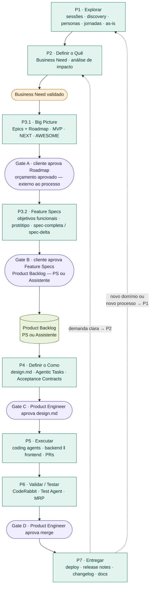
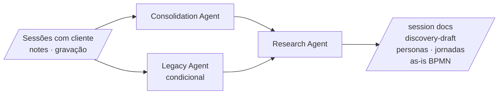
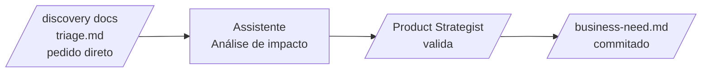
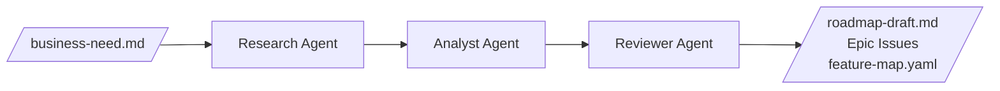
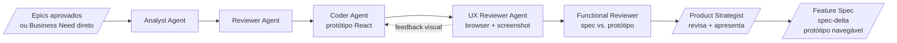
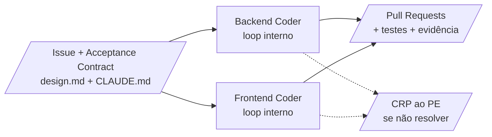
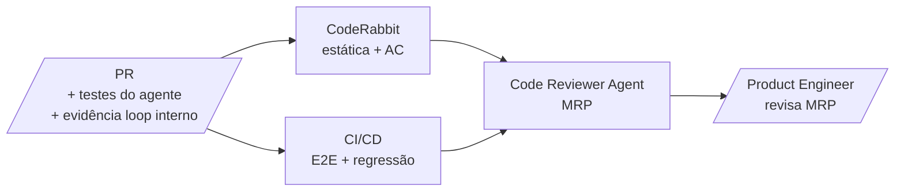

# Kognit — Processo Agent-First

> **Versão:** 1.0 — Processo from scratch
> **Data:** Abril de 2026
> **Status:** Em construção — documento vivo, evolui com cada Sprint

---

## Como ler este documento

O processo está organizado em **seis blocos**, leia nesta sequência:

1. **Visão Geral** — o diagrama macro e como as fases se conectam
2. **Hierarquia de Artefatos** — a árvore Business Need → Epic → Feature → Issue e a progressão de formalidade
3. **Papéis Humanos** — PS e PE, suas responsabilidades e mapeamento para os papéis Kognit atuais
4. **Fases P1–P7** — cada fase com objetivo, inputs, outputs, papéis e diagrama micro
5. **Suporte S1–S3** — o Assistente, a gestão de backlog e a infraestrutura
6. **Apêndice** — glossário, estrutura de arquivos, labels e campos GitHub Projects

**Como referenciar seções:** use os identificadores semânticos (P1, P3.2, GA, S1) nas referências internas. Exemplos: "ver [P3.1 — Big Picture](#p31--big-picture--epics--roadmap)" ou "ver [Assistente](#s1--assistente-de-contexto-permanente)". Nunca use números de linha ou posição — eles se tornam inválidos quando o documento cresce.

---

## Visão Geral — Diagrama Macro



**Leitura rápida do diagrama:**
- Fases verdes = trabalho de produto e técnico
- Losangos roxos = gates de aprovação formal
- Losango laranja = convergência interna (Business Need)
- Círculo verde = Product Backlog — criado pelo PS ou via Assistente após Gate B
- Seta tracejada = loop para o próximo ciclo (P2 para demanda clara; P1 para novo domínio)

**Caminhos pelo processo:**

| Situação | Entrada | Caminho |
|---|---|---|
| Produto novo ou módulo novo | P1 | P1 → P2 → BN → P3.1 → Gate A → P3.2 → Gate B → P4... |
| Projeto em andamento — nova feature ou módulo que exige discovery (novas personas, novo processo, contexto desconhecido) | P1 | P1 → P2 → BN → P3.1 → Gate A → P3.2 → Gate B → P4... |
| Projeto em andamento — demanda clara (mudança, melhoria, ajuste em feature existente, pedido direto) | P2 | P2 → BN → P3.2 direto (sem P3.1 e sem Gate A) → Gate B → P4... |
| Bug em produção | Issue direta | Bug Issue → P4 (Classe A — sem Business Need) |
| Task operacional / de suporte | Issue direta | Task Issue → P4 ou execução direta pelo PE; Tasks sensíveis (DB, produção) exigem aprovação explícita do PE antes de execução |
| Risco identificado | Issue direta | Risco Issue → rastreamento; PS/PE decide se gera Task ou Spike; fechado sem ação se mitigado naturalmente |
| Pendência (aguardando informação ou ação externa) | Issue direta | Pendência Issue → rastreamento; referenciada na Issue bloqueada; fechada quando a informação ou ação chega |

> **Critério de decisão P1 vs P2 em projeto em andamento:** o PS decide na triagem. Se a demanda pode ser especificada com o contexto já disponível no repositório (specs, feature-map, discovery anterior) → P2. Se exige entender um novo domínio, novo processo, novos usuários ou nova integração relevante → P1.

---

## Hierarquia de Artefatos

### Árvore de Trabalho

```
Business Need  (entrada — qualquer demanda nova exceto itens diretos)
      ↓  [BA Agent — 1ª passagem]
    Epic  (roadmap — MVP / NEXT / AWESOME)
      ↓  [BA Agent — 2ª passagem]
    Feature  (tem Feature Spec + protótipo)
      ↓  [Decompositor Agent]
    Issue  (unidade de trabalho ou rastreamento)

    Passam por Business Need:
      ├── Backlog Item   nova capacidade ou melhoria em Feature existente
      └── Spike          pesquisa ou POC antes de comprometer solução

    Entrada direta (sem Business Need):
      ├── Bug            defeito em produção ou em testes
      ├── Task           trabalho operacional ou técnico direto
      │                  (ex: update de base, configuração, suporte)
      │                  Tasks sensíveis exigem aprovação do PE
      ├── Risco          risco identificado — rastreamento com possível ação
      │                  pode gerar Task ou Spike; pode ser fechado sem ação
      └── Pendência      item aguardando informação ou ação externa
                         bloqueador de Issue ou decisão — fechada quando resolvida
```

### Progressão de Formalidade

Ao longo do processo, as informações sobre o usuário evoluem de hipóteses até critérios técnicos verificáveis:

| Artefato | Nível | Conteúdo sobre o usuário | Audiência |
|---|---|---|---|
| **Business Need** | Hipóteses | Narrativa da dor/necessidade, sem formato inicial prescrito — facilitado e formatado pelo Assistente | PS · cliente |
| **Feature Spec** | Objetivos funcionais | O que a feature deve permitir, orientado ao usuário | PS · cliente · PE |
| **Acceptance Contract** | Critérios técnicos | Dado/quando/então — verificável e automatizável | Dev · QA · automação |

> **Regra:** US+AC no Business Need e na Feature Spec são **informativos** — ajudam a definir o escopo mas não são a especificação técnica. Os critérios técnicos formais vivem exclusivamente no Acceptance Contract, gerado pelo Decompositor Agent após o Gate C.

### Ciclo de Vida dos Artefatos

| Artefato | Criado em | Fechado/Arquivado em |
|---|---|---|
| Business Need | P2 — com ajuda do Assistente | Gate B — quando Feature Specs são aprovadas |
| roadmap-draft.md | P3.1 — pelo BA Agent (1ª passagem) | Gate A — vira base para apresentação em PPT pelo PS |
| Feature Spec | P3.2 — pelo BA Agent (2ª passagem) | Vigente até ser substituída por nova versão |
| spec-delta | P3.2 — pelo BA Agent para mudanças | Aprovação registrada dentro do próprio documento |
| Protótipo | P3.2 — pelo Coder Agent | Aprovação no Gate B; branch mantida como referência |
| design.md | P4 — pelo Architecture Agent | Vigente; atualizado pelo Release Agent a cada merge |
| Acceptance Contract | P4 — pelo Decompositor Agent | Promovido de work/ para docs/ pelo Release Agent após merge |
| Issue | P4 — pelo Assistente via GitHub API | Fechada após merge e deploy |

---

## Papéis Humanos {#papeis}

O processo Agent-First é conduzido por dois perfis de entrega. Não são cargos novos — são mapeamentos dos papéis Kognit existentes.

| Papel | Abreviação | Papéis Kognit atuais | Domínio de entrega |
|---|---|---|---|
| **Product Strategist** | **PS** | Project Owner · Analista de Negócios Sr. · Analista de Negócios | Do entendimento da dor do cliente até a aprovação formal de spec + protótipo — tudo que é produto e estratégia |
| **Product Engineer** | **PE** | Analista de Solução · Desenvolvedor Sr. · Desenvolvedor | Do design técnico até o deploy — tudo que é arquitetura, código e qualidade |

**Responsabilidades centrais:**

O **PS** conduz as sessões de discovery, facilita a triagem, valida Business Needs, apresenta Epics e Feature Specs ao cliente, registra aprovações e define o conteúdo de cada Sprint. É o dono do contexto de negócio e da relação com o cliente.

O **PE** revisa e aprova o `design.md`, monitora a execução dos Coding Agents, lê o MRP e aprova merges, acompanha o deploy e valida a entrega. É o dono da qualidade técnica e da integridade do repositório.

**Nota de acumulação:** em projetos pequenos ou demandas técnicas pontuais, o mesmo profissional pode acumular ambos os papéis — tipicamente o Analista de Solução conduzindo da concepção ao PR sem handoff.


---

## P1 — Explorar {#p1}

**Objetivo:** Entender em profundidade o contexto, o problema, os usuários e o mercado antes de definir qualquer solução. Fase divergente — o objetivo é ampliar o entendimento, não convergir para respostas.

**Quando se aplica:** início de produto novo, novo módulo de escopo significativo, ou revisão de direção após milestone importante (Design Thinking recorrente).

**Inputs:**
- Agendamento de sessões com o cliente
- Boards / Canvas de Design Thinking exportados em `.md` (quando existentes)
- Transcrições das sessões (reuniões) em `.md` ou `.txt`
- Contexto existente do cliente (quando projeto em andamento)
- Documentação de sistemas legados (quando presente)

**Papéis humanos:** Product Strategist (conduz as sessões com o cliente)

**Papéis agênticos:**
- Consolidation Agent [Sonnet] — estrutura o material bruto de cada sessão
- Legacy Agent [Sonnet] — condicional; analisa sistemas legados quando presentes
- Research Agent [Opus] — pesquisa de mercado, concorrentes, referências

**Outputs:**
- `session-[produto]-[data].md` — uma por sessão
- `discovery-draft-[produto].md` — rascunho consolidado
- `discovery-[produto]-[data].md` — discovery consolidado final
- `personas-[produto].md`
- `journeys-[produto].md`
- `[processo]-as-is-v1.bpmn` + `.png`




---

## P2 — Definir o Quê {#p2}

**Objetivo:** Transformar o entendimento gerado na exploração em demandas estruturadas. Fase convergente — o objetivo é organizar e clarificar o que precisa ser construído, resultando em um ou mais Business Needs validados.

**Quando se aplica:**
- Após P1 (produto novo): múltiplos Business Needs emergem do discovery
- Projeto em andamento: Business Need gerado a partir do triage, reunião ou pedido direto
- Qualquer situação que gere uma demanda nova (exceto bug)

**Inputs:**
- Artefatos de P1 (quando produto novo)
- `triage-[produto].md` com itens pendentes de encaminhamento (projeto em andamento)
- Pedido direto ao Assistente
- Classificação e análise de impacto provenientes de [S1 — Assistente](#assistente)

**Papéis humanos:** Product Strategist (revisa e valida o Business Need gerado pelo Assistente)

**Papéis agênticos:**
- Assistente de Contexto Permanente [Sonnet] — faz análise de impacto, classifica a demanda e gera o rascunho do `business-need.md`

**Outputs:**
- Issue tipo **Business Need** criada no GitHub Projects — os artefatos da demanda (incluindo specs e outros documentos de produto) ficam em `work/[issue]-[slug]/` durante o desenvolvimento e são promovidos para `docs/` pelo Release Agent após o merge. O Business Need em si é arquivado após o Gate B, mas artefatos de produto gerados a partir dele permanecem vivos no repositório.
- Epics identificados em nível de intenção (alimentam P3.1)
- Issues de entrada direta criadas quando identificadas na triagem ou na consolidação de reuniões: Bug, Task, Risco ou Pendência — conforme classificação do Assistente ([ver A5](#ciclo-diretos))



**Convergência — Business Need validado:** o `business-need.md` commitado e validado pelo PS é o artefato de entrada para P3. Nenhum dispatch para o BA Agent ocorre sem ele.


---

## P3 — Idealizar a Solução {#p3}

Fase dividida em duas passagens com um gate externo entre elas.

---

### P3.1 — Big Picture: Epics + Roadmap {#p31}

**Objetivo:** A partir dos Business Needs, gerar uma visão macro do produto organizada em Epics e distribuída nos horizontes MVP, NEXT e AWESOME. Essa visão serve como base para a apresentação do Roadmap ao cliente e, quando for produto novo, para a proposta de orçamento.

**Quando se aplica:** sempre que houver Business Need — seja produto novo, módulo novo ou demanda de projeto em andamento que justifique um Epic novo ou impacte o roadmap existente. O PS decide se a demanda exige revisão do Big Picture antes de especificar Features.

> **Demanda de mudança/melhoria que impacta Epic existente:** o Assistente sinaliza o impacto no roadmap e o PS decide se é necessário passar por P3.1 (revisão do Epic afetado) ou ir direto para P3.2.

**Inputs:**
- `business-need.md` validado
- Outputs de [P1 — Explorar](#p1) quando produto novo ou módulo novo — incluindo `discovery-[produto]-[data].md`, `session-[produto]-[data].md`, `personas-[produto].md`, `journeys-[produto].md`, `[processo]-as-is-v1.bpmn` e boards/canvas de Design Thinking
- `[cliente]-context.md` e documentação de contexto existente do cliente (quando projeto em andamento)
- `feature-map.yaml` (estado atual do produto — Epics, Features em produção, em andamento e backlog)

**Papéis humanos:** Product Strategist (revisa Epics e Roadmap, prepara apresentação em PPT a partir do `roadmap-draft.md`)

**Papéis agênticos:**
- BA Agent — 1ª passagem:
  - Research Agent [Opus] — contexto de mercado e referências
  - Analyst Agent [Opus] — gera Epics e organiza no roadmap
  - Reviewer Agent [Sonnet] — verifica coerência e cobertura

**Outputs:**
- `roadmap-draft.md` — visão macro dos Epics por horizonte; base para o PS preparar PPT de apresentação
- Epic Issues criadas no GitHub Projects com campos: Tipo=Epic, Fase=MVP/NEXT/AWESOME
- `feature-map.yaml` atualizado com os novos Epics

**Priorização dos Epics no Roadmap:** a distribuição dos Epics nos horizontes MVP, NEXT e AWESOME segue os critérios definidos em [S2 — Gestão de Backlog e Priorização](#backlog). O Assistente sugere a priorização inicial; o PS valida e ajusta conforme contexto de negócio.

**Decisão de avançar para P3.2:**
O PS sempre terá Epics como output de P3.1. A decisão que cabe ao PS é se deseja:
- Apresentar os Epics ao cliente (Gate A) antes de avançar para as Feature Specs — fluxo padrão para produto novo ou escopo relevante
- Avançar diretamente para P3.2 sem Gate A formal — quando o PS já tem clareza suficiente para gerar as Features sem validação intermediária do cliente




---

### Gate A — Validação do Roadmap {#ga}

**Natureza:** opcional — ocorre quando o PS decide apresentar os Epics ao cliente antes de avançar para as Feature Specs. Tipicamente uma reunião de apresentação conduzida pelo PS fora das ferramentas. O PS pode optar por pular o Gate A e avançar diretamente para P3.2 quando já tiver clareza suficiente.

**Como o processo é informado da decisão quando Gate A ocorre:**
- PS atualiza o status dos Epic Issues no GitHub Projects (aprovado / cancelado), ou
- PS pede ao Assistente: "Aprova os Epics CLT-E001, CLT-E002 e cancela o CLT-E003"

**O que acontece após validação:**
- Epics aprovados recebem label `roadmap-approved`
- Epics cancelados recebem status `cancelled`
- PS avança para P3.2 com os Epics aprovados

**Quando o PS pula o Gate A:**
- Todos os Epics gerados em P3.1 avançam para P3.2 sem validação formal do cliente
- A aprovação do cliente ocorre no Gate B (Feature Specs), que permanece obrigatório

---

### P3.2 — Feature Specs {#p32}

**Objetivo:** Refinar cada Epic aprovado em uma ou mais Feature Specs com objetivos funcionais claros e protótipo navegável para apresentação ao cliente. O tipo de artefato gerado depende do tipo de demanda:

| Tipo de demanda | Artefato gerado | Protótipo |
|---|---|---|
| Feature nova | `spec-[feature]-v1.md` — especificação completa | Novo, gerado do zero |
| Melhoria ou mudança em feature existente | `spec-delta-[issue].md` — apenas o que muda, com referência à spec original | Delta do protótipo existente |

**Inputs:**
- Epic Issues (com ou sem Gate A formal — o PS decide)
- `feature-map.yaml`
- Feature Spec existente (`spec-[feature]-v[N].md`) — quando mudança ou melhoria em feature existente
- `/identidade-visual` do cliente

**Papéis humanos:** Product Strategist (revisa Feature Specs, apresenta ao cliente, coleta feedback, registra aprovação)

**Papéis agênticos:**
- BA Agent — 2ª passagem:
  - Research Agent [Opus] — condicional; aprofunda contexto quando necessário
  - Analyst Agent [Opus] — gera Feature Spec ou spec-delta
  - Reviewer Agent [Sonnet] — verifica consistência
- Coder Agent [Sonnet] — gera protótipo React
- UX Reviewer Agent [Sonnet] — renderiza o protótipo no browser (via Playwright MCP ou equivalente), captura screenshots, avalia conformidade visual com a identidade do cliente, verifica responsividade e fluxo de navegação; gera feedback estruturado para o Coder Agent corrigir antes de o PS apresentar ao cliente
- Functional Reviewer Agent [Sonnet] — compara o protótipo renderizado contra a Feature Spec, verificando cobertura funcional critério a critério

**Outputs:**
- `spec-[feature]-v1.md` por Feature (ou `spec-delta-[issue].md` para mudanças)
- Protótipo navegável (branch `proto/[feature]-[cliente]`) — revisado pelo UX Reviewer Agent antes de chegar ao PS
- Screenshots de avaliação gerados pelo UX Reviewer Agent (commitados em `work/[issue]-[slug]/ux-review/`)
- `[processo]-to-be-v1.bpmn` atualizado quando aplicável
- `FeatureRegistry_{MODULE_CODE}.json` para incorporação ao `feature-map.yaml`




---

### Gate B — Cliente aprova Feature Specs {#gb}

**Natureza:** síncrono — apresentação conduzida pelo PS com o cliente. A aprovação é registrada na seção "Aprovação" de cada Feature Spec / spec-delta.

**Critério de avanço:** todas as Features do escopo atual devem estar `approved` ou `pending-client-input`. Features com `pending-client-input` ficam no backlog e entram em ciclos subsequentes.

**O que acontece após aprovação:**
- Feature Issues criadas no GitHub Projects (via Assistente ou manualmente pelo PS/PE) com campos: Tipo=Feature, Fase=MVP (ou NEXT/AWESOME), linkadas ao Epic pai
- **Product Backlog** — as Features MVP aprovadas se tornam Backlog Items. O PS atualiza as Issues manualmente no GitHub Projects ou pede ao Assistente para fazê-lo
- `feature-map.yaml` atualizado com as novas Features
- Artefatos gerados até aqui (specs, protótipos) já estão commitados em `work/[issue]-[slug]/` — nenhum artefato se perde; a promoção para `docs/` ocorre em P7 pelo Release Agent

> **Coerência com a Regra de Ouro ([S1](#assistente)):** Issues criadas manualmente (sem Assistente) devem ser notificadas ao Assistente para manter o `feature-map.yaml` atualizado. PS e PE podem criar e commitar artefatos manualmente — o repositório é a fonte de verdade, não a ferramenta.


---

## P4 — Definir o Como {#p4}

**Objetivo:** Transformar as Feature Specs aprovadas em um plano técnico executável — arquitetura, componentes, contratos de API, tarefas de execução e critérios técnicos de aceite. Os Acceptance Contracts gerados aqui são o artefato central que garante qualidade em todo o processo subsequente: definem o que o agente precisa provar, não apenas o que precisa escrever.

**Inputs:**
- Feature Spec aprovada (`spec-[feature]-v[N].md`) ou spec-delta aprovada
- `feature-map.yaml`
- `CLAUDE.md` (MentorScript — reforça padrões e contexto do projeto para os agentes)
- `openapi.yaml` de features dependentes (quando existem)

**Papéis humanos:** Product Engineer (revisa `design.md` e Acceptance Contracts; aprova antes do dispatch para os Coding Agents)

**Papéis agênticos:**
- Architecture Agent [Opus] — gera `design.md` com arquitetura, componentes, análise de impacto e — obrigatoriamente — seção de impacto no banco de dados
- Spec Writer Agent [Sonnet] — gera `openapi-draft.yaml` quando a feature expõe nova API
- Decompositor Agent [Sonnet] — decompõe `design.md` em Agentic Tasks e gera `acceptance-contract-[issue].md` por task

**Seção obrigatória no `design.md` — Requisitos Não-Funcionais:**

Para ambientes críticos (transações financeiras, dados sensíveis, alta disponibilidade), o Architecture Agent deve preencher obrigatoriamente:

```markdown
## Requisitos Não-Funcionais

### Segurança
- [ ] OWASP Top 10 verificado para os endpoints desta feature
- [ ] Gestão de segredos — nenhuma credencial em código ou em contexto de agente
- [ ] Autenticação/autorização — escopo mínimo necessário (least privilege)
- [ ] Dados sensíveis identificados e tratados (criptografia, mascaramento)

### Performance
- Latência alvo: [X]ms p95 sob carga esperada
- Volume esperado: [N] transações/hora no pico

### Disponibilidade
- SLA alvo: [X]%
- Impacto de indisponibilidade: crítico / alto / médio / baixo

### Integridade de dados
- Boundaries transacionais: [quais operações são atômicas]
- Rollback possível: sim / não — [estratégia]
```

> Critérios de RNF marcados como `verificabilidade: não funcional` no Acceptance Contract são verificados pelo CI/CD via SAST (análise estática — SonarQube ou equivalente) e load tests quando aplicável. O Code Reviewer Agent verifica aderência antes de gerar o MRP.

Toda feature que toca o modelo de dados deve ter esta seção preenchida pelo Architecture Agent antes do Gate C. Ela é o input direto para o Backend Coder gerar as migrations:

```markdown
## Impacto no Banco de Dados

### Classificação
- [ ] Somente aditivo (novas tabelas, novas colunas, novos índices)
- [ ] Destrutivo — requer gate explícito do PE antes de hom_prod
      (DROP COLUMN, DROP TABLE, ALTER COLUMN com mudança de tipo)

### Mudanças de schema
| Operação | Tabela | Coluna / Índice | Tipo antes | Tipo depois | Observação |
|---|---|---|---|---|---|
| CREATE TABLE | clientes | — | — | — | nova entidade |
| ADD COLUMN | usuarios | ultimo_acesso | — | datetime NULL | backward compatible |
| ALTER COLUMN | pedidos | status | varchar(20) | varchar(50) | expansão segura |
| DROP COLUMN | enderecos | complemento2 | varchar(100) | — | ⚠️ DESTRUTIVO |

### Dados de seed (migrations com inserts)
| Tabela | Descrição | Idempotente? |
|---|---|---|
| tipo_usuario | Inserir perfis: Admin, Profissional, Discente | Sim — IF NOT EXISTS |
| tradução | Inserir labels PT/EN/ES das novas telas | Sim — IF NOT EXISTS |

### Rollback
Descreva como reverter cada mudança destrutiva se necessário após deploy.
```

> **Migrations destrutivas são marcadas com `[Destructive]`** na classe FluentMigrator. Isso ativa um gate adicional no Gate D: o PE deve aprovar explicitamente antes da migration rodar em `hom_prod`, independente de ter passado em `dev_qa`.

**Estrutura do Acceptance Contract:**

Cada critério do contrato define não apenas o comportamento esperado, mas como verificar que foi atingido. O campo `verificabilidade` responde diretamente à pergunta "o que automatizar?" — embutindo essa decisão no contrato, antes de qualquer linha de código ser escrita:

```
Critério:        [ID único]
Contexto:        dado que [estado inicial]
Ação:            quando [evento ou ação]
Resultado:       então [comportamento esperado]
Verificabilidade: automática | automatizável com ambiente |
                  revisão humana | não funcional | observabilidade
Evidência:       [o que precisa ser produzido como prova]
Responsável:     Coding Agent | Code Reviewer | Product Engineer
```

| Verificabilidade | Significado | Executor | Velocidade |
|---|---|---|---|
| `automática-unit` | Unit test isolado — lógica pura, sem I/O (xUnit / Vitest) | Backend Coder ou Frontend Coder (loop interno) | < 1 min |
| `automática-api` | API integration via WebApplicationFactory — app .NET Core inteiro em memória, HTTP real, sem browser | Backend Coder (loop interno) | < 3 min |
| `automática-componente` | React component test (RTL + msw) — componente isolado com API mockada, sem browser | Frontend Coder (loop interno) | < 2 min |
| `e2e-smoke` | Jornada crítica via browser real — login + ação central do módulo; apenas o que não pode ser verificado nas camadas anteriores | CI/CD (Cypress / Playwright) | < 5 min total |
| `revisão humana` | Requer julgamento — UX subjetivo, acessibilidade, lógica de negócio ambígua | Product Engineer (Gate D) | — |
| `não funcional` | Performance, segurança, escalabilidade | CI/CD ou ferramenta específica | — |
| `observabilidade` | Logs, métricas, traces — verificável via ferramentas de monitoramento | Release Agent (P7) | — |

**Outputs:**
- `design.md` em `work/[issue]-[slug]/` — inclui seção obrigatória de impacto no banco de dados
- `acceptance-contract-[issue].md` por Issue — inclui critérios de verificação das migrations com `verificabilidade` adequado
- `openapi-draft.yaml` (condicional — quando nova API)
- Issues (Backlog Items / Tasks) criadas no GitHub Projects com campos preenchidos
- Sprint Backlog: atribuição de Issues a uma Sprint feita pelo PS manualmente ou via Assistente

**Priorização das Issues:** segue os critérios definidos em [S2 — Gestão de Backlog e Priorização](#backlog).


---

### Gate C — Product Engineer aprova design.md {#gc}

**Natureza:** síncrono — PE revisa o `design.md` e o conjunto de Acceptance Contracts antes de liberar para execução.

**Critério de avanço:** `design.md` commitado + todas as Issues criadas + Sprint Backlog definido pelo PS.

**Checklist específico para banco de dados:**
- A seção "Impacto no Banco de Dados" do `design.md` está preenchida?
- Mudanças destrutivas estão identificadas e têm rollback documentado?
- Dados de seed são idempotentes (verificação `IF NOT EXISTS` antes de inserir)?
- A ordem das migrations está correta em relação às dependências de FK?

> Migrations destrutivas não bloqueiam o Gate C — o PE toma ciência aqui. O bloqueio ocorre no **Gate D**, antes do deploy em `hom_prod`.

---

## P5 — Executar {#p5}

**Objetivo:** Implementar as Issues de forma assíncrona e paralela. Os Coding Agents recebem cada Issue com seu Acceptance Contract, implementam o código, escrevem os testes correspondentes e executam um loop interno de verificação — abrindo o PR apenas quando os testes passam.

**Inputs:**
- Issues com Acceptance Contracts (campo `verificabilidade` por critério)
- `design.md`
- `CLAUDE.md` + `.cursorrules` (MentorScript — inclui regras de o que automatizar, convenção de `data-testid`, estratégia de dados com âncoras)
- `openapi.yaml` (quando existente) / `openapi-draft.yaml` (quando nova API)

**Papéis humanos:** Product Engineer (monitora via GitHub Projects; intervém quando o agente emite CRP)

**Papéis agênticos:**
- Backend Coder [Sonnet] — implementa Issues de backend (.NET/C#); gera migrations EF Core / FluentMigrator; escreve e executa no loop interno: **unit tests** (xUnit — lógica pura) e **API integration tests** (WebApplicationFactory — app em memória, HTTP real, sem browser); aplica migrations localmente; loop de correção antes de abrir PR
- Frontend Coder [Sonnet] — implementa Issues de frontend (React/TypeScript); escreve e executa no loop interno: **unit tests** (Vitest — lógica pura) e **component tests** (React Testing Library + msw) **apenas para critérios `automática-componente`** — comportamentos interativos verificáveis sem browser (validações de form, estados de UI, rendering condicional); componentes puramente presentacionais não recebem testes RTL; loop de correção antes de abrir PR
- Paralelo quando não há dependência técnica; sequencial quando o Frontend depende de contrato de API estabilizado pelo Backend

**Loop interno do Coding Agent — o coração da verificação:**

```
BACKEND CODER — loop interno
recebe Issue + Acceptance Contract + seção de banco do design.md
        ↓
implementa código (entities, services, controllers)
        ↓
gera migration (EF Core ou FluentMigrator) + seed data idempotente
aplica localmente → erro → corrige e gera novamente
        ↓
escreve testes para critérios com verificabilidade:
  "automática-unit"  → xUnit, lógica pura, sem I/O
  "automática-api"   → WebApplicationFactory, HTTP real em memória
        ↓
executa — todos passaram?
  sim → abre PR com evidência
  não → corrige → executa de novo
  após N iterações → CRP ao PE

FRONTEND CODER — loop interno
recebe Issue + Acceptance Contract + protótipo aprovado
        ↓
implementa componentes React/TypeScript
        ↓
escreve testes para critérios com verificabilidade:
  "automática-unit"        → Vitest, lógica pura
  "automática-componente"  → React Testing Library + msw (API mockada)
                             SOMENTE para comportamentos interativos:
                             validações de form, estados de UI,
                             rendering condicional, mensagens de erro
                             NÃO escrever para componentes puramente
                             presentacionais (tabelas somente-leitura,
                             cards, dashboards de visualização)
        ↓
executa — todos passaram?
  sim → abre PR com evidência
  não → corrige → executa de novo
  após N iterações → CRP ao PE
```

> **Por que o loop interno é fundamental:** o PR já chega ao Code Reviewer com evidência de verificação — não é o CI/CD que descobre os problemas, é o próprio agente. Critérios com `verificabilidade = "automatizável com ambiente"` (E2E) são verificados pelo CI/CD após o PR; o agente não tenta executá-los durante a implementação.

> **Limite de iterações:** definido no `CLAUDE.md` do projeto. Quando atingido sem resolução, o agente emite CRP formal ao PE documentando o que tentou e por que não conseguiu avançar — protegendo contra loops infinitos e garantindo que decisões que requerem julgamento humano chegam ao humano certo.

**Outputs:**
- Código em branches `feat/[issue]-[slug]`
- Migration files em `Migrations/` (EF Core ou FluentMigrator) com seed data idempotente e flag `[Destructive]` quando aplicável
- Testes escritos pelo agente na mesma branch:
  - Backend: xUnit (unit) + WebApplicationFactory (API integration)
  - Frontend: Vitest (unit) + React Testing Library + msw (component)
- Pull Request com evidência do loop interno (testes passando — nenhum browser necessário)




---

## P6 — Validar / Testar {#p6}

**Objetivo:** Verificar que a implementação atende integralmente os Acceptance Contracts antes de chegar ao Product Engineer. Dois processos rodam em paralelo logo após o PR ser aberto; o PE só entra quando ambos concluem sem bloqueios.

**Inputs:**
- Pull Requests (com testes e evidência do loop interno do Coding Agent)
- `acceptance-contract-[issue].md`
- Feature Spec (contexto de UX e comportamento esperado)
- `.coderabbit.yaml` do projeto

**Papéis humanos:** Product Engineer — lê o MRP, aprova merge ou solicita ajuste referenciando o critério específico do AC. Sua atenção é concentrada nos critérios com `verificabilidade = "revisão humana"` e nos riscos sinalizados

**Papéis agênticos (rodam em paralelo após o PR):**

- **CodeRabbit** — verifica qualidade estática: padrões de código, segurança, aderência ao `CLAUDE.md`, análise de complexidade. Produz report por critério do AC com resultado explícito: passou / falhou / sinalizado para humano
- **CI/CD** — aplica migrations em `dev_qa` e executa a camada `e2e-smoke`: 1–2 jornadas críticas por módulo via browser (Cypress ou Playwright). Smoke < 5 min em todo PR; esta é a **única camada com browser** — toda verificação funcional de backend e frontend já foi coberta no loop interno do agente (WebApplicationFactory + RTL). Migrations destrutivas em `dev_qa` rodam automaticamente; bloqueio para `hom_prod` no Gate D
- **Code Reviewer Agent [Sonnet]** — consolida os resultados de CodeRabbit + CI/CD no MRP (Merge-Readiness Pack); avalia cobertura do AC critério a critério; sinaliza via CRP quando testes revelam comportamento não coberto pelo contrato

**Merge-Readiness Pack — o que o PE recebe:**

O MRP é o único artefato que o PE precisa ler para tomar a decisão de merge. Ele prova cinco critérios antes de qualquer aprovação humana:

| Critério | Evidência incluída no MRP |
|---|---|
| **Completude funcional** | API integration tests cobrindo todos os critérios `automática-api`; smoke E2E para os critérios `e2e-smoke` |
| **Verificação sólida** | Unit tests + API integration + component tests escritos pelo agente; smoke E2E passando; nenhum critério `e2e-smoke` verificado apenas via browser quando poderia ser via API |
| **Higiene de engenharia** | Report de linting, análise estática, complexidade ciclomática |
| **Racional claro** | Síntese legível da abordagem e trade-offs |
| **Auditabilidade** | Rastreabilidade código → AC → Feature Spec → Business Need |

**Outputs:**
- Report do CodeRabbit com resultado por critério do AC
- Resultados de testes E2E do CI/CD (Smoke / Core / Full conforme evento)
- `MRP` commitado em `work/[issue]-[slug]/mrp.md`
- CRP ao PE quando testes revelam gap no AC (não-bloqueante — MRP entregue com lacuna sinalizada)



> **Princípio da camada mínima necessária:** cada critério do Acceptance Contract deve ser verificado na camada mais rápida possível. Validações de campo, regras de negócio e comportamento de API ficam em `automática-api` (WebApplicationFactory — sem browser). Comportamento de componente React fica em `automática-componente` (RTL — sem browser). Apenas o que genuinamente requer browser vai para `e2e-smoke` — a jornada crítica de login e ação central do módulo. Ver documento *Qualidade e Testes no Processo Agent-First* para fundamentação completa.


---

### Gate D — Product Engineer aprova merge {#gd}

**Natureza:** síncrono — PE revisa o MRP e aprova (ou solicita ajustes com comentário referenciando critério específico).

**Critério de avanço:** MRP gerado + quality gates passando + PE aprova.

**Gate adicional — migrations destrutivas em `hom_prod`:**

Quando o PR contém migration marcada com `[Destructive]`, o pipeline bloqueia o deploy em `hom_prod` até aprovação explícita do PE. O MRP inclui uma seção específica de banco de dados com:

| Item | Descrição |
|---|---|
| Mudanças detectadas | Lista das operações destrutivas identificadas na migration |
| Impacto estimado | Tabelas/colunas afetadas, volume de dados impactado |
| Migration executou em dev_qa | Resultado e tempo de execução |
| Rollback | Como reverter se necessário após aplicar em hom_prod |
| Janela recomendada | Período de menor uso para aplicar em produção |

> **Migrations aditivas** (ADD COLUMN, CREATE TABLE, CREATE INDEX) não requerem este gate adicional — rodam automaticamente no pipeline de deploy em `hom_prod` após o merge aprovado.

---

## P7 — Entregar {#p7}

**Objetivo:** Deploy em produção com documentação automática da entrega. Nenhuma atualização de documentação é feita manualmente — tudo é gerado e commitado pelo Release Agent após o merge.

**Inputs:**
- Código mergeado na branch principal
- Feature Spec(s) da entrega
- `feature-map.yaml` vigente

**Papéis humanos:** Product Engineer (monitora deploy; valida entrega com cliente)

**Papéis agênticos:**
- Release Agent [Sonnet] — executa o pipeline pós-merge:
  - Aplica migrations pendentes em cada ambiente na sequência (dev_qa → hom_prod) — migrations aditivas automaticamente; destrutivas somente após Gate D específico aprovado pelo PE
  - Deploy no ambiente de produção
  - Gera release notes — inclui seção de mudanças de banco quando houver migrations
  - Atualiza `CHANGELOG.md`
  - Atualiza `feature-map.yaml` (move Features de `em-andamento` para `em-producao`)
  - Atualiza `feature-map.yaml` com nível de Epic (Epic status: parcialmente entregue / concluído)
  - Incorpora `spec-delta` na `spec-completa` da Feature correspondente, gerando nova versão (`spec-[feature]-v[N+1].md`)
  - Promove artefatos de `work/[issue]-[slug]/` para `docs/` (specs, acceptance contracts, openapi)
  - Fecha Issues entregues no GitHub Projects

**Outputs:**
- Deploy em produção
- Release Notes publicadas no GitHub Releases
- `CHANGELOG.md` atualizado
- `feature-map.yaml` atualizado
- `openapi.yaml` definitivo publicado (quando havia `openapi-draft.yaml`)
- `spec-[feature]-v[N+1].md` — spec-completa atualizada com conteúdo da spec-delta (quando aplicável)
- Artefatos promovidos de `work/[issue]-[slug]/` para `docs/`
- Business Need(s) da entrega arquivados/fechados


**Loop:** após a entrega, o processo pode retornar para P2 (projeto em andamento) com novos itens do triage ou para P1 (novo ciclo de discovery) conforme critérios de revisão de milestone.


---

## S1 — Assistente de Contexto Permanente {#assistente}

**Objetivo:** Interface de dispatch disponível a qualquer profissional via Teams. Integra três capacidades: classificar demandas antes de criar Issues, despachar agentes em linguagem natural e consultar qualquer artefato do produto sem navegar no repositório.

**Modos de operação:**
- **Classificação** — analisa a demanda, lê `feature-map.yaml`, specs funcionais das Features impactadas (`spec-[feature]-v[N].md`) e spec-deltas em andamento (work/ de Issues abertas) para detectar conflitos com trabalho já em progresso; quando relevante para análise de impacto técnico, lê o `design.md` associado; consolida o diagnóstico e apresenta ao PS antes de qualquer ação
- **Dispatch** — após confirmação, cria Issue com campos e labels corretos, estrutura pasta `work/[issue]-[slug]/`, gera `business-need.md` como rascunho
- **Consulta** — responde em linguagem natural com referência ao artefato de origem, sem criar tasks

**Regra de ouro:** nenhuma Issue deve ser criada manualmente fora do Assistente. Issues criadas manualmente quebram a camada semântica do `feature-map.yaml`.

**Exceção:** Engineer pode abrir uma `Task` manual para trabalho técnico pontual — mesmo assim notifica o Assistente para registrar no `feature-map.yaml` quando relevante.

**Tabela de classificação — o que o Assistente identifica e como age:**

| O que encontra no `feature-map.yaml` | Classificação | Caminho |
|---|---|---|
| Nada — Feature não existe em nenhum horizonte | Feature nova (Classe C) | P2 → Business Need → P3.1 → ... |
| Feature em produção | Mudança em existente | P2 → Business Need → P3.2 direto (sem P3.1) |
| Feature em andamento | Subtask ou Issue dependente | Issue linkada à Issue em andamento |
| Duas demandas afetando mesmo componente | Conflito | CRP formal antes de prosseguir |
| Demanda sem impacto funcional (bug, cosmético) | Classe A | Issue tipo Bug direto — sem Business Need |

**Implementação no Now:**

O Assistente (S1) é acessível via interface web (assistant-ui) no MVP. A integração com Teams via Azure Bot Service é Fase 2 — quando o time adotar o canal como padrão de comunicação. O orquestrador LangGraph recebe as mensagens via API REST, independente do canal de entrada.

---

## S2 — Gestão de Backlog e Priorização {#backlog}

**Objetivo:** Manter o backlog como output do processo — não como ponto de partida. O PS gerencia contexto e direção; os agentes mantêm o backlog atualizado.

**Como o backlog nasce:**
- Produto novo: Gate B aprovado → PS cria Backlog Items a partir das Features MVP (manualmente ou via Assistente)
- Projeto em andamento: Gate B aprovado → Backlog Items gerados por Issue/Feature aprovada (manualmente ou via Assistente)

**Sprint Backlog — decisão humana:**
O conteúdo de cada Sprint é definido pelo PS em conversa livre. O Assistente pode sugerir distribuição com base nos critérios de priorização ou atribuir Issues a uma Sprint quando solicitado pelo PS.

**Prioritization Skills — critérios para tomada de decisão:**
O Assistente aplica os seguintes critérios quando sugere prioridade de Issues:
1. **Dependência técnica** — o que precisa ser construído primeiro para desbloquear outras Issues
2. **Risco e complexidade** — issues de alto risco têm prioridade para detectar problemas cedo
3. **Valor para o negócio (MoSCoW)** — Must have / Should have / Could have / Won't have


---

## S3 — Infraestrutura e Ferramentas {#infra}

O processo Agent-First opera sobre quatro camadas. A Camada 0 é o padrão arquitetural de orquestração — independente de ferramenta. As demais são mantidas no repositório central Kognit ou no repositório de cada projeto.

---

### Camada 0 — Orquestração {#orquestracao}

Define **como os agentes são invocados, como o contexto chega até eles e como os resultados fluem entre fases**. É intencionalmente agnóstica de ferramenta — o executor concreto (Claude Code, Codex, LangGraph, n8n, pipeline customizado ou outro) é uma decisão de implementação que não altera o processo.

#### Interface padrão de cada agente

Todo agente do processo segue o mesmo contrato de entrada e saída:

```
ENTRADA (montada pelo orquestrador antes de cada execução):
  ├── skill file          → system prompt do agente (Camada 1)
  ├── mentorscript        → CLAUDE.md ou equivalente do projeto (Camada 3)
  ├── arquivos de contexto → inputs listados na fase correspondente (P1–P7)
  └── template de output  → formato esperado do artefato (Camada 2)

PROCESSAMENTO:
  └── agente executa com o contexto montado

SAÍDA (depositada pelo agente antes de encerrar):
  ├── artefato principal  → commitado em work/[issue]-[slug]/
  ├── CRP (se necessário) → emitido antes de qualquer outra saída
  └── handoff             → sinaliza conclusão ao orquestrador ou ao humano
```

> **Regra de contexto mínimo:** nenhum agente inicia sem ter recebido pelo menos o skill file, o mentorscript e os inputs da fase. O orquestrador é responsável por montar e verificar o contexto antes do dispatch.

#### Modos de dispatch

| Modo | Quem invoca | Quando ocorre |
|---|---|---|
| **Dispatch humano** | PS ou PE invoca diretamente | Gates e decisões de validação — sempre síncrono |
| **Dispatch em pipeline** | Output do agente anterior dispara o próximo | Steps determinísticos dentro de uma fase — automático |
| **Dispatch via Assistente** | S1 invoca agente em nome do humano | Classificação de demanda, criação de Issue, geração de rascunho |

#### Padrão de handoff entre agentes

**Dentro de uma fase** (ex: Research → Analyst → Reviewer em P3.1):

```
Agente A executa
  → deposita output em work/[issue]-[slug]/
  → sinaliza conclusão
Orquestrador detecta conclusão
  → monta contexto do Agente B (inclui output do A)
  → dispatcha Agente B
```

Nenhum agente lê diretamente o estado interno do anterior — toda comunicação é via arquivos em `work/`. Isso garante rastreabilidade e permite reexecução de qualquer step sem perda de contexto.

**Entre fases** (ex: P3.2 → Gate B → P4):

```
Fase anterior conclui → artefato disponível em work/
Gate humano (PS ou PE lê, decide)
  → Aprovado: commita artefato + dispatcha próxima fase
  → Revisão necessária: envia feedback → agente reexecuta com feedback como contexto adicional
```

#### Paralelismo

Apenas P5 (Executar) tem paralelismo por design:

```
Backend Coder ──────────────────┐
                                 ├──→ PRs independentes
Frontend Coder ─────────────────┘
```

Condição de paralelismo: Backend e Frontend rodam simultaneamente **quando não há dependência técnica entre eles**. Quando o frontend depende de contrato de API ainda não definido, a ordem é sequencial: Backend primeiro → contrato estabilizado → Frontend.

O orquestrador é responsável por detectar dependências declaradas no `design.md` e sequenciar adequadamente.

#### Política de erro e CRP

Três situações que geram CRP:

| Situação | Tipo de CRP | Comportamento do agente |
|---|---|---|
| Ambiguidade no input que impede execução | Bloqueante | Emite `crp.md`, para e aguarda resposta humana |
| Conflito detectado entre demandas simultâneas | Bloqueante | Emite `crp.md`, não cria Issue até resolução |
| Decisão técnica ou de negócio fora do escopo do agente | Não-bloqueante | Entrega output parcial com lacunas sinalizadas + `crp.md` |

Todo CRP é commitado em `work/[issue]-[slug]/` antes de qualquer notificação ao humano. O humano responde no mesmo canal de comunicação (conversa, comentário na Issue ou commit de resposta) e o orquestrador reinicia o agente com o contexto atualizado.

**Retry policy:** falhas transitórias (timeout, rede, limite de contexto) permitem até 3 tentativas automáticas com o mesmo contexto. Após 3 falhas, gera CRP bloqueante ao PE.

#### Capacidades por agente

Em vez de mapear ferramentas específicas, o processo define **capacidades necessárias** por agente. O orquestrador escolhido deve prover essas capacidades ou delegar para um executor que as tenha:

| Agente | Capacidades necessárias |
|---|---|
| Consolidation Agent | Leitura/escrita de arquivos · processamento de texto longo |
| Legacy Agent | Automação de browser (modo leitura) · leitura/escrita de arquivos |
| Research Agent | Busca na internet · leitura/escrita de arquivos |
| Analyst Agent | Leitura de arquivos do repositório · escrita de artefatos · leitura do `feature-map.yaml` |
| Reviewer Agent | Leitura de output do agente anterior · escrita de feedback estruturado |
| UX Reviewer Agent | Automação de browser (Playwright MCP ou equivalente) · captura de screenshot · leitura de arquivos de identidade visual · escrita de feedback estruturado |
| Functional Reviewer Agent | Automação de browser · leitura de arquivos · comparação entre spec e protótipo renderizado |
| Architecture Agent | Leitura do repositório · escrita de artefatos · geração de diagramas |
| Spec Writer Agent | Leitura de arquivos · escrita em formato OpenAPI |
| Decompositor Agent | Leitura de artefatos · escrita de Issues via API do GitHub |
| Backend Coder | Leitura/escrita do repositório · execução de terminal · xUnit · WebApplicationFactory · FluentMigrator runner |
| Frontend Coder | Leitura/escrita do repositório · Vitest · React Testing Library · msw |
| Test Agent | Automação de browser · leitura do repositório · escrita de resultados |
| Code Reviewer Agent | Leitura de PR e resultados de testes · escrita de MRP |
| Release Agent | Leitura/escrita do repositório · trigger de pipeline de deploy · escrita no GitHub Releases |
| Context Assistant (S1) | Leitura do repositório e `feature-map.yaml` · leitura/escrita de Issues via API do GitHub · interface de conversa com o humano |

> **Nota de implementação:** diferentes orquestradores proveem essas capacidades de formas distintas. Claude Code provê leitura/escrita de repositório e execução de terminal nativamente. Um agente com acesso a MCP servers pode prover GitHub API. Browser automation pode ser Playwright, Puppeteer ou Computer Use. A escolha do orquestrador não altera os skills nem o processo — apenas a forma como as capacidades são satisfeitas.

#### Status de implementabilidade por fase

| Fase | Implementável sem integração adicional | Dependência principal |
|---|---|---|
| P1 | ✅ Sim | Consolidation Agent + Research Agent com acesso a arquivos e web |
| P2 | ⚠️ Parcialmente | S1 funciona como conversa; integração com canal de comunicação (Teams, Slack, etc.) é separada |
| P3.1 + P3.2 | ✅ Sim | Pipeline Research → Analyst → Reviewer com acesso a arquivos |
| P4 | ✅ Sim | Architecture Agent + Decompositor com acesso a repositório e GitHub API |
| P5 | ✅ Sim | Coding agents com acesso a repositório e terminal |
| P6 | ✅ Sim | CodeRabbit + CI/CD com Cypress/Playwright para smoke (1–2 testes por módulo) — todo o resto já coberto no loop interno |
| P7 | ✅ Sim | Release Agent com acesso a repositório e pipeline de deploy |
| S1 (canal) | ⚠️ Separado | Interface de conversa com o humano — implementação depende do canal escolhido |

**Sequência recomendada para o primeiro ciclo implementado:**

```
1. Validar P3.2 → P4 → P5 → P6 → P7 com um módulo piloto
   (núcleo técnico — menor dependência de integração externa)

2. Adicionar P3.1 e o loop completo de produto
   (BA Agent nas duas passagens + gates)

3. Integrar S1 no canal de comunicação do time
   (Assistente acessível sem navegar no repositório)

4. Cobrir P1 + P2 com o pipeline de discovery
   (Consolidation + Legacy + Research para sessões)
```

> **Orquestrador:** LangGraph (Python, MIT) — escolha confirmada para o MVP. Agnóstico de modelo via LangChain integrations. Checkpointing com PostgreSQL. Observabilidade via LangSmith (MVP) / Langfuse self-hosted (Fase 2). Ver documento *Orquestrador_Analise_reThink.md* para fundamentação.

---

### Camada 1 — Skills de Agente {#skills}

System prompts que definem papel, comportamento, políticas e formato de output de cada agente. São o padrão Kognit — mantidos em repositório centralizado, versionados, reutilizados em todos os projetos.

| Skill | Agente | Modelo | Fase(s) |
|---|---|---|---|
| `consolidation-agent.md` | Consolidation Agent | Sonnet | P1 |
| `legacy-agent.md` | Legacy Agent | Sonnet | P1 (condicional) |
| `research-agent.md` | Research Agent | Opus | P1 · P3.1 · P3.2 |
| `analyst-agent.md` | Analyst Agent | Opus | P3.1 · P3.2 |
| `reviewer-agent.md` | Reviewer Agent | Sonnet | P3.1 · P3.2 |
| `ux-reviewer-agent.md` | UX Reviewer Agent | Sonnet | P3.2 |
| `functional-reviewer-agent.md` | Functional Reviewer Agent | Sonnet | P3.2 |
| `architecture-agent.md` | Architecture Agent | Opus | P4 |
| `spec-writer-agent.md` | Spec Writer Agent | Sonnet | P4 (condicional) |
| `decompositor-agent.md` | Decompositor Agent | Sonnet | P4 |
| `coder-agent-backend.md` | Backend Coder | Sonnet | P5 |
| `coder-agent-frontend.md` | Frontend Coder | Sonnet | P5 |
| `code-reviewer-agent.md` | Code Reviewer Agent | Sonnet | P6 — consolida resultados de CodeRabbit + CI/CD no MRP; avalia cobertura do AC critério a critério |
| `release-agent.md` | Release Agent | Sonnet | P7 |
| `context-assistant.md` | Assistente de Contexto Permanente | Sonnet | S1 (permanente) |

**Notas:**
- **BA Agent** não é um skill único — é uma orquestração das passagens de Research + Analyst + Reviewer coordenadas pelo PS. O que varia entre P3.1 e P3.2 é o objetivo e o template de output, não o agente em si.
- **Test Agent** foi removido como skill separado. Os testes unitários e de integração são escritos pelo Coding Agent em P5 como parte da implementação (loop interno). Os testes E2E com `verificabilidade = "automatizável com ambiente"` também são escritos pelo Coding Agent e executados pelo CI/CD em P6 — não por um agente separado durante a inferência.
- **CodeRabbit** é ferramenta externa configurada via `.coderabbit.yaml` — não é um skill Kognit.
- A coluna Fase indica onde o skill é ativado. Skills de uso transversal (como `context-assistant.md`) são carregados permanentemente.

**Governança de skills:**
Atualizações seguem PR com revisão do PE no repositório central. Mudanças propagam para projetos novos — não retroativamente. Cada repositório de projeto registra a versão dos skills em uso em `.kognit/agents/agents.md`.

**Políticas de CRP e guardrails por skill:** definidos no `CLAUDE.md` de cada projeto (Camada 3). O skill file define o comportamento padrão do agente; o `CLAUDE.md` define os limites operacionais específicos do projeto — limite de iterações, condições de escalada via CRP, modelos permitidos por nó e políticas de custo.

---

### Camada 2 — Templates de Artefato {#templates}

Esqueletos dos documentos gerados pelos agentes. Garantem que o output siga o formato padrão Kognit independentemente de quem conduziu o projeto. A cada novo projeto, o PE copia a versão vigente para `.kognit/templates/`.

| Template | Gerado por | Consumido por | Fase |
|---|---|---|---|
| `business-need.md` | Assistente de Contexto Permanente | BA Agent (P3.1 · P3.2) | P2 |
| `roadmap-draft.md` | Analyst Agent | PS (PPT de apresentação) | P3.1 |
| `spec-[feature]-v1.md` | Analyst Agent | Architecture Agent · Decompositor | P3.2 |
| `spec-delta-[issue].md` | Analyst Agent | Architecture Agent · Decompositor | P3.2 |
| `design.md` | Architecture Agent + Spec Writer | Decompositor · Coder Agents | P4 |
| `acceptance-contract-[issue].md` | Decompositor Agent | Coder Agents · Code Reviewer Agent | P4 |
| `openapi-draft.yaml` | Spec Writer Agent | Coder Agents · Release Agent | P4 (condicional) |
| `crp.md` | Qualquer agente (política CRP) | PS ou PE | Qualquer fase |
| `mrp.md` | Code Reviewer Agent | PE (Gate D) | P6 |

**Implementação dos templates:** os templates da Camada 2 são implementados via **Spec Kit** (GitHub, licença MIT, custo zero), customizado com os padrões Kognit pela Head de Processos. O Spec Kit provê os slash commands `/specify → spec-[feature]`, `/plan → design.md` e `/tasks → acceptance-contracts`, integrados nativamente ao Claude Code e ao GitHub Projects. A customização dos templates é responsabilidade da Head — o conteúdo de cada template reflete o processo Kognit, não o template genérico do Spec Kit.

---

### Camada 3 — Padrões por Repositório de Projeto {#padroes-projeto}

Arquivos que vivem no repositório do cliente e definem regras específicas daquele projeto. Criados e mantidos pelo PE no início de cada projeto, evoluem junto com o produto.

| Arquivo | Propósito | Quem mantém |
|---|---|---|
| `CLAUDE.md` | MentorScript — padrões de arquitetura, stack, regras de negócio, guardrails por agente, políticas operacionais, referência à versão dos skills em uso; inclui obrigatoriamente: regras de migration (convenção de nomenclatura, critérios para `[Destructive]`, seed data idempotente), limite de iterações do loop interno, regra de RTL (escrever apenas para critérios `automática-componente`), **política de modelos por nó** (preferred + fallback — garante agnósticidade e continuidade se um provider ficar indisponível) | PE |
| `.cursorrules` | Padrões front-end para os Coder Agents: convenções React/TypeScript, estrutura de componentes, padrões de estado | PE |
| `.coderabbit.yaml` | Regras de review automático: critérios de qualidade, checklist de segurança, padrões de PR | PE |
| `.kognit/agents/agents.md` | Registro da versão dos skills em uso no projeto | PE |
| `.kognit/templates/` | Cópia dos templates vigentes no momento de início do projeto | PE |

**Políticas operacionais obrigatórias no `CLAUDE.md`:**
Limites de iterações por agente · limite de custo por Issue · timeout por task · retry policy para falhas transitórias · fallback de modelo quando o principal falhar · condições de escalada via CRP.

**Governança:** qualquer alteração em `CLAUDE.md`, `.cursorrules` ou `.coderabbit.yaml` exige PR com revisão do PE — mudanças nesses arquivos afetam o comportamento de todos os agentes do projeto.

---

### GitHub Projects — Estrutura de Campos

Todo trabalho do projeto vive em um único GitHub Project com as seguintes configurações:

**Campos customizados:**

| Campo | Tipo | Valores |
|---|---|---|
| Tipo | Seleção única | Epic · Feature · Backlog Item · Bug · Task · Spike · Risco · Pendência |
| Fase | Seleção única | MVP · NEXT · AWESOME · Em Andamento · Concluído · Cancelado |
| Prioridade | Seleção única | P1 (Must) · P2 (Should) · P3 (Could) |
| Sprint | Iteração | Sprint 1 · Sprint 2 · ... |

**Labels de processo:**

| Label | Cor | Uso |
|---|---|---|
| `tipo:epic` | Roxo | Issues do tipo Epic |
| `tipo:feature` | Verde escuro | Issues do tipo Feature |
| `tipo:bug` | Vermelho | Bugs — entrada direta |
| `tipo:task` | Azul | Tasks — entrada direta |
| `tipo:spike` | Amarelo | Spikes de pesquisa/estudo |
| `tipo:risco` | Laranja | Rastreamento de riscos |
| `tipo:pendencia` | Cinza | Bloqueios externos |
| `fase:mvp` | Verde | Escopo do MVP atual |
| `fase:next` | Azul claro | Próxima onda |
| `fase:awesome` | Lilás | Horizonte futuro |
| `agente:em-execucao` | Amarelo | Issue sendo processada por agente |
| `agente:crp` | Vermelho claro | Agente aguarda resposta humana |
| `gate:aguardando` | Laranja | Aguardando aprovação de gate |
| `gate:aprovado` | Verde | Gate aprovado |
| `seguranca:revisao` | Vermelho | Requer revisão de segurança antes do merge |
| `destrutivo` | Vermelho escuro | Migration ou operação destrutiva — Gate D extra |

**Views recomendadas:**
- **Roadmap** — agrupado por Fase, ordenado por Prioridade, Tipo = Epic
- **Backlog** — Tipo = Backlog Item / Bug / Task, ordenado por Sprint + Prioridade
- **Board** — Kanban por status (Backlog · Em andamento · Review · Done)

---

### Interface de Dispatch

O Assistente de Contexto Permanente (S1) é acessível via interface web durante o MVP. A integração com canais de comunicação corporativos (Teams, Slack) é Fase 2.

| Modo | Implementação MVP | Fase 2 |
|---|---|---|
| Interface de conversa | assistant-ui (React · web) | Teams Bot via Azure Bot Service |
| Gates humanos | Streamlit (interface visual de aprovação) | Notificação no canal do time |
| Monitoramento | LangGraph Studio (dev) / LangSmith (produção) | Dashboard integrado |

**Agnósticidade:** a interface é desacoplada do orquestrador via REST API e WebSocket. Trocar de assistant-ui para Teams Bot não altera o grafo LangGraph nem os skill files.

---

### Ambientes de Execução e Segurança

O processo define **quatro ambientes** com segregação estrita. Nenhum agente tem acesso direto a `hom_prod` ou `producao` — toda ação nesses ambientes passa por Gate humano explícito.

| Ambiente | Propósito | Acesso dos Agentes | Gate para escalar |
|---|---|---|---|
| `dev_qa` | Desenvolvimento e testes automatizados | ✅ Leitura e escrita — loop interno do Coding Agent | — |
| `hom_prod` | Validação de negócio (UAT) | ⚠️ Apenas via pipeline CI/CD após Gate D | Gate D — PE aprova merge |
| `producao` | Ambiente real dos usuários | ❌ Nenhum acesso direto de agente | Gate D + aprovação de deploy |

**Princípios de segurança por agente:**

- **Least privilege:** cada agente recebe apenas as permissões mínimas para sua tarefa. Coding Agent acessa apenas sua branch. Release Agent acessa o pipeline mas não o banco de produção diretamente.
- **Sandbox obrigatório:** o loop interno do Coding Agent (implementação + testes) roda exclusivamente em `dev_qa`. Nenhuma execução de código, migration ou seed acontece em `hom_prod` ou `producao` sem Gate D explícito.
- **Secrets segmentados:** o `CLAUDE.md` e os skill files não carregam credenciais. O agente recebe referências de ambiente (ex: `$DB_DEV_CONN`) resolvidas pelo runtime com as permissões do ambiente correto. Credenciais de produção nunca estão em contexto de inferência.
- **Bloqueio de comandos destrutivos:** qualquer operação que afete dados persistidos fora de `dev_qa` (incluindo migrations `[Destructive]`, truncates, resets) requer `interrupt()` no grafo LangGraph — o pipeline pausa e aguarda aprovação do PE antes de continuar.
- **Audit trail completo:** LangSmith/Langfuse registra cada ação do agente com timestamp, modelo utilizado, inputs e outputs. Para ambientes com transações financeiras, isso constitui rastreabilidade completa de quem (qual agente e modelo) executou o quê e quando.
- **SAST/DAST no CI/CD:** análise estática de segurança (SonarQube ou equivalente) faz parte do pipeline de P6 como critério `não funcional` dos Acceptance Contracts. O Code Reviewer Agent verifica se os critérios de segurança foram atendidos antes de gerar o MRP.

**AWS como runtime:** os servidores AWS são infraestrutura de execução — não são dependência de fornecedor de IA. Os agentes rodam sobre LangGraph (self-hosted ou Bedrock AgentCore) e são agnósticos ao cloud provider.

---

## Apêndice

### A1 — Glossário {#glossario}

| Termo | Definição |
|---|---|
| **PS** | Product Strategist — profissional responsável pelo domínio de produto e estratégia: do entendimento da dor do cliente até a aprovação formal de spec + protótipo. Ver [Papéis Humanos](#papeis) |
| **PE** | Product Engineer — profissional responsável pelo domínio técnico: do design técnico até o deploy. Ver [Papéis Humanos](#papeis) |
| **Business Need** | Issue que captura uma demanda nova em linguagem de negócio; contém hipóteses de sucesso (US+AC informativos); rascunho gerado pelo Assistente, validado e commitado pelo PS; arquivado após Gate B. Artefatos de produto gerados a partir dela permanecem no repositório |
| **Epic** | Capacidade maior do produto; unidade do roadmap; agrupado em MVP, NEXT ou AWESOME; gerado pelo BA Agent na 1ª passagem; Issue no GitHub com Tipo=Epic |
| **Feature** | Capacidade entregável ao usuário dentro de um Epic; tem Feature Spec, objetivos funcionais e protótipo; Issue no GitHub com Tipo=Feature |
| **Feature Spec** | Especificação funcional de uma Feature; contém objetivos funcionais (não US+AC formais); gerada pelo BA Agent na 2ª passagem; aprovada pelo cliente no Gate B |
| **spec-delta** | Especificação de mudança em Feature existente; descreve apenas o que muda em relação à Feature Spec vigente; aprovada pelo cliente; incorporada à spec-completa pelo Release Agent em P7 |
| **Acceptance Contract** | Contrato técnico por Issue gerado pelo Decompositor Agent; cada critério define contexto/ação/resultado + campo `verificabilidade` (automática / automatizável com ambiente / revisão humana / não funcional / observabilidade) — esse campo determina quem verifica e quando; é o artefato que conecta especificação, implementação e verificação |
| **Product Backlog** | Lista de Backlog Items priorizados; emerge quando Gate B é aprovado — PS cria manualmente as Issues ou solicita ao Assistente; gerido no GitHub Projects |
| **Sprint Backlog** | Subconjunto do Product Backlog para a Sprint atual; definido pelo PS em conversa livre com ou sem ajuda do Assistente |
| **MRP** | Merge-Readiness Pack — pacote de evidências gerado pelo Code Reviewer Agent antes do Gate D; prova 5 critérios: (1) completude funcional, (2) verificação sólida, (3) higiene de engenharia, (4) racional claro, (5) auditabilidade; é o único artefato que o PE precisa ler para decidir o merge |
| **Task** | Issue de trabalho operacional ou técnico direto — entra sem Business Need; exemplos: update de base, configuração de ambiente, suporte pontual; Tasks sensíveis (produção, DB, permissões) exigem aprovação explícita do PE antes de execução |
| **Risco** | Issue de rastreamento de risco identificado — pode gerar Task ou Spike para mitigar, ou ser fechado com decisão registrada de aceite; nunca fecha sem decisão explícita documentada |
| **Pendência** | Issue de rastreamento de item aguardando informação ou ação externa — referenciada como bloqueadora de outra Issue; fechada quando a informação ou ação chega |
| **CRP** | Clarification Request Point — gerado por agente quando encontra ambiguidade que exige decisão humana; pode ser bloqueante (pausa execução) ou não-bloqueante (entrega com anotação) |
| **roadmap-draft.md** | Documento macro gerado pelo BA Agent na 1ª passagem; base para o PS preparar PPT de apresentação do Roadmap ao cliente |
| **feature-map.yaml** | Índice estruturado e versionado de todos os Epics e Features do produto; lido pelo Assistente para análise de impacto; atualizado automaticamente pelo Release Agent |
| **Orquestrador** | Ferramenta ou pipeline responsável por montar o contexto, invocar agentes e gerenciar o fluxo entre eles — agnóstico ao processo; exemplos: Claude Code, Codex, LangGraph, pipeline customizado |
| **Dispatch** | Ato de invocar um agente com contexto montado; pode ser humano (gates), automático (pipeline) ou via Assistente (S1) |
| **Handoff** | Transferência de output de um agente para o próximo, sempre via arquivos em `work/[issue]-[slug]/` — nunca por estado interno |
| **Skill (agente)** | System prompt que define papel, comportamento, políticas e formato de output de um agente específico; mantido no repositório central Kognit; versionado em `.kognit/agents/agents.md` por projeto; ver [Camada 1 — Skills de Agente](#skills) |
| **Skill (priorização)** | Critério de tomada de decisão aplicado pelo Assistente ao sugerir prioridade de Issues: dependência técnica, risco/complexidade e valor de negócio (MoSCoW); ver [S2 — Gestão de Backlog e Priorização](#backlog) |
| **Migration** | Arquivo de código C# (EF Core ou FluentMigrator) que descreve uma mudança incremental no schema do banco de dados; versionado no repositório; executado automaticamente pelo pipeline de deploy em cada ambiente na sequência dev_qa → hom_prod |
| **Seed Data** | Inserts de dados de configuração ou regras de negócio incluídos nas migrations (tipos, traduções, dados básicos como países, estados, tipos de usuário, rotas); sempre idempotentes — verificam existência antes de inserir; não são re-executados pois o log de execução fica registrado no banco |
| **Migration Destrutiva** | Migration que remove ou altera incompativelmente dados existentes (DROP COLUMN, DROP TABLE, ALTER COLUMN com mudança de tipo); marcada com `[Destructive]` na classe FluentMigrator; roda automaticamente em dev_qa mas requer gate explícito do PE antes de ser aplicada em hom_prod |
| **WebApplicationFactory** | Classe nativa do ASP.NET Core que sobe o app inteiro em memória para testes de integração via HTTP real — sem browser, sem servidor externo; é o executor dos critérios `automática-api` no loop interno do Backend Coder |
| **React Testing Library (RTL)** | Biblioteca de testes de componente React que testa comportamento de UI sem browser; combinada com msw para mockar chamadas de API; usada **apenas para critérios `automática-componente`** — comportamentos interativos (validações de form, estados de loading, rendering condicional, mensagens de erro); componentes puramente presentacionais (tabelas somente-leitura, cards, dashboards) não recebem testes RTL — sua cobertura é `revisão humana` ou já está garantida via WebApplicationFactory no backend |
| **msw** | Mock Service Worker — intercepta chamadas HTTP do React em nível de rede durante testes; permite testar componentes contra respostas de API mockadas sem subir servidor |

### A2 — Estrutura de Arquivos {#filesystem}

**Estrutura de pastas do repositório de projeto:**

```
[projeto]/
│
├── .kognit/
│   ├── agents/
│   │   └── agents.md              # registro de versão dos skills em uso
│   │                              # formato: skill | versão | data adoção | responsável
│   └── templates/                 # templates Spec Kit customizados Kognit
│       ├── spec-template.md       # base para /speckit.specify → Feature Spec
│       ├── plan-template.md       # base para /speckit.plan → design.md
│       └── tasks-template.md      # base para /speckit.tasks → Acceptance Contracts
│
├── work/                          # artefatos EM CONSTRUÇÃO — gerados pelos agentes
│   └── [issue]-[slug]/            # uma pasta por Issue
│       ├── business-need.md       # P2 — Assistente gera, PS valida
│       ├── roadmap-draft.md       # P3.1 — Analyst Agent, bullets de Epics
│       ├── spec-[feature]-v1.md   # P3.2 — Feature nova (spec completa)
│       ├── spec-delta-[issue].md  # P3.2 — Mudança em feature existente
│       ├── design.md              # P4 — Architecture Agent
│       │                          #   inclui: arquitetura, banco, RNFs, impacto
│       ├── openapi-draft.yaml     # P4 — Spec Writer (condicional — nova API)
│       ├── acceptance-contract-[issue].md  # P4 — Decompositor Agent
│       │                          #   inclui: critérios com campo verificabilidade
│       ├── mrp.md                 # P6 — Code Reviewer Agent
│       ├── crp.md                 # qualquer fase — quando agente emite CRP
│       └── ux-review/             # P3.2 — UX Reviewer Agent
│           └── [screenshot].png   # capturas do protótipo renderizado
│
├── docs/                          # artefatos PROMOVIDOS — após merge aprovado (Gate D)
│   └── [epic-slug]/               # organizado por Epic
│       └── [feature-slug]/        # organizado por Feature
│           ├── spec-[feature]-v[N].md     # versão atual da spec (Release Agent atualiza)
│           ├── openapi.yaml               # API publicada (promovida do draft)
│           └── acceptance-contracts/
│               └── [issue]-ac.md          # contratos por Issue entregue
│
├── specs/                         # estrutura Spec Kit — gerada pelos slash commands
│   └── [###-feature]/             # numeração automática pelo Spec Kit
│       ├── spec.md                # /speckit.specify — objetivos funcionais + US
│       ├── plan.md                # /speckit.plan — design técnico
│       ├── data-model.md          # /speckit.plan — modelo de dados
│       └── tasks.md               # /speckit.tasks — Acceptance Contracts
│
├── src/                           # código-fonte do produto
│   ├── backend/                   # .NET Core — C#
│   └── frontend/                  # React — TypeScript
│
├── Migrations/                    # EF Core ou FluentMigrator
│   └── [timestamp]_[description].cs   # migrations versionadas; [Destructive] quando aplicável
│
├── CHANGELOG.md                   # atualizado pelo Release Agent a cada entrega
├── CLAUDE.md                      # MentorScript — regras do projeto para os agentes
│                                  #   inclui: stack, convenções, política de modelos,
│                                  #   limites de iteração, regra RTL, critérios [Destructive]
├── constitution.md                # Spec Kit — princípios não-negociáveis (base do CLAUDE.md)
├── .coderabbit.yaml               # regras de code review automático — configurado pelo PE
├── .cursorrules                   # padrões front-end para Coding Agents
└── feature-map.yaml               # índice de Epics e Features — fonte de verdade do produto
                                   # atualizado pelo Release Agent após cada entrega
```

**Regras de ciclo de vida dos artefatos:**

| Fase | Artefato | Criado por | Local | Destino após merge |
|---|---|---|---|---|
| P2 | `business-need.md` | Assistente (PS valida) | `work/` | Arquivado — referência histórica |
| P3.1 | `roadmap-draft.md` | Analyst Agent | `work/` | Arquivado |
| P3.2 | `spec-[feature]-v1.md` | Analyst Agent | `work/` e `specs/` | `docs/[epic]/[feature]/` |
| P3.2 | `spec-delta-[issue].md` | Analyst Agent | `work/` | Incorporado à spec pelo Release Agent |
| P3.2 | screenshots UX | UX Reviewer Agent | `work/ux-review/` | Arquivado |
| P4 | `design.md` | Architecture Agent | `work/` | Arquivado após merge |
| P4 | `openapi-draft.yaml` | Spec Writer Agent | `work/` | `docs/[epic]/[feature]/openapi.yaml` |
| P4 | `acceptance-contract-[issue].md` | Decompositor Agent | `work/` | `docs/[epic]/[feature]/acceptance-contracts/` |
| P6 | `mrp.md` | Code Reviewer Agent | `work/` | Arquivado — auditoria |
| P6 | `crp.md` | Qualquer agente | `work/` | Arquivado — auditoria |
| P7 | `CHANGELOG.md` | Release Agent | raiz | Permanente — atualizado incrementalmente |
| P7 | `feature-map.yaml` | Release Agent | raiz | Permanente — fonte de verdade |

> **Nada é deletado.** O histórico completo de decisões, CRPs e MRPs permanece rastreável no repositório. A promoção de `work/` para `docs/` não remove os originais — apenas torna os artefatos finais acessíveis em estrutura navegável por Epic e Feature.

> **Spec Kit e `work/`:** o Spec Kit gera artefatos em `specs/[###-feature]/`. O Release Agent é responsável por mover o conteúdo final para `docs/` na estrutura por Epic/Feature. Os dois sistemas coexistem — `specs/` é o espaço de geração dos agentes via slash commands; `docs/` é o espaço de consulta de qualquer membro do time.

### A3 — Progressão de US+AC {#usac}

A formalidade das informações sobre o usuário aumenta ao longo do processo:

```
Business Need   →   Feature Spec   →   Acceptance Contract
"hipóteses"         "objetivos"         "critérios técnicos"
(informativo)        (semi-formal)       (formal e testável)
  PS · cliente       PS · cliente · PE    dev · QA · automação
```

Nenhum artefato antes do Acceptance Contract é considerado especificação técnica formal. US+AC no Business Need e na Feature Spec existem para comunicação e alinhamento — não para geração automática de código ou testes.

### A5 — Ciclo de Vida dos Tipos de Entrada Direta {#ciclo-diretos}

Itens que entram como Issues diretamente, sem Business Need, têm fluxos distintos. Qualquer um desses tipos pode ser identificado tanto por pedido direto ao Assistente quanto pelo processo de consolidação de reuniões e triagem — não apenas Bugs.

**Bug**

```
Reportado → Triagem (Assistente classifica + analisa impacto)
  → Issue Bug criada → P4 (design técnico se necessário) → P5 → P6 → P7
  → Fechado após deploy + validação
```

**Task (operacional / suporte)**

```
Solicitada → Assistente cria Issue Task
  → Task comum: PE executa diretamente
  → Task sensível (DB, produção, permissões):
      PE avalia → aprovação explícita antes de executar
      → execução com registro do que foi feito na Issue
  → Fechada após execução confirmada
```

> Tasks sensíveis são classificadas como **Classe D** — requerem checkpoint humano reforçado e registro de aprovação na Issue antes de qualquer execução.

**Risco**

```
Identificado (PE, PS ou agente durante execução)
  → Assistente cria Issue Risco com: descrição, probabilidade, impacto, feature afetada
  → Status inicial: Em monitoramento
  → PS/PE decide ação:
      a) Gera Task ou Spike para mitigar → Risco linkado à Task
      b) Aceita o risco conscientemente → fecha com decisão registrada
      c) Monitora — fecha quando condição de risco deixar de existir
  → Nunca fecha sem registro explícito da decisão tomada
```

**Pendência**

```
Identificada (aguardando cliente, terceiro ou decisão interna)
  → Assistente cria Issue Pendência com: o que aguarda, quem é responsável, prazo esperado
  → Referenciada na Issue bloqueada (ex: "bloqueada por #42")
  → Status: Aguardando
  → Fechada quando a informação ou ação externa chega
  → Issue bloqueada é desbloqueada e retoma o fluxo
```

| Tipo | Gera execução? | Pode fechar sem ação? | Precisa de aprovação? |
|---|---|---|---|
| Bug | ✅ Sempre | ❌ | Não (exceto Classe D) |
| Task | ✅ Sempre | ❌ | Apenas se sensível (Classe D) |
| Risco | ⚠️ Pode gerar | ✅ Se mitigado ou aceito | Não — mas decisão deve ser registrada |
| Pendência | ❌ Raramente | ✅ Quando resolvida externamente | Não |

**Política de Roteamento do Assistente — Classes de Demanda:**

| Classe | Tipo de demanda | Caminho | Exemplo |
|---|---|---|---|
| **A** | Bug ou problema operacional sem impacto funcional novo | Issue tipo Bug criada diretamente — sem Business Need | Erro de formatação, comportamento inesperado documentado |
| **B** | Mudança em feature existente em produção | `business-need.md` → P3.2 direto (sem P3.1) | Novo campo em formulário existente, ajuste de regra de negócio |
| **C** | Feature nova ou módulo novo | `business-need.md` → P3.1 (Epics) → Gate A → P3.2 (Spec) → Gate B | Novo módulo de relatórios, nova integração |
| **D** | Task sensível com impacto em infraestrutura, segurança ou dados de produção | `business-need.md` → Gate explícito do PE antes de qualquer execução | Mudança de schema em produção, alteração de política de acesso |

O Assistente classifica automaticamente a demanda ao criar a Issue, consultando o `feature-map.yaml` para identificar se a Feature existe, está em andamento ou é nova. Em caso de ambiguidade, emite CRP ao PS antes de criar qualquer Issue.

---
